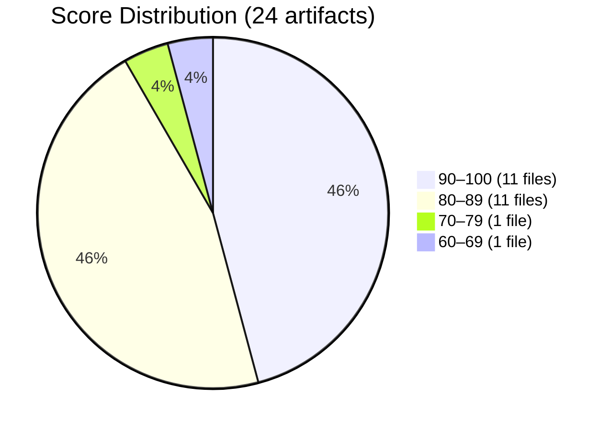
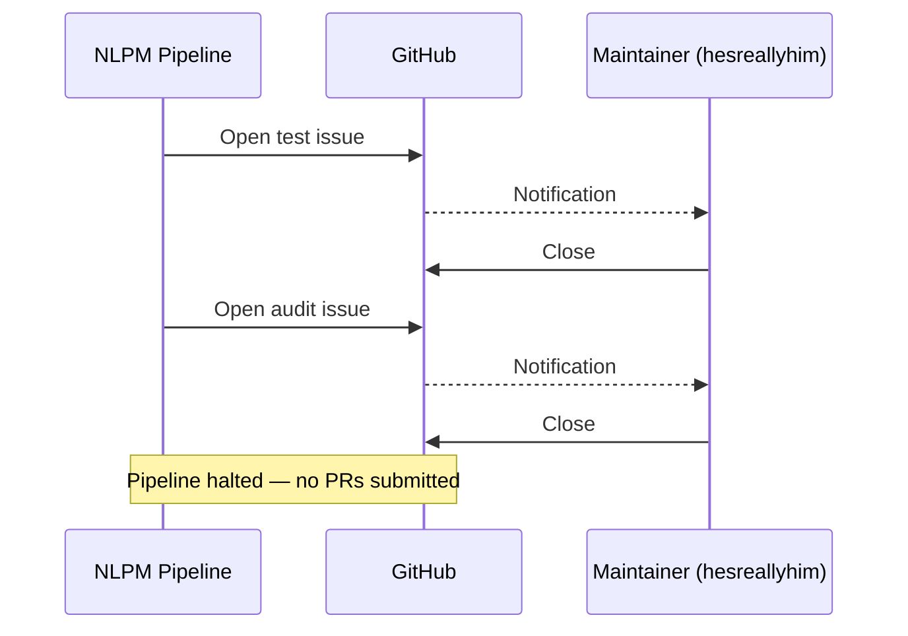
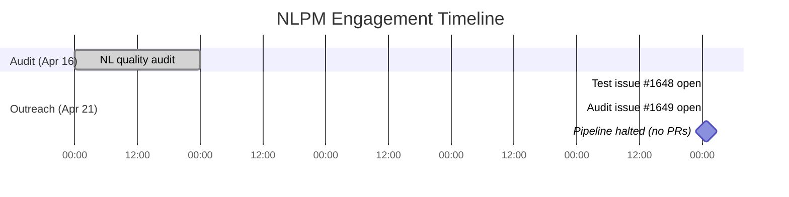

# When the Curator Gets Curated: Closed in Under Ten Seconds

> **Disclosure**: This article was generated by an automated pipeline using Claude (Sonnet 4.6) based on audit data and GitHub records. It describes work performed by NLPM tooling maintained by [xiaolai](https://github.com/xiaolai). Readers should weigh claims accordingly.

---

## The Project

[hesreallyhim/awesome-claude-code](https://github.com/hesreallyhim/awesome-claude-code) is a curated list of skills, hooks, slash-commands, agent orchestrators, applications, and plugins for Claude Code by Anthropic. Maintained by [Really Him](https://github.com/hesreallyhim), it has accumulated 39,983 stars and 3,309 forks, making it one of the most-watched Claude Code community resources in existence.

What makes this repo unusual as an audit target is its nature: it does not implement anything. It collects — a naturalist cataloging the ecosystem rather than disturbing it. Its primary NL artifact — a custom Claude Code command — automates the process of evaluating other repositories. Its remaining 23 audited artifacts are CLAUDE.md files gathered from external projects and stored under `resources/claude.md-files/` as reference examples. The repo is, in effect, a quality signal for the ecosystem — which makes the question of its own quality interesting. Auditing it is a bit like reviewing the reviewer.

---

## The Audit

The audit was conducted on 2026-04-16, covering 24 NL artifacts using a batched scoring strategy.

**Overall NL Score: 89/100.** Security posture: **CLEAR** (0 critical, 0 high findings).

The distribution is notably bimodal: nearly all artifacts cluster at either "good" (86–89) or "excellent" (94–100). One outlier on each end pulls the tail:

- **Lowest**: `.claude/commands/evaluate-repository.md` scored **62/100** — the repo's own Claude Code command, missing YAML frontmatter and an `allowed-tools` declaration, and containing eight vague-quantifier hits.
- **Highest**: `resources/claude.md-files/Guitar/CLAUDE.md` scored **100/100** — a perfect score with no findings.

The weighted average of 89/100 reflects a collection that, on balance, represents good practice. The variance is largely explained by the heterogeneous provenance of the sample: 23 of 24 files come from external repositories with no shared style guide.

**Top issues by category:**

| Category | Count | Examples |
|----------|-------|---------|
| Vague quantifiers | 14 | "appropriate" (×3 in 6 files), "comprehensive" (×3), "concise" (×4) |
| Ephemeral state in context files | 2 | "Current Task: Cleaning up app for release" (DroidconKotlin); implementation-plan notes (Network-Chronicles) |
| Structural gaps | 2 | Missing build/test commands (AVS-Vibe-Developer-Guide, Note-Companion) |
| Instruction-override language | 2 | "supersede any conflicting instructions" (claude-code-mcp-enhanced); permission-expansion language (Cursor-Tools) |
| Malformed embedded syntax | 1 | Cursor Rules frontmatter fragments in the body of Cursor-Tools/CLAUDE.md |

A fair assessment: the quality issues are largely inherited from the source repositories. The curator cannot fully control upstream CLAUDE.md quality — and arguably, including diverse real-world examples (including imperfect ones) is a valid editorial choice. The one artifact fully under the maintainer's control, `evaluate-repository.md`, had the most significant mechanical deficiencies.

---

## What Was Submitted

No pull requests were submitted to this repository.

The pipeline creates a tracking issue before opening PRs as a notification mechanism and a circuit-breaker. Both issues opened against this repository were closed before the pipeline could proceed to PR creation.

| Issue | Title | Created | Closed | Duration Open |
|-------|-------|---------|--------|---------------|
| [#1648](https://github.com/hesreallyhim/awesome-claude-code/issues/1648) | [NLPM Audit] Test issue - please ignore | 2026-04-21 00:38:29Z | 2026-04-21 00:38:37Z | 8 seconds |
| [#1649](https://github.com/hesreallyhim/awesome-claude-code/issues/1649) | [NLPM Audit] Automated quality audit: 4 bugs + 2 security fixes identified | 2026-04-21 00:42:40Z | 2026-04-21 00:42:50Z | 10 seconds |

The four quality gaps identified in the audit — and the two medium-priority security fixes — were never proposed as patches. The door closed before the knock finished.

---

## The Outcome

Both issues were closed within ten seconds of creation, with no comment left on either — whether by the maintainer directly or by an automated rule is not known.

There are no review comments, no commits referencing NLPM or Claude, and no other engagement on record. The signal is clear operationally — the pipeline was halted — but the reason is not. One interpretation is that unsolicited automation was not welcome; another is that routine automated triage rules closed the issues before any human review occurred.

---

## What the Audit Revealed

Several patterns emerged that are worth noting independent of the engagement outcome.

**Vague quantifiers are the dominant quality signal in this sample.** Of 14 quality issues logged, 10 involve vague-quantifier hits. The word "appropriate" alone appeared across six separate files — each instance defensible in isolation, and collectively a fingerprint of the community's default vocabulary. This is not a weakness unique to this repo — it is a pattern across the CLAUDE.md files it collects from the broader Claude Code community. The curator mirrors the community's habits.

**Ephemeral state leaking into committed context files is a recurring structural failure.** Two files contained clearly transient content: a "Current Task" note about prepping for a release (DroidconKotlin/CLAUDE.md) and implementation-plan notes (Network-Chronicles/CLAUDE.md). These files were presumably authored during active development sessions and committed without cleanup — like whiteboard notes photographed instead of erased. CLAUDE.md files persist indefinitely; task context does not.

**The command (`evaluate-repository.md`) underperformed its surrounding collection.** It scored 62/100 — below every third-party CLAUDE.md file in the audit. The missing YAML frontmatter means the command that evaluates other repositories appears in the picker without a description — a map that doesn't label itself. The missing `allowed-tools` declaration means no tool restrictions are enforced during evaluation runs. These appear to be mechanical omissions rather than intentional design choices — though a minimal command used internally by a maintainer exists in a different register than a plugin artifact intended for distribution, and may not require the same formalization.

**Security posture is genuinely clean.** No critical or high findings — worth saying plainly, since a clean bill is easier to overlook than a finding. The three medium findings are all scoped to link-validation and resource-download scripts — maintenance tooling, not the core repo surface. The low finding (unpinned dependencies) is broadly applicable and low-urgency.

A fairness note: the 23 collected CLAUDE.md files were audited as examples, not as components of a system the maintainer wrote. Penalizing `awesome-claude-code` for the vague writing in `SG-Cars-Trends-Backend/CLAUDE.md` is methodologically defensible (these files are published as reference material) but should be understood as an audit of what the collection contains, not solely what the maintainer produced. A library is partly judged by its shelves.

---

## Timeline

Five days elapsed between audit and outreach — a gap reflecting normal pipeline batch scheduling. Whether the 24 artifacts were re-validated against the live repo before issue filing is not recorded in audit logs. Both outreach events resolved in under a minute.

---

## Limitations

**We do not know who or what closed the issues.** The closure could have been manual (the maintainer saw the notification and acted), automated (a bot configured to close unlabeled or unrecognized-author issues), or a combination. The ten-second response time is consistent with automation, but it is also consistent with a maintainer who happened to be online and had a clear policy.

**Rapid closure does not validate or invalidate the findings.** The four quality gaps and four security findings were identified against the audit evidence. Whether the maintainer agrees with those assessments is unknown — no comment was left.

**The audit covered 24 artifacts.** The repository contains substantially more content. Score of 89/100 is a sample estimate, not a whole-repo measurement.

**The collection's quality reflects upstream authors.** Treating the audit score as a judgment on the curator's work is partially unfair. Many of the deductions were for writing choices made by external developers whose files were gathered, not authored, by this maintainer.

**We did not check the repo's contribution guidelines.** A project of this visibility likely has a CONTRIBUTING.md or issue templates that may address automated or bot submissions. If so, the rapid closure may reflect policy enforcement rather than a reaction to the specific audit content.

---

## Significance

The result here is not a success or failure of the audit process — it is a data point about deployment context.

`hesreallyhim/awesome-claude-code` is a high-visibility project maintained by someone who likely receives a significant volume of automated noise. A ten-second issue closure, applied consistently to both a test issue and the substantive audit notification, suggests a deliberate policy rather than an oversight. This is a reasonable posture for a maintainer of a 40K-star repo — at that scale, an unrecognized sender and a ten-second closure is not rudeness; it is triage.

The engagement produced no real-world improvement to the target repository: both issues were closed before any findings could be reviewed or addressed. On the pipeline's own terms, the audit did confirm that NLPM can handle a heterogeneous curation target — a repo whose NL artifacts span a dozen upstream projects — and produce coherent, file-level scoring. The 89/100 result with a clear breakdown by artifact and a clean security verdict required no special-casing for the "collection of collections" structure.

The four quality gaps in this repo remain unaddressed. They are genuine: the command still lacks frontmatter, DroidconKotlin's CLAUDE.md still contains stale task state, and the Cursor-Tools file still has embedded Cursor Rules fragments. Whether that matters depends on how many of the repo's 39,983 stargazers use those files as templates, and that question is outside the scope of what this audit can answer. The command still lacks a description. Somewhere, someone is probably reading it anyway.
