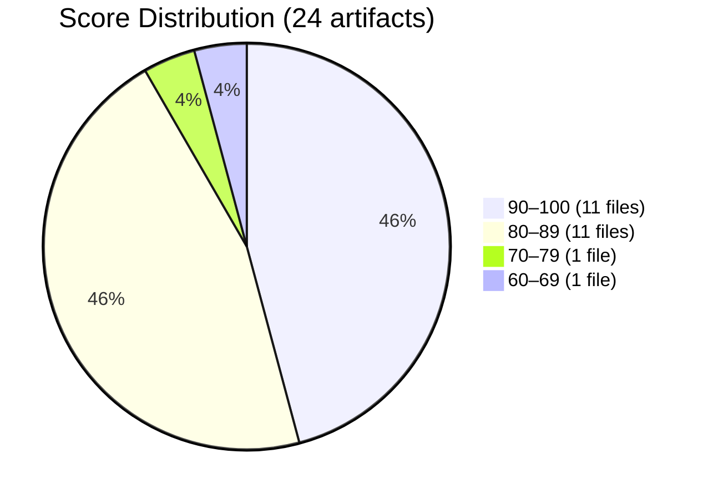
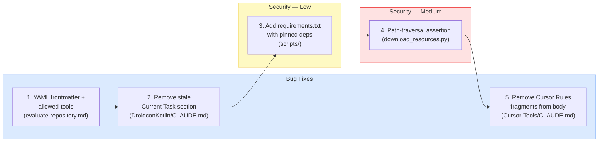
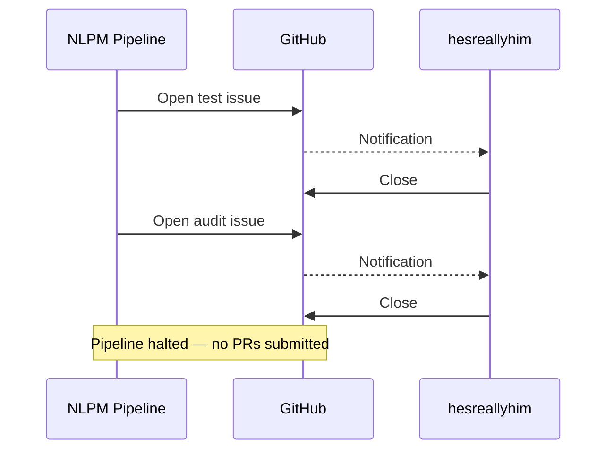
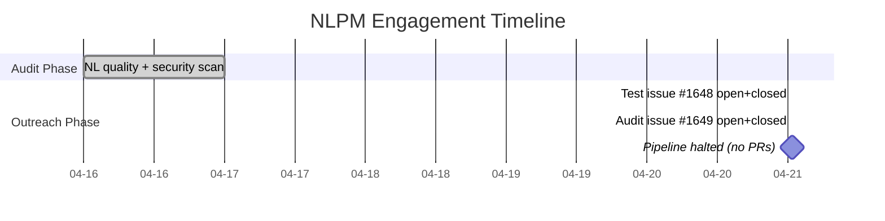

# Forty Thousand Stars, Ten Seconds: Auditing the Claude Code Curator

> **Disclosure**: This article was generated by an automated pipeline using Claude (Sonnet 4.6) based on audit data and GitHub records. It describes work performed by NLPM tooling maintained by [xiaolai](https://github.com/xiaolai). Readers should weigh claims accordingly.

---

## The Project

[hesreallyhim/awesome-claude-code](https://github.com/hesreallyhim/awesome-claude-code) is a curated list of skills, hooks, slash-commands, agent orchestrators, applications, and plugins for Claude Code by Anthropic. Maintained by [Really Him](https://github.com/hesreallyhim), the repository has accumulated **40,271 stars** and 3,335 forks — one of the most-watched Claude Code resources on GitHub.

The repo occupies an unusual position: it does not implement anything. It curates. Its single Claude Code command automates evaluation of other repositories. Its remaining 23 NL artifacts are CLAUDE.md files gathered from external projects and stored under `resources/claude.md-files/` as community reference examples. Auditing it is a bit like evaluating a restaurant critic's palate — by reading the menus they collected.

---

## The Audit

**Date**: 2026-04-16 | **Artifacts**: 24 | **Strategy**: batched

**NL Score: 89/100** | **Security: CLEAR** *(no cross-repo baseline is available for direct comparison)*

The distribution is sharply bimodal — two tight clusters with almost nothing between them, like a reading group where most people either finished the book or didn't open it. Eleven files score at or above 90; eleven cluster in the 80s. One file anchors each tail:

- **Lowest**: `.claude/commands/evaluate-repository.md` — **62/100**. No YAML frontmatter, no `allowed-tools` declaration, eight vague-quantifier hits. The command that evaluates other repositories shows up in the picker without a description — a critic who arrived to judge without bringing credentials.
- **Highest**: `resources/claude.md-files/Guitar/CLAUDE.md` — **100/100**. No findings.

**Top issues by category:**

| Category | Count | Examples |
|----------|-------|---------|
| Vague quantifiers | 14 | "appropriate" in 6 files; "comprehensive" ×3; "concise" ×4 |
| Ephemeral state in context files | 2 | "Current Task: Cleaning up app for release" (DroidconKotlin); implementation notes (Network-Chronicles) |
| Structural gaps | 2 | Missing build/test commands (AVS-Vibe-Developer-Guide, Note-Companion) |
| Instruction-override language | 2 | "supersede any conflicting instructions" (claude-code-mcp-enhanced); permission-expansion (Cursor-Tools) |
| Malformed embedded syntax | 1 | Cursor Rules frontmatter fragments embedded in Cursor-Tools/CLAUDE.md body prose |

**Security findings:**

| Severity | Count |
|----------|-------|
| Critical | 0 |
| High | 0 |
| Medium | 3 |
| Low | 2 |

All findings are scoped to maintenance scripts under `scripts/`. No hooks, no `shell=True` subprocess calls, no hardcoded credentials. The medium findings cover SSRF risk in link validation, path-traversal gaps in resource downloads, and an unverified POST destination in the ticker SVG generator. The low finding is unpinned script dependencies — broadly applicable, low urgency.

A fair assessment: 23 of 24 audited files were authored by external developers and gathered rather than written by this maintainer. The quality issues in those files reflect upstream choices. The artifact fully under the maintainer's control scored lowest — the sort of irony that needs no footnote. A library is partly judged by its shelves, but the librarian wrote the catalog, not the books.

---

## What Was Submitted

No pull requests were submitted to this repository — the findings never made it past the lobby.

The pipeline creates a tracking issue before opening PRs as a notification mechanism and circuit-breaker. After test issue #1648 closed within 8 seconds, the pipeline nonetheless proceeded to open the substantive audit issue #1649 four minutes later. The circuit-breaker halted only after #1649 was also closed — before any PR was submitted.

| Issue | Title | Created | Closed | Open Duration |
|-------|-------|---------|--------|---------------|
| [#1648](https://github.com/hesreallyhim/awesome-claude-code/issues/1648) | [NLPM Audit] Test issue - please ignore | 2026-04-21 00:38:29Z | 2026-04-21 00:38:37Z | 8 seconds |
| [#1649](https://github.com/hesreallyhim/awesome-claude-code/issues/1649) | [NLPM Audit] Automated quality audit: 4 bugs + 2 security fixes identified | 2026-04-21 00:42:40Z | 2026-04-21 00:42:50Z | 10 seconds |

Three bugs and five security findings were identified. Two security findings were planned as patches (path-traversal and unpinned dependencies); the three remaining security findings were not queued for submission. None were delivered — the pipeline halted before PR creation. (The issue title cited four bugs; only three are enumerated in this record.) For reference, the intended priority order was:

**Procedural note**: Contribution guidelines for this repository were not consulted before issues were filed. A repository of this scale almost certainly has documented policy on automated or bot-submitted issues — checking CONTRIBUTING.md is a prerequisite the pipeline should enforce. Whether the pipeline identifies itself in conformance with GitHub's bot conduct policies is not documented in this record; rapid closure may reflect policy enforcement rather than a reaction to the specific findings.

---

## The Response

Both issues were closed within ten seconds of creation. No comment was left on either — each door closed quietly, without explanation. No PR reviews exist — no PRs were submitted.

Whether closures were manual or automated is not recorded. Ten-second response times are consistent with both a maintainer who was online and had a clear policy, and a bot configured to close issues from unrecognized senders. No further contact was made beyond the issue mechanism; the interpretation of this signal remains one-sided — a message received but not replied to, a question without a respondent.

---

## What the Audit Revealed

**A note on methodology**: the audit scored files that span a dozen upstream projects. Penalizing this repo for vague writing in `SG-Cars-Trends-Backend/CLAUDE.md` is methodologically defensible — these files are published as community reference material — but should be understood as a measurement of what the collection contains, not solely what the maintainer produced.

**Vague quantifiers dominate the quality signal in this sample.** Vague-quantifier hits account for 14 of the 21 distinct quality findings. "Appropriate" appeared across six separate files, doing the work that six more specific words might have done — it is, after all, the most appropriate word available when a better one hasn't yet been chosen. This is a 24-file sample from a curation repo, not a statistically representative cross-section of the Claude Code community — extrapolating to an ecosystem-wide pattern overstates the evidence. What it does show is the default vocabulary of the projects this repo chose to feature.

**Ephemeral state leaking into committed context files is a recurring structural failure.** Two files contained clearly transient content: a "Current Task" note about prepping for a release (DroidconKotlin/CLAUDE.md) and implementation-plan notes (Network-Chronicles/CLAUDE.md). CLAUDE.md files persist indefinitely; task context does not. These read as development-session artifacts that were committed without cleanup — like sticky notes photographed into the company handbook.

**The repo's own command underperformed every third-party file it curates.** `evaluate-repository.md` scored 62/100 — below all 23 external CLAUDE.md files. The missing YAML frontmatter means the command appears in the picker without a description. The missing `allowed-tools` declaration means no explicit tool restrictions are declared for evaluation runs. For a command designed to evaluate arbitrary repositories, broad tool access may be intentional — and restricting it could break the command's core functionality. The absence of an explicit declaration is undocumented either way. Missing frontmatter is a functional gap in a distributed plugin but cosmetically suboptimal in an internal utility command; the distinction matters when interpreting the 62/100 score.

**Instruction-override findings warrant context.** Two files flag override language: "supersede any conflicting instructions" and permission-expansion patterns. These may reflect intentional integration choices for commands that need to override conflicting defaults. NLPM's override penalty is a heuristic that may not apply cleanly to this artifact class.

**Security posture is genuinely clean.** Worth saying plainly, since a clean bill is easier to overlook than a finding — a zero on the inspection form is the best possible result, and rarely the one that gets framed. No critical or high severity issues. No hooks, no credential handling, no shell injection vectors. The medium findings are all scoped to maintenance tooling.

---

## Timeline

Five days elapsed between audit and outreach — normal batch scheduling lag. The audit took a day; both outreach events resolved in under a minute each. Between the two phases, the gap is five days; within the outreach phase, the gap between test issue and audit issue is four minutes; within each issue, the gap from creation to closure is under ten seconds.

---

## Limitations

**We do not know who or what closed the issues.** Ten-second closure is consistent with automation but not exclusively so. No comment was left on either issue, leaving the reason unrecorded.

**Rapid closure does not validate or invalidate the findings.** The three quality gaps and five security findings were identified against the audit evidence. No maintainer feedback was received on their accuracy.

**No direct outreach was attempted beyond automated issue filing.** For a repository of this profile, a human outreach attempt (discussion post, email, or comment) would have been a reasonable next step after automated issues were closed without explanation.

**The audit covered 24 of many more artifacts.** The repo contains substantially more content. A score of 89/100 is a sample estimate, not a whole-repo measurement.

**The collection's quality reflects upstream authors.** Many deductions were for writing choices made by external developers whose files were gathered, not authored, by this maintainer.

**Contribution guidelines were not checked before filing issues — a procedural gap.** A project with 40,271 stars almost certainly has documented policy on automated or bot-submitted issues. The pipeline should have reviewed CONTRIBUTING.md before opening issues. Rapid closure may reflect policy enforcement rather than a reaction to the specific findings.

**Curation repos may not be appropriate NLPM targets.** Awesome-lists are architecturally distinct from implementation repos. Their NL artifacts are primarily collected from external authors. Scoring a collection of contributed files on a rubric designed for owned artifacts conflates curator judgment with upstream author choices.

---

## Significance

The result is not a success or failure of the audit process — it is a data point about deployment context.

A maintainer of a 40,000-star project receives a significant volume of automated noise — by the time a new pipeline arrives, the recipient has almost certainly seen this pattern before. Consistent ten-second closures applied to both a test issue and the substantive audit notification suggest a deliberate policy rather than an oversight. This is a reasonable posture at that scale — an unrecognized sender and a ten-second closure is not rudeness; it is triage.

The engagement produced no real-world improvement to the target repository. The contribution path was blocked before it could be tested. As a product observation rather than a measure of this audit's outcome: the scoring run demonstrated that NLPM can process a heterogeneous curation target — a repo whose NL artifacts span a dozen upstream projects — and produce coherent, file-level scoring without special-casing the structure.

The three documented findings were never delivered as proposed patches — the pipeline halted before any PRs were submitted, so the maintainer had no opportunity to review or act on them. The command still lacks frontmatter and `allowed-tools`. DroidconKotlin's CLAUDE.md still contains stale task state. Cursor-Tools still has embedded Cursor Rules fragments. Whether that matters depends on how many of the repo's 40,271 stargazers use those files as templates — a question this audit cannot answer. The door closed before the findings arrived.
