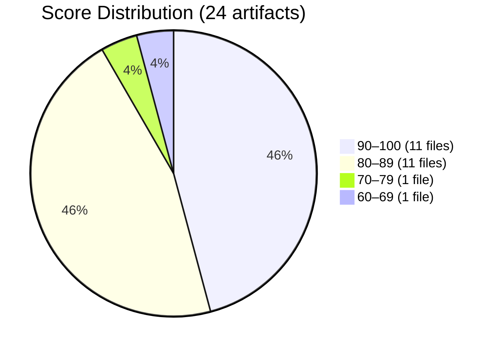
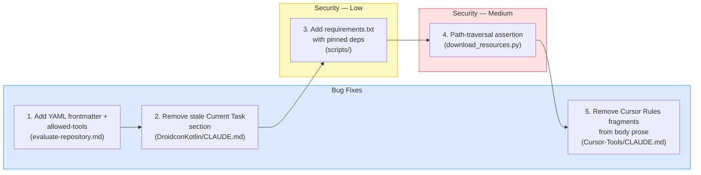
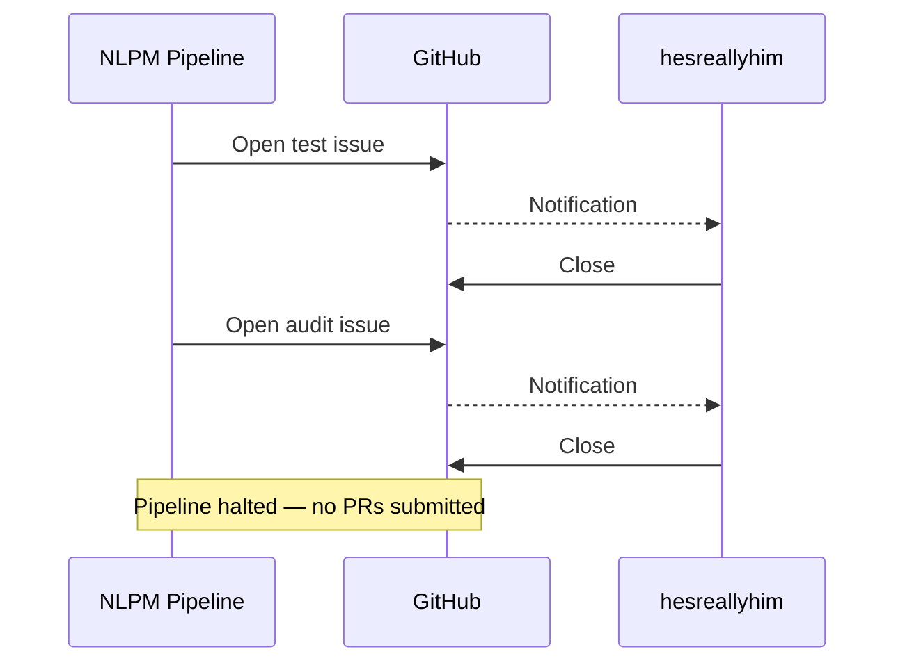
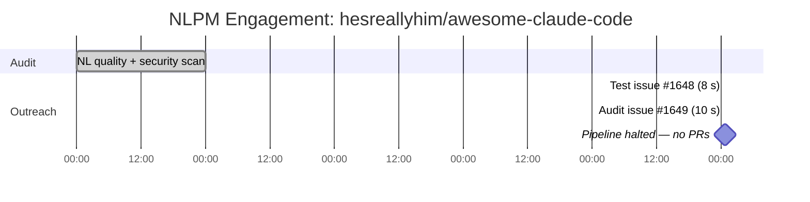

# The Curator's Paradox: Auditing the Repo That Judges Everyone Else

> **Disclosure**: This article was generated by an automated pipeline using Claude (Sonnet 4.6) based on audit data and GitHub records. It describes work performed by NLPM tooling maintained by [xiaolai](https://github.com/xiaolai). Readers should weigh claims accordingly.

---

## The Project

[hesreallyhim/awesome-claude-code](https://github.com/hesreallyhim/awesome-claude-code) is a curated list of skills, hooks, slash-commands, agent orchestrators, applications, and plugins for Claude Code by Anthropic. The repository is maintained by [Really Him](https://github.com/hesreallyhim) and has accumulated **40,303 stars** (as of audit date) and 3,339 forks, making it one of the most-referenced Claude Code resources on GitHub.

The repo occupies a structurally unusual position: it does not implement anything — closer to a museum guide than an exhibit. Its primary NL artifact is a single Claude Code command — `evaluate-repository.md` — that automates quality evaluation of other repositories. The remaining 23 NL artifacts are CLAUDE.md files gathered from external projects and stored as community reference examples under `resources/claude.md-files/`. Auditing it means applying a quality rubric to a collection of files the maintainer curated rather than authored — a question of editorial judgment as much as writing quality.

---

## The Audit

**Date**: 2026-04-16 | **Artifacts**: 24 | **Strategy**: batched

**NL Score: 89/100** | **Security: CLEAR**

The distribution is bimodal: 22 of 24 files cluster above 80, while one occupies each tail. The highest-scoring artifact — `resources/claude.md-files/Guitar/CLAUDE.md` — achieved 100/100 with no findings. The lowest — `.claude/commands/evaluate-repository.md` — scored 62/100, the only file fully under the maintainer's control — the reviewer's own work arriving last to its own evaluation.

**Score table (all 24 artifacts):**

| File | Type | Score | Top Issue |
|------|------|-------|-----------|
| .claude/commands/evaluate-repository.md | command | 62 | No YAML frontmatter; no allowed-tools declaration |
| resources/claude.md-files/Network-Chronicles/CLAUDE.md | context | 77 | Ephemeral implementation-plan notes; vague terms |
| resources/claude.md-files/SG-Cars-Trends-Backend/CLAUDE.md | context | 84 | Vague quantifiers: "appropriate" ×3, "concise" ×2 |
| resources/claude.md-files/AVS-Vibe-Developer-Guide/CLAUDE.md | context | 86 | Sparse: missing code style and architecture overview |
| resources/claude.md-files/claude-code-mcp-enhanced/CLAUDE.md | context | 86 | Instruction-override language; vague "meaningful" ×2 |
| resources/claude.md-files/AWS-MCP-Server/CLAUDE.md | context | 86 | Vague quantifiers: "appropriate" ×3, "robust" ×1 |
| resources/claude.md-files/Basic-Memory/CLAUDE.md | context | 86 | Vague quantifiers: "appropriate" ×3, "comprehensive" ×1 |
| resources/claude.md-files/Course-Builder/CLAUDE.md | context | 86 | Vague quantifiers: "appropriate" ×3, "comprehensive" ×3 |
| resources/claude.md-files/Note-Companion/CLAUDE.md | context | 86 | Missing build commands and project structure sections |
| resources/claude.md-files/DroidconKotlin/CLAUDE.md | context | 88 | Ephemeral "Current Task" section |
| resources/claude.md-files/JSBeeb/CLAUDE.md | context | 88 | Vague quantifiers: "appropriate" ×2, "complex" ×2 |
| resources/claude.md-files/Pareto-Mac/CLAUDE.md | context | 88 | Vague quantifiers: "appropriate" ×3, "complex" ×2 |
| resources/claude.md-files/Cursor-Tools/CLAUDE.md | context | 89 | Cursor Rules frontmatter embedded mid-document; autonomy-override language |
| resources/claude.md-files/Giselle/CLAUDE.md | context | 90 | Vague quantifiers: "meaningful" ×3, "unclear" ×1 |
| resources/claude.md-files/Anthropic-Quickstarts/CLAUDE.md | context | 94 | Vague quantifiers: "appropriate" ×2, "proper" ×1 |
| resources/claude.md-files/LangGraphJS/CLAUDE.md | context | 94 | Vague quantifiers: "appropriate" ×1, "proper" ×1, "relevant" ×1 |
| resources/claude.md-files/TPL/CLAUDE.md | context | 94 | Vague quantifiers: "appropriate" ×1, "proper" ×1 |
| resources/claude.md-files/Perplexity-MCP/CLAUDE.md | context | 95 | No code style guidance for server development |
| resources/claude.md-files/Lamoom-Python/CLAUDE.md | context | 96 | Vague quantifiers: "appropriate" ×2 |
| resources/claude.md-files/SPy/CLAUDE.md | context | 96 | Mismatched quote in command example |
| resources/claude.md-files/Comm/CLAUDE.md | context | 98 | Vague "Descriptive variable names" |
| resources/claude.md-files/EDSL/CLAUDE.md | context | 98 | Minor: "appropriate" logging levels |
| resources/claude.md-files/AI-IntelliJ-Plugin/CLAUDE.md | context | 98 | Vague "complex logic" in documentation rule |
| resources/claude.md-files/Guitar/CLAUDE.md | context | 100 | None |

**Weighted average**: 2145 / 24 = **89/100**

**Top issues by category:**

| Category | Findings | Notes |
|----------|----------|-------|
| Vague quantifiers | 14 of 21 quality issues | "appropriate" appears across 6 files |
| Ephemeral state in context files | 2 | "Current Task" note; implementation-plan prose |
| Structural gaps | 2 | Missing build/test commands |
| Instruction-override language | 2 | "supersede" pattern; permission-expansion |
| Malformed embedded syntax | 1 | Cursor Rules fragments in CLAUDE.md body |

**Security findings:**

| Severity | Count |
|----------|-------|
| Critical | 0 |
| High | 0 |
| Medium | 3 |
| Low | 2 |

All five security findings are confined to maintenance scripts under `scripts/`. No hooks, no `shell=True` subprocess calls, no hardcoded credentials. The three medium findings cover SSRF risk in link validation (`validate_links.py`), path-traversal exposure in resource downloads (`download_resources.py`), and an unverified POST destination in the ticker SVG generator (`generate_ticker_svg.py`). The two low findings are unpinned script dependencies and subprocess argument handling — safe as written, noted for defensive hygiene.

**Fairness note**: 23 of 24 audited files were authored by external developers and gathered by this maintainer as reference material. Quality issues in those files reflect upstream authoring choices. The one artifact written entirely by the maintainer — `evaluate-repository.md` — scored lowest, at 62/100. An 89/100 aggregate on a collection of external CLAUDE.md files is a reasonable outcome; interpreting it as a score on the maintainer's own writing requires a narrower lens — and a fair one would find mostly careful curation.

---

## Outreach and Response

No pull requests were submitted to this repository.

The pipeline opened two tracking issues as part of its outreach sequence. Both were closed within seconds of creation — like letters returned before they were read. The circuit-breaker halted further action before any PR was opened.

| Issue | Title | Created | Closed | Duration |
|-------|-------|---------|--------|----------|
| [#1648](https://github.com/hesreallyhim/awesome-claude-code/issues/1648) | [NLPM Audit] Test issue - please ignore | 2026-04-21T00:38:29Z | 2026-04-21T00:38:37Z | 8 seconds |
| [#1649](https://github.com/hesreallyhim/awesome-claude-code/issues/1649) | [NLPM Audit] Automated quality audit: 4 bugs + 2 security fixes identified | 2026-04-21T00:42:40Z | 2026-04-21T00:42:50Z | 10 seconds |

Four identified defects were addressed by three proposed bug-fix patches (B1 bundles two defects — missing YAML frontmatter and missing `allowed-tools` — into a single PR). Of the five security findings, two were proposed as patches (S1, S2); the three remaining medium findings were flagged informational-only. None were delivered. The intended priority order, for the record:

**Procedural gap**: Contribution guidelines for this repository were not reviewed before issues were filed. We did not check whether a CONTRIBUTING.md or bot policy existed; one may or may not have been in place. Rapid closure may reflect policy enforcement rather than a reaction to the specific audit findings.

Whether the closures were manual or automated is not recorded. A ten-second response time is consistent with both an active maintainer with a clear no-bot policy and an automated issue-close rule for unrecognized senders — a bouncer who works from a list, not a conversation. No further contact was made; the interpretation of the signal is necessarily one-sided.

---

## What the Audit Revealed

`evaluate-repository.md` is a slash-command that automates quality evaluation of external repositories — fetching their NL artifacts, applying the evaluation prompt, and surfacing findings. It is the only artifact in this collection that the maintainer authored directly.

**The command scored 62/100 under NLPM's rubric — though broad tool access may be intentional for an open-ended evaluation workflow; NLPM penalizes undeclared access regardless.** It scores below all 23 externally authored files in the collection. Missing YAML frontmatter means the command appears in the picker without a description, if no other description mechanism is present — a command that evaluates everything except its own first impression. Missing `allowed-tools` leaves tool access undeclared for a command that evaluates arbitrary external repositories — broad tool access may be intentional for this use case, but its absence is unacknowledged in the file itself.

**Vague quantifiers dominate the quality signal.** 14 of 21 distinct quality findings are vague-quantifier hits. "Appropriate" appears across six separate files. These are the default vocabulary of hurried context files — words chosen when a more precise alternative wasn't at hand — the written equivalent of a shrug. Across a collection that positions itself as community reference material, the prevalence is worth noting; it is also distributed unevenly, concentrated in files from repos with less documented engineering practice. Note that the vague-quantifier penalty was designed for files giving Claude actionable instructions; community reference files intended to illustrate approaches may use looser language by design.

**Ephemeral state committed to shared context is a structural failure mode.** Two files contained transient content: a "Current Task: Cleaning up the app and prepping for release" note in DroidconKotlin/CLAUDE.md and implementation-plan prose in Network-Chronicles/CLAUDE.md. CLAUDE.md files persist indefinitely; task state does not. These are development-session artifacts that weren't cleaned up before commit — sticky notes left on the whiteboard that ended up in the company handbook.

**Instruction-override language appears in two files.** `claude-code-mcp-enhanced/CLAUDE.md` contains "these standards supersede any conflicting instructions you may have received previously." `Cursor-Tools/CLAUDE.md` contains permission-expansion language ("Don't ask me for permission to do stuff"). NLPM penalizes these patterns as autonomy-reduction risks — but both files were designed for specific environments (MCP-enhanced agents, Cursor IDE) where overriding defaults is expected behavior. NLPM's rule may be calibrated for general CLAUDE.md files, not specialized deployment configs — penalizing the surgeon for carrying a scalpel.

**Security posture is clean.** Zero critical or high findings — the security surface is clean. The five findings are all scoped to maintenance tooling, not the artifact surface exposed to end users.

**Curation repos are an edge case for NLPM's scoring rubric.** The rubric was designed for artifacts owned and authored by the target maintainer. Applying it to a collection of externally authored CLAUDE.md files conflates editorial curation decisions with writing quality. A high score here partly means "the upstream repos this collection featured wrote well"; a low score partly means "some upstream repos did not." Separating the two requires artifact-level attribution the rubric does not currently perform.

---

## Timeline

Five days separated the audit run from the outreach attempt — normal batch scheduling lag. The audit itself took a full day. Both outreach events resolved in under a minute each. Four minutes separated the two issues; under ten seconds resolved each one.

---

## Limitations

**We do not know who or what closed the issues.** Ten-second closure times are consistent with automation but are not exclusively explained by it. No comment records the reason.

**Rapid closure does not evaluate the findings.** The four bugs and five security findings were identified against audit evidence. No maintainer feedback confirmed or disputed their accuracy.

**The audit covered 24 of many more artifacts.** The repo contains substantially more content. An 89/100 is a sample estimate against the batched artifact set, not a whole-repo measurement.

**23 of 24 files were authored externally.** Quality penalties for vague writing in files the maintainer gathered rather than wrote should be understood as measurements of the collection, not of the maintainer's prose.

**Contribution guidelines were not checked before outreach.** For a 40,000-star repository, this is a procedural gap. The pipeline should review CONTRIBUTING.md before opening issues.

**Curation repos may fall outside NLPM's intended target profile.** The scoring rubric does not distinguish between files authored and files curated. Findings in externally authored content may not be actionable by this repo's maintainer.

---

## Significance

The engagement produced no real-world improvement to the target repository. The pipeline was stopped before the first PR was filed — it noted the architecture from the street. No bugs were patched; no security fixes were submitted; the findings were never delivered to a human reviewer.

The result is better understood as a deployment signal than an audit failure. A repository with 40,303 stars receives automated noise at scale. Consistent ten-second closures applied to both a labeled test issue and a substantive audit notification are consistent with deliberate policy rather than oversight — a not-unreasonable posture for a high-traffic project that did not invite the outreach.

The audit showed the scoring pipeline produces consistent file-level scores on heterogeneous collections — though the inability to deliver findings limits practical validation. The 89/100 aggregate reflects real quality signal across the collected files; the score reflects how these files perform against NLPM's rubric, not an independent assessment of their quality. Without a distribution of scores across NLPM-audited repos, it is difficult to assess whether 89/100 is exceptional or typical for a well-curated collection. Whether that signal is useful to this maintainer depends on whether they view their role as curator, author, or both.

The paradox named in this article's title has a structural resolution: a scoring rubric applied to curation repos needs an authorship-attribution mode — the ability to distinguish files the maintainer wrote from files the maintainer collected. Without it, aggregate scores conflate two distinct quality questions. That is a calibration gap in NLPM's rubric, not a finding about the repo — and honest enough to name itself as the problem.

The command still lacks frontmatter and `allowed-tools`. DroidconKotlin's CLAUDE.md still contains a stale task note. Cursor-Tools still has embedded Cursor Rules fragments. These findings are waiting in a closed issue — undelivered, like a letter slipped under a door that was already locked.
