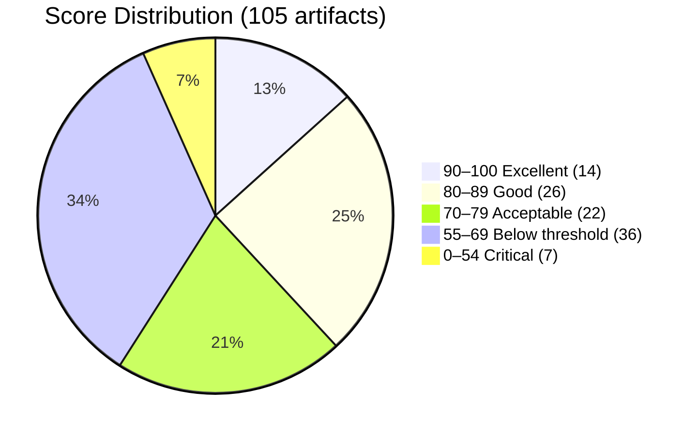
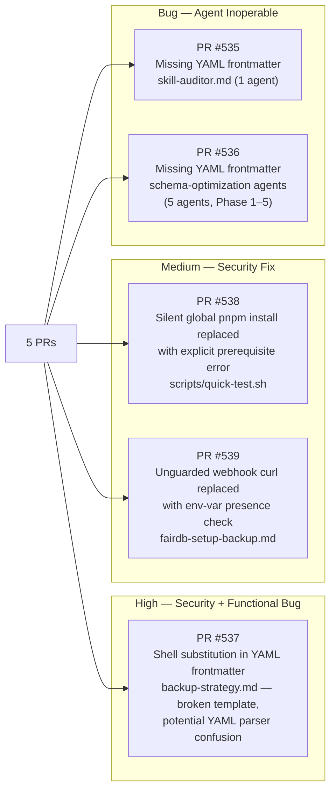
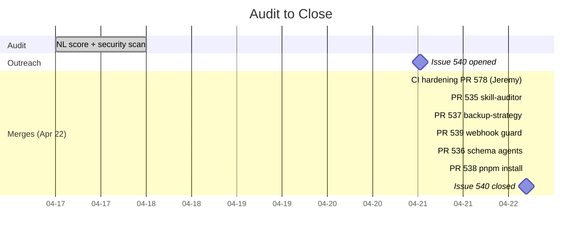

# The Fix That Fixed the Fixer: 423 Plugins, 73 Points, and a Validator That Learned New Tricks


> **Disclosure**: This article was generated by an automated pipeline using Claude (Sonnet 4.6) based on audit data and GitHub records. It describes work performed by NLPM tooling maintained by [xiaolai](https://github.com/xiaolai). Readers should weigh claims accordingly.

---

## The Project

[jeremylongshore/claude-code-plugins-plus-skills](https://github.com/jeremylongshore/claude-code-plugins-plus-skills) is an open-source Claude Code marketplace maintained by [intentsolutions.io](https://github.com/jeremylongshore). As of the audit it held 1,998 stars and 268 forks, with 423 plugins, 2,849 skills, and 177 agents available through the `ccpi` CLI package manager and the companion site at tonsofskills.com.

The scale sets the stakes. At nearly 3,300 NL artifacts, even a small defect rate produces a large absolute bug count — like a bridge where a 99.9% bolt-torque pass rate still ships three unsecured bolts per span. The audit sampled 105 representative artifacts — 31 agents and 74 commands — covering the active plugin directories, workspace lab files, and `.claude/agents/`.

---

## The Audit

The NLPM audit ran on 2026-04-17. The audit issue was opened four days later on 2026-04-21, following the batch-processor queue and a manual triage step before outreach. Scoring covered 105 artifacts against the 100-point quality scale.

**Overall NL Score: 73/100** — above the default 70-point passing threshold, on a sample deliberately weighted toward known rough areas (see Limitations). Security posture: **REVIEW** (0 critical, 2 high, 5 medium, 2 low).



The distribution is lopsided in both directions at once — two repositories wearing the same score. The top 38% of artifacts are genuinely good — the Geepers multi-agent suite, FairDB operational commands, and Freshie inventory pipeline all show coherent structure, consistent naming, and working frontmatter. The bottom 41% drag the average down sharply: 36 artifacts fall below the default 70-point threshold, and 7 scored in the critical band (30–55).

**Top penalty patterns:**

| Pattern | Artifacts Affected | Max Penalty |
|---|---|---|
| Zero YAML frontmatter — agent/command cannot load | 7 | −70 per file |
| Shell substitution in YAML `description` field | 1 + 20 backfill | −50 per file |
| Missing required `name` field | 10 | −25 per file |
| No `<example>` blocks | 31 | −15 per file |
| No `allowed-tools` declaration | 33 | −5 per file |

**Security summary:**

The 9 findings divide cleanly into two risk classes. The two HIGH findings are both correctness defects with security implications: unevaluated shell substitutions in YAML frontmatter (`backup-strategy.md`) that produce a literal shell expression as the field value instead of the expected truncated text, and a `sudo rm -rf` against a PostgreSQL data directory (`incident-p0-disk-full.md`) without a target-path safety guard. The five MEDIUM findings cover a runtime global package install that pollutes the system environment, a credential passed via process-visible `ps aux` env var, an unguarded webhook `curl` call, and pervasive `sudo` usage across operational commands.

A fair framing: most of the low-scoring artifacts live in two isolated areas — a `backups/` directory containing timestamped plugin snapshots from a bulk-enhancement pipeline, and a `workspace/lab/` directory of experimental pipeline code. The active production plugins score significantly better. The median score conceals two populations: a well-maintained core and a noisy trailing edge.

---

## What Was Submitted

The pipeline's PR tracking file was not populated at the time the evidence was collected. What follows is reconstructed from merged commit records, which are the canonical evidence of what shipped. Note: PR records were unavailable at evidence collection time, so co-authorship and PR descriptions below are inferred from commit metadata rather than PR metadata.

Five pull requests were submitted by NLPM tooling, likely co-authored by `claude[bot]`. On GitHub, PRs and issues share a counter; PRs #535–539 carry lower numbers than audit issue #540, indicating they were submitted before or alongside the issue being opened — the pipeline creates fix PRs and opens the notification issue in the same batch. All five were merged by the maintainer within a 4-minute window on 2026-04-22 — less time than most CI pipelines take to acknowledge a push.



**PR #535** — [commit d2614d1](https://github.com/jeremylongshore/claude-code-plugins-plus-skills/commit/d2614d1257c8d2a8635149788821dcd34b341fa0): Added `name` and `description` frontmatter to `.claude/agents/skill-auditor.md`. The agent contained detailed multi-phase audit methodology but had no frontmatter block, making it unloadable by Claude Code — a fully-staffed kitchen behind a door marked "staff only" with no handle on the outside.

**PR #536** — [commit 41d827](https://github.com/jeremylongshore/claude-code-plugins-plus-skills/commit/41d827123bf0e9254a232baaf7ee0055d2f7ef31): Added YAML frontmatter to all five `workspace/lab/schema-optimization/agents/phase_*.md` files. These agents implement a sequential BigQuery schema optimization pipeline with defined JSON I/O contracts — functional as documentation, unusable as agents.

**PR #537** — [commit ede8844](https://github.com/jeremylongshore/claude-code-plugins-plus-skills/commit/ede8844dfb925638b20812e01fd97cfdd01573f5): Replaced unevaluated template expressions in `backup-strategy.md` YAML frontmatter. The `description` field contained `$(echo "$description" | cut -d' ' -f1-5)` and the body used `$(echo "$name" | sed ...)` — shell substitution syntax that YAML parses as a valid scalar string but never evaluates, so the field value is the literal shell expression rather than the intended truncated text, producing a non-functional command — the file read like valid YAML right up until anyone tried to use it. (The generator-template scenario — where these expressions are meant to be instantiated by an outer script before writing — is also plausible; either way, the delivered file is non-functional as written.)

**PR #538** — [commit 92f96ba](https://github.com/jeremylongshore/claude-code-plugins-plus-skills/commit/92f96ba1e700501d7ae76f13a088d3d3e7d0ef28): Replaced `npm install -g pnpm@9.15.9` (run silently during test execution) with an explicit error message directing users to `corepack enable pnpm`. The silent global install caused unexpected global environment mutation — a side-effecting CI step that polluted the system environment without warning.

**PR #539** — [commit 87eadd2](https://github.com/jeremylongshore/claude-code-plugins-plus-skills/commit/87eadd26cead23d6f8a5f5a31dea903b1b1b2d44): Added `[[ -n "${FAIRDB_MONITORING_WEBHOOK:-}" ]]` guard before the `curl` notification call in `fairdb-setup-backup.md`. The unguarded call would fail with a curl error on unconfigured environments; the guard is good hardening practice even though a connection error is the realistic failure mode.

---

## The Response

Jeremy merged all five PRs. That is what the pipeline measures. What made this engagement unusual was what came alongside the merges — not a reply, but a response.

At 04:26:11Z on April 22 — nine minutes before the first NLPM PR was merged — Jeremy pushed [commit f84d3ab](https://github.com/jeremylongshore/claude-code-plugins-plus-skills/commit/f84d3abde0e3637e94c0b8cdbd50a8f08f107f9e) directly to main, a 500-line CI hardening commit authored in direct response to the audit issue (#540). (The sequence diagram below labels this as "PR #578" for reference; PR metadata was unavailable at evidence collection time, so it is not confirmed whether a PR existed or this was a direct push.) Its own commit message describes what it fixed:

- `scripts/validate-skills-schema.py` now scans `.claude/agents/` and `workspace/**/agents/` in addition to `plugins/` — the precise blind spot that made the six agent frontmatter bugs invisible to existing CI.
- A new `check_yaml_shell_substitution()` function flags `$(...)`, backticks, and unguarded `${VAR}` in YAML string values. The same shell-substitution pattern the pipeline found in `backup-strategy.md` was present in **20 additional command files** across `plugins/devops/` — the CI expansion caught them all.
- A new `secret-scan.yml` workflow runs gitleaks on every PR and trufflehog weekly, replacing an ad-hoc regex scan that the maintainer noted was triggering on documentation files that described the very patterns it was scanning for.
- A new `.gitleaks.toml` extends upstream defaults with credential shapes for Anthropic, Groq, and Firebase/GCP — directly addressing the credential-scanning gap identified in the audit.
- PR trigger paths were extended to `scripts/**`, `.claude/**`, and `workspace/**`, closing a CI gap where changes in those directories silently skipped validation.

The commit's closing line: *"Jeremy made me do it / —claude"* — suggesting the hardening commit was AI-assisted, though the line may also be a humorous attribution rather than a literal claim — either way, a quiet acknowledgment that the diagnosis came from somewhere worth naming.

```mermaid
sequenceDiagram
    participant N as NLPM Pipeline
    participant GH as GitHub
    participant J as Jeremy (intentsolutions.io)

    N->>GH: Open issue #540 (2026-04-21 00:40Z)
    GH-->>J: Notification
    J->>GH: Commit CI hardening — PR #578 (04:26Z)
    Note over J,GH: Validator now scans .claude/ + workspace/;<br/>adds gitleaks + shell-subst checks;<br/>backfills 20 more files same bug
    J->>GH: Merge PR #535 — skill-auditor frontmatter (04:35Z)
    J->>GH: Merge PR #537 — backup-strategy fix (04:35Z)
    J->>GH: Merge PR #539 — webhook guard (04:35Z)
    J->>GH: Merge PR #536 — schema agents frontmatter (04:39Z)
    J->>GH: Merge PR #538 — pnpm install (04:39Z)
    J->>GH: Close issue #540 (04:43Z)
```

Issue #540 was open for approximately 28 hours. The merge window lasted 17 minutes.

---

## What the Audit Revealed

**The CI blind spot was structural.** The validator scanned `plugins/` but not `.claude/agents/` or `workspace/**/agents/`. This is a reasonable initial scope that turns into a real gap as a project grows beyond its original layout — the kind of blind spot you only notice when something crawls in from outside the fence. The audit surfaced six agents that had been invisible to CI since they were created.

**Backup archives as a noise amplifier.** The `backups/` directory contains versioned plugin snapshots from a mass-enhancement pipeline. These inflate the raw bug count substantially — 10 of the 18 mechanical bugs are missing `name` fields in backup-command files. These are pre-enhancement snapshots, not deployed artifacts. The audit flags them correctly as defects (they are broken files on disk), but a consumer should weight them differently than bugs in active plugins.

**The shell-substitution pattern propagated silently.** The `$(echo "$description" | cut ...)` template expression appears in `backup-strategy.md` and in 20 additional devops command files. This is likely a code-generation artifact — a template that was never instantiated. It escaped detection because the validator wasn't checking YAML string values for shell syntax.

> **Credit note:** NLPM identified the pattern in one file; Jeremy's CI expansion found 20 additional instances — 95% of the total. The more impactful discovery came from the maintainer's own tooling once it was pointed at the right pattern.

The audit found one; Jeremy's CI fix found the other 20. In open source, it's perfectly fine to arrive second with the right answer.

**The fairness note on score interpretation.** A 73/100 weighted average across 105 artifacts drawn from a 3,300-artifact repository is not a grade for the repository — it is a core sample, not a survey. It is a grade for the sample, which was chosen to include known-rough areas (workspace lab, backup archives, `.claude/agents/`). The Geepers plugin scored 91–93 across 15 agents. FairDB commands scored 85–88. These are the production-quality artifacts a user would actually install. The score reflects what the auditor found, not a representative average of the full marketplace.

---

## Timeline



---

## Limitations

The audit sampled 105 of approximately 3,300 NL artifacts in the repository. The sample was deliberately weighted toward areas likely to contain issues (workspace lab, backup archives, `.claude/agents/`) — this means the 73/100 score should not be extrapolated as a marketplace-wide quality estimate.

The `backups/` directory was not scanned for security issues in the archive contents, only the active execution surfaces. A thorough security audit would need to examine what the backup-pipeline scripts do and whether archived plugin versions contain unsafe patterns not present in current versions.

Pull request records were unavailable at evidence collection time; the PR descriptions, reviewer exchanges, and any inline comments are not captured here. The merge narrative above is reconstructed entirely from commit metadata.

The audit does not evaluate whether the plugins actually work — whether the agents produce correct outputs, whether the commands achieve their described goals, or whether the skills provide accurate technical guidance. NL scoring measures structural quality of the artifact files, not runtime correctness.

**Two security findings were not addressed by the submitted PRs.** The `sudo rm -rf` against a PostgreSQL data directory in `incident-p0-disk-full.md` (HIGH severity — no target-path guard) and the credential passed via process-visible `ps aux` env var (MEDIUM severity) remain unpatched as of the close of this engagement. Readers treating this case study's "security posture: REVIEW" framing as resolved should consult the repository directly to confirm current status.

---

## Significance

Five bugs were fixed. More notably, a CI system was expanded to catch a class of defects it had been blind to. The shell-substitution check Jeremy added in response to one NLPM finding went on to surface 20 additional instances of the same pattern. The agent-path expansion closed a structural gap that would have silently admitted new broken agents indefinitely.

The pipeline's job is to find things and report them. What the maintainer does with the report determines whether the work matters. In this case the maintainer read the issue, reproduced the underlying causes, and addressed the root problems — not just the individual files NLPM flagged. That outcome is outside what any automated audit can guarantee; it is specific to this maintainer and this project. Maintainer response rates and engagement depth vary considerably across projects; a 5/5 acceptance rate with no disputed findings is notably clean — worth flagging as unusually frictionless, not typical. Response rates, fix quality, and turnaround differ project by project; some audits end in silence, some end in an afternoon.

The issue was open for 28 hours. The merge window was 17 minutes.
