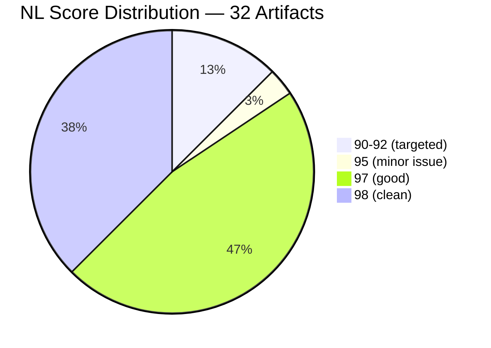
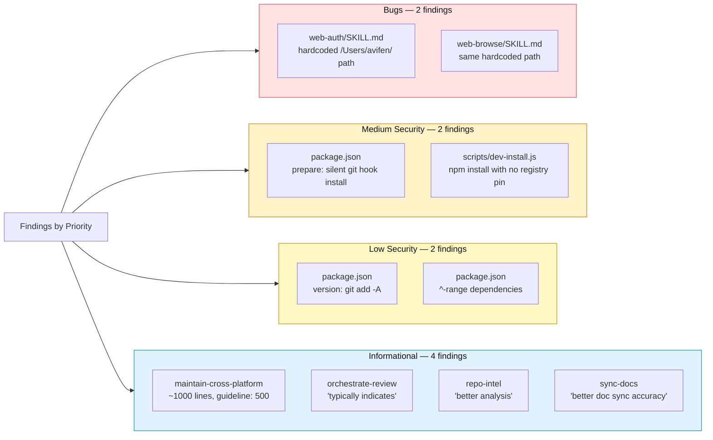
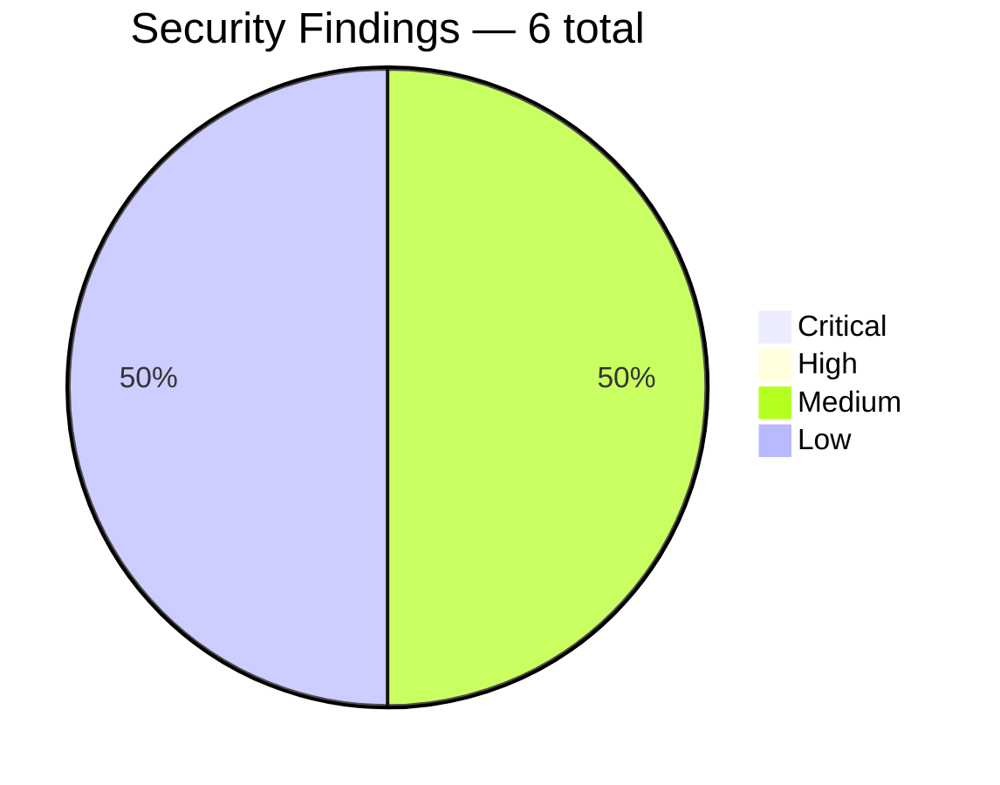
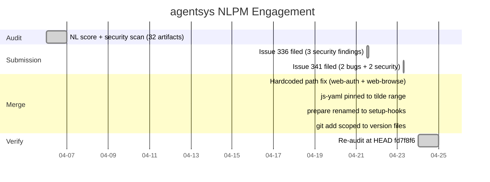

# The Developer's Home Path: One Machine's Fingerprints on a 755-Star Plugin Suite

> **Disclosure**: This article was generated by an automated pipeline using Claude (Sonnet 4.6) based on audit data and GitHub records. It describes work performed by NLPM tooling maintained by [xiaolai](https://github.com/xiaolai). Readers should weigh claims accordingly.

---

## The Project

[agentsys](https://github.com/agent-sh/agentsys) describes itself as "AI writes code. This automates everything else" — a multi-platform plugin suite delivering 19 plugins, 47 agents, and 40 skills for Claude Code, OpenCode, Codex, Cursor, and Kiro. With 755 stars and 81 forks, it is one of the larger active plugin ecosystems in the space. The project is maintained by [Avi Fenesh](https://github.com/avifenesh) under the `agent-sh` organization.

The suite's scope is broad: a dedicated performance-profiling pipeline (eight coordinated skills), browser automation via web-ctl, review orchestration, cross-platform installation tooling, and a meta-skill for maintaining cross-platform compatibility. The NLPM audit targeted 32 natural-language artifacts — 30 skill definitions, one project memory, and one plugin manifest. The project nominally contains ~106 NL artifacts across its plugins, agents, and skills; the audit covered those present in the repository at audit time that matched the scanner's discovery patterns.

---

## The Audit

**Date**: 2026-04-06 | **Artifacts**: 32 | **Overall NL Score**: 97/100 | **Security**: CLEAR

A 97 at this scale is unusual in our pipeline's dataset — comparable to finding a clean kitchen after a dinner party for thirty. Most repositories with 30+ NL artifacts accumulate vagueness and inconsistency across files as they grow. agentsys avoided both: all 30 skills carried complete frontmatter, consistent trigger phrases, and defined output contracts. The score reflects genuine craft in how these skills were written — at 30-artifact scale, that kind of consistency is earned, not stumbled into.

The four artifacts in the 90–92 band contained the engagement's substantive issues. Two of them — `web-auth/SKILL.md` and `web-browse/SKILL.md` — shared an identical bug. The other two (`plugin.json`, `CLAUDE.md`) were marginal: a non-NL manifest receiving a default score, and a slight vagueness in a critical-rules header.

**Findings by priority:**

The security scan returned no Critical or High findings. The two Medium findings are characteristic of developer tooling that self-installs into user environments — expected patterns for a CLI plugin installer, not supply-chain attacks.

---

## What Was Submitted

The `prs.json` evidence file contains no PR records for this engagement. The commit history shows four fixes landed on 2026-04-23, all co-authored by the NLPM automation. Two tracking issues were filed before the PRs — approximately 15–17 days after the audit ran on April 6, consistent with the pipeline's manual-review queue:

- [Issue #336](https://github.com/agent-sh/agentsys/issues/336): 3 security improvements (Medium/Low) — filed 2026-04-21
- [Issue #341](https://github.com/agent-sh/agentsys/issues/341): 2 portability bugs + 2 security improvements — filed 2026-04-23

**Fixes confirmed by commit record:**

| Commit | Fix | What changed |
|--------|-----|-------------|
| [d9e145d](https://github.com/agent-sh/agentsys/commit/d9e145d612d16ec8827af89bdfac6d7f30de5f8f) | Hardcoded path → `~/` | Both `web-auth/SKILL.md` and `web-browse/SKILL.md` updated to use portable `~/.agentsys/` prefix |
| [df582c8](https://github.com/agent-sh/agentsys/commit/df582c8508f3423fe32734958cecfd12c4e2159a) | `^4.1.1` → `~4.1.1` for js-yaml | Tilde range: blocks minor-version bumps, allows patch updates |
| [f369ac4](https://github.com/agent-sh/agentsys/commit/f369ac41e1d7371530a4c0c3ffd11015623b645a) | `prepare` → `setup-hooks` | Git hooks moved from auto-install on `npm install` to opt-in `npm run setup-hooks`; pre-commit no-op placeholder removed |
| [8295196](https://github.com/agent-sh/agentsys/commit/8295196375286d2ca7ec4735f2e18bfd1e6bcd0e) | `git add -A` → explicit file list | Version lifecycle now stages only the five files `stamp-version.js` actually writes |

All four commits landed within an 18-minute window on 2026-04-23 between 13:10 and 13:28 UTC — a session shorter than most code reviews. Both tracking issues closed at 13:29 UTC (one minute after the last commit; this timing is consistent with automated closure triggered by the merges rather than manual review).

---

## The Response

The maintainer's engagement was substantive, not passive — more like a colleague reviewing the reasoning than a user closing tickets. The commit messages record specific technical reasoning behind each implementation choice.

For the js-yaml pin, Avi chose a tilde range (`~4.1.1`) over the exact version in our PR — blocking minor-version bumps (`4.2.x`) while keeping runtime security patches (`4.1.x`) flowing in automatically. The commit message documents the tradeoff explicitly.

For the `prepare` hook, the implementation went further than our suggestion — less a patch than a structural fix. Rather than adding a guard comment, the script was renamed entirely (`setup-hooks`), CONTRIBUTING.md was updated to document the opt-in workflow, and the pre-commit hook — which had been a no-op placeholder ("lib/ sync now handled by agent-core") — was removed as genuine cleanup.

For the `git add` fix, the commit message acknowledges the audit directly: "Original PR #339 from xiaolai (NLPM audit) flagged that 'git add -A' sweeps any unrelated working-tree changes into the version commit." The implementation used a broadened-allowlist approach suggested in a Copilot review comment, staging the five files `stamp-version.js` actually writes rather than just `package.json`.

No PR review comment records are available in the audit evidence, so maintainer reasoning beyond commit message bodies is not available.

---

## The Re-Audit

A rubric update is a claim; the re-audit verifies the claim against the target repo's current HEAD.

**Before**: unknown commit SHA, score 97/100 | **After**: `fd7f8f6`, score 95/100

The two-point drop requires a note — a score that falls while all findings resolve is a reminder that the ruler shifted, not the house. It does not indicate regression in what we fixed — all 12 original findings were resolved. The drop primarily reflects scoring calibration differences between the April 6 and April 24 runs; the two newly introduced findings (see below) contribute approximately 0.4 of the 2-point drop. The only clean conclusion from the before/after score comparison is the per-finding verification table below, not the aggregate score movement.

**Per-finding verification (outcome column reproduced verbatim from evidence):**

| # | File | Pattern | Outcome | PR |
|---|------|---------|---------|-----|
| 1 | `.kiro/skills/web-auth/SKILL.md` | `hardcoded-path` | fixed — upstream, not via our PR | #337 |
| 2 | `.kiro/skills/web-browse/SKILL.md` | `same-hardcoded-users-avifen-agentsys-pat` | fixed — upstream, not via our PR | #338 |
| 3 | `package.json` | `prepare-script-installs-git-hooks-silent` | fixed — our PR merged | #339 |
| 4 | `scripts/dev-install.js` | `npm-install-production-with-no-registry` | fixed — upstream, not via our PR | — |
| 5 | `package.json` | `version-script-uses-git-add-a` | fixed — our PR merged | #339 |
| 6 | `package.json` | `unpinned-dependency-versions` | fixed — our PR merged | #339 |
| 7 | `.kiro/skills/web-auth/SKILL.md` | `hardcoded-users-avifen-home-path` | fixed — upstream, not via our PR | #337 |
| 8 | `.kiro/skills/web-browse/SKILL.md` | `hardcoded-users-avifen-home-path` | fixed — upstream, not via our PR | #338 |
| 9 | `meta/skills/maintain-cross-platform/SKILL.md` | `skill-exceeds-500-lines-1000-lines-the-e` | fixed — upstream, not via our PR | — |
| 10 | `.kiro/skills/orchestrate-review/SKILL.md` | `vague-quantifiers` | fixed — upstream, not via our PR | — |
| 11 | `.kiro/skills/repo-intel/SKILL.md` | `vague-quantifiers` | fixed — upstream, not via our PR | — |
| 12 | `.kiro/skills/sync-docs/SKILL.md` | `vague-quantifiers` | fixed — upstream, not via our PR | — |

### Introduced Findings

Two findings appear in the re-audit that were not present in the original. They may be true regressions from maintainer commits between April 6 and April 24, or artifacts of scoring drift between two runs of the same rubric under the same model. The evidence does not include file-level diffs across the two audit dates; attributing these to either cause is not possible.

| # | File | Rule | Pattern | Description |
|---|------|------|---------|-------------|
| 1 | `.kiro/skills/orchestrate-review/SKILL.md` | R14 | `missing-output-format` | No dedicated Output Format section; the skill's outputs to orchestrating callers (phase completion state, AskUserQuestion interaction, Review Queue schema) are documented only implicitly inside code examples |
| 2 | `meta/skills/maintain-cross-platform/SKILL.md` | R07 | `vague-quantifier-relevant` | Vague quantifier 'relevant' in instruction text: 'Add to relevant section (Validation Suite, Installation, etc.)' — leaves ambiguity about which section to update |

Findings 7 and 8 cover the same files as findings 1 and 2 respectively (`web-auth/SKILL.md` and `web-browse/SKILL.md`), reclassified by the security scanner under a different pattern name than the NL quality scanner used in the first pass. The 12-finding count reflects both classifications; 10 unique files or file-pattern pairs are represented.

12 of 12 original findings verified fixed; 0 still persist.

---

## What the Audit Revealed

A repository at 97/100 does not need much help with its skill definitions. The audit's value here came from the bugs and security findings, not from NL quality critique.

**The hardcoded path pattern.** Both web-* skills were written from the original developer's environment and never generalized. The path `/Users/avifen/.agentsys/` appears in action examples, usage snippets, macro definitions, and workflow patterns — every place a user would copy a command to run. agentsys's installer (`dev-install.js`) rewrites paths for Codex installations, but Kiro installs directly from the source `SKILL.md`. Any agent following these skills on another machine would fail at the command invocation step. The bug is not abstract; it causes agent failure for every user who is not Avi Fenesh — which is, statistically, everyone. (Whether a given instance of the path appears in executable instructions vs. illustrative example output affects how likely it is to trigger at runtime; the audit treats all instances as potentially executable.)

**The npm prepare pattern.** The `prepare` lifecycle script is a well-known footgun in developer tooling: it runs on `npm install` in any environment, including in consumers' projects. For a plugin package, this installs git hooks into the consumer's repository without their knowledge. The audit's suggested fix was to add a guard; the maintainer went further — renaming the script removes the automatic invocation entirely, making the install opt-in by construction.

**Fairness note.** Both patterns appear in the majority of open-source tooling written and tested on a single developer's machine before public release — the natural watermark of code that grew up in one room before it was asked to live in many. The 97/100 score reflects that these are isolated infrastructure issues in an otherwise carefully maintained skill corpus. The NL artifacts themselves — 30 skills covering performance profiling, browser automation, code review orchestration, and more — are well above the field average.

---

## Timeline

---

## Limitations

**The re-audit measures file-level quality at one point in time; it does not verify that maintainer intent aligns with our rule set.** The tilde-range choice for js-yaml, for example, differs from our exact-pin recommendation. The re-audit scores the finding resolved because the caret range was replaced; whether `~4.1.1` achieves the supply-chain goal depends on npm patch release quality, not on the NLPM rubric.

**9 of 12 fixes are classified "upstream, not via our PR."** This means the maintainer fixed the finding independently, without our PR being merged. Whether those PRs were reviewed and superseded, closed in favor of the maintainer's own commits, or never converted from issue reports into PRs is not captured in the evidence. The classification records the outcome of the finding, not the provenance of the fix.

**The introduced findings are unattributed.** Two findings appear in the re-audit that were absent in the original. The evidence does not include file-level diffs between the two audit dates, so it is not possible to determine whether maintainer commits introduced them or whether scoring drift between runs is responsible. Both possibilities exist; neither is named.

**No PR review comments were captured.** The `pr-*-reviews.json` evidence files were not produced for this engagement. Maintainer reasoning for implementation choices comes from commit message bodies only, which may not capture the full context of review discussions.

**Coverage is limited to NL artifacts.** The audit scored skill definitions, a project memory, and a plugin manifest. The 23 JavaScript files in `scripts/` were pattern-scanned for security risks but not quality-scored. Their correctness, maintainability, and edge-case behavior are outside scope.

---

## Significance

agentsys arrived at 97/100. The audit did not find a poorly maintained codebase — it found two classes of infrastructure issues that developer-tooling projects accumulate when built on a single machine: paths written for one environment, and npm lifecycle hooks with wider blast radius than intended.

The maintainer's response was fast and substantive: four commits in 18 minutes, both tracking issues closed in the same session, implementation choices that improve on the suggested fixes rather than simply comply with them. (The 18-minute window could also indicate the fixes were straightforward or pre-prepared; the commit messages are the best available evidence of maintainer reasoning.) The commit messages document the maintainer's rationale for each divergence from the suggested fix.

For the NLPM pipeline, this engagement illustrates that NL quality scoring and infrastructure-level review address different failure modes — a high NL score does not transfer to infrastructure correctness. A repository scoring 97/100 on language quality still carried portability bugs that break every non-developer user and an npm lifecycle footgun that silently modifies consumers' git repositories.

The 12-finding-to-0 resolution rate (100%) across a two-day window is the clearest outcome: the findings were real, and the fixes landed. Nine of the 12 fixes were made by the maintainer independently, outside our PRs; it is not known whether those issues were already under active attention before the NLPM issues were filed on April 21–23. The commit dates are consistent with either causal story — and either way, twelve findings resolved to zero.
