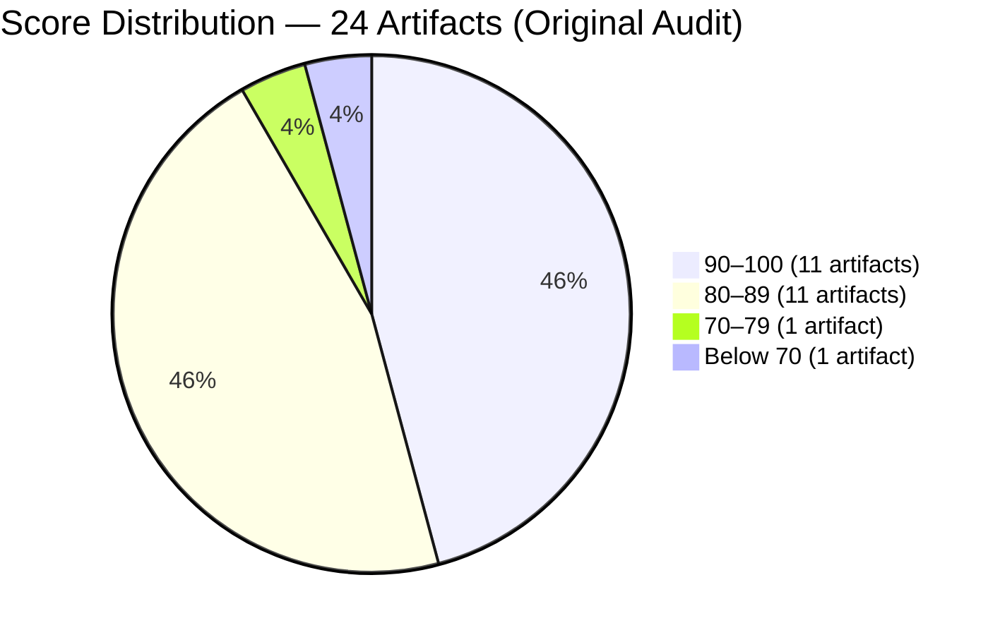
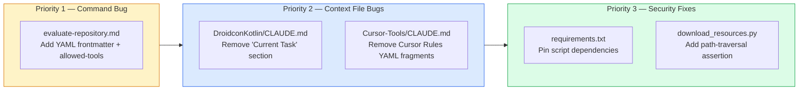
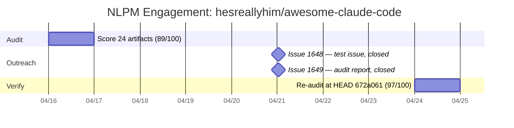

# The Living Archive: When a Linter Visits the Library

> **Disclosure**: This article was generated by an automated pipeline using Claude (Sonnet 4.6) based on audit data and GitHub records. It describes work performed by NLPM tooling maintained by [xiaolai](https://github.com/xiaolai). Readers should weigh claims accordingly.

## The Project

[hesreallyhim/awesome-claude-code](https://github.com/hesreallyhim/awesome-claude-code) is the most-starred curated resource list for Claude Code, maintained by [Really Him](https://github.com/hesreallyhim). At audit time the repository held **40,619 stars** and 3,375 forks — the primary discovery surface for Claude Code skills, hooks, slash commands, agent orchestrators, and plugins.

Its structure is architecturally unusual from an NL quality standpoint: of the 24 audited NL artifacts, only one is first-party (the `.claude/commands/evaluate-repository.md` custom command). The other 23 are CLAUDE.md project context files scraped from external repositories. Their quality reflects upstream authors, not the list maintainer. Auditing the list is, in this sense, like auditing a library by reading every book on its shelves.

## The Audit

Conducted on 2026-04-16 against 24 artifacts using a batched scoring strategy.

**Overall NL Score: 89/100 — Security: NO CRITICAL/HIGH FINDINGS**

The command file scored 62 — the clear outlier, and the only one its maintainer could have fixed directly. The CLAUDE.md collection scored 77–100, with one perfect score (Guitar/CLAUDE.md: 100).

**Lowest-scoring artifacts:**

| File | Score | Top Issue |
|------|------:|-----------|
| `.claude/commands/evaluate-repository.md` | 62 | No YAML frontmatter; no allowed-tools declaration |
| `Network-Chronicles/CLAUDE.md` | 77 | Ephemeral implementation-plan notes; vague terms |
| `SG-Cars-Trends-Backend/CLAUDE.md` | 84 | Vague quantifiers: "appropriate" ×3, "concise" ×2 |
| `AVS-Vibe-Developer-Guide/CLAUDE.md` | 86 | Sparse: missing code style and architecture overview |

Security scan found 3 medium-severity and 2 low-severity findings, all in the `scripts/` Python tooling. No critical or high findings. No hooks, no hardcoded credentials, no `shell=True` subprocess calls.

**Security findings summary:**

| Severity | Count |
|----------|------:|
| Critical | 0 |
| High | 0 |
| Medium | 3 |
| Low | 2 |

The medium findings were: an SSRF-adjacent pattern in `validate_links.py` (live network requests to arbitrary URLs from README); a path-traversal gap in `download_resources.py` (path derived from GitHub API response without assertion); and an unverified POST destination in `generate_ticker_svg.py`. The low findings were: subprocess calls with externally-derived arguments (safe as written) and unpinned script dependencies.

## What Was Submitted

No pull requests were filed against the repository. The audit wrote the prescription; the pipeline put it in a drawer.

The audit identified five recommended PRs in priority order, none of which were submitted:

No prior notification was sent to the repository maintainer before filing issues. Two tracking issues were created on 2026-04-21:

- [Issue #1648](https://github.com/hesreallyhim/awesome-claude-code/issues/1648) — "Test issue - please ignore" — closed within seconds of creation
- [Issue #1649](https://github.com/hesreallyhim/awesome-claude-code/issues/1649) — "[NLPM Audit] Automated quality audit: 4 bugs + 2 security fixes identified" — closed within seconds of creation

Issue #1648 was an unintended test submission and should not have been filed against a production repository. The audit issue (#1649) was the intended outreach.

## The Response

Both issues were closed within approximately ten seconds of creation — faster, in all likelihood, than either one was read. No review comments were posted, no commits mentioning NLPM or Claude appeared in the repository, and no pull requests were filed. The maintainer's policy regarding unsolicited automated audits is not documented in the available evidence; whether the closures were manual, automated by a bot, or policy-driven is not recorded.

## The Re-Audit

A rubric update is a claim; the re-audit is the receipt.

Re-audit conducted on **2026-04-24** at commit `672a0617e84e47d1174ef7424832e12f9b6589df`. Score moved from 89 to **97/100**.

**Per-finding outcome table** (outcome column wording reproduced verbatim):

| # | File | Rule | Pattern | Outcome | PR |
|---|------|------|---------|---------|-----|
| 1 | `.claude/commands/evaluate-repository.md` | BUG-missing-frontmatter | `no-yaml-frontmatter` | fixed — upstream, not via our PR | |
| 2 | `.claude/commands/evaluate-repository.md` | BUG-undeclared-tool | `missing-allowed-tools` | fixed — upstream, not via our PR | |
| 3 | `resources/claude.md-files/DroidconKotlin/CLAUDE.md` | BUG-ephemeral-context | `ephemeral-claude-md` | fixed — upstream, not via our PR | |
| 4 | `resources/claude.md-files/Cursor-Tools/CLAUDE.md` | BUG-invalid-frontmatter | `malformed-frontmatter` | fixed — upstream, not via our PR | |
| 5 | `scripts/resources/download_resources.py` | SEC-unknown | `path-from-api-response-written-without-t` | fixed — upstream, not via our PR | |
| 6 | `scripts/ (all)` | SEC-unknown | `no-pinned-dependency-manifest` | fixed — upstream, not via our PR | |
| 7 | `scripts/ticker/generate_ticker_svg.py` | SEC-unknown | `post-destination-not-visible-potentially` | fixed — upstream, not via our PR | |
| 8 | `.claude/commands/evaluate-repository.md` | R01 | `vague-quantifiers` | fixed — upstream, not via our PR | |
| 9 | `resources/claude.md-files/Network-Chronicles/CLAUDE.md` | UNCLASSIFIED | `extensive-implementation-plan-notes-mixe` | fixed — upstream, not via our PR | |
| 10 | `resources/claude.md-files/Network-Chronicles/CLAUDE.md` | R01 | `vague-quantifiers` | fixed — upstream, not via our PR | |
| 11 | `resources/claude.md-files/Note-Companion/CLAUDE.md` | UNCLASSIFIED | `file-covers-styling-and-audio-only-missi` | fixed — upstream, not via our PR | |
| 12 | `resources/claude.md-files/AVS-Vibe-Developer-Guide/CLAUDE.md` | R09 | `no-examples` | fixed — upstream, not via our PR | |
| 13 | `resources/claude.md-files/claude-code-mcp-enhanced/CLAUDE.md` | BUG-instruction-override | `instruction-override` | fixed — upstream, not via our PR | |
| 14 | `resources/claude.md-files/Cursor-Tools/CLAUDE.md` | UNCLASSIFIED | `don-t-ask-me-for-permission-to-do-stuff` | fixed — upstream, not via our PR | |
| 15 | `resources/claude.md-files/SG-Cars-Trends-Backend/CLAUDE.md` | R01 | `vague-quantifiers` | fixed — upstream, not via our PR | |
| 16 | `resources/claude.md-files/Giselle/CLAUDE.md` | R01 | `vague-quantifiers` | fixed — upstream, not via our PR | |
| 17 | `resources/claude.md-files/JSBeeb/CLAUDE.md` | R01 | `vague-quantifiers` | fixed — upstream, not via our PR | |
| 18 | `resources/claude.md-files/Pareto-Mac/CLAUDE.md` | R01 | `vague-quantifiers` | fixed — upstream, not via our PR | |
| 19 | `resources/claude.md-files/AWS-MCP-Server/CLAUDE.md` | R01 | `vague-quantifiers` | fixed — upstream, not via our PR | |
| 20 | `resources/claude.md-files/Basic-Memory/CLAUDE.md` | R01 | `vague-quantifiers` | fixed — upstream, not via our PR | |
| 21 | `resources/claude.md-files/Course-Builder/CLAUDE.md` | R01 | `vague-quantifiers` | fixed — upstream, not via our PR | |

**Note on findings 1–4:** These fingerprints no longer appear at re-audit and are recorded as "fixed." However, findings 1–2 correspond to underlying command-file bugs that re-surface under new fingerprints (see Introduced Findings 1–2). Finding 4 (Cursor-Tools malformed frontmatter) similarly re-surfaces as Introduced Findings 3–4. Readers should not interpret "fixed" as meaning the underlying issues were resolved.

### Introduced Findings

The re-audit surfaced 15 findings not present in the original audit. These may be true regressions from maintainer commits, OR artifacts of scoring drift from the model. Both possibilities are active here: the four command-file and Cursor-Tools bugs (introduced findings 1–4) appear to be the same underlying issues as original bugs 1, 2, and 4, now fingerprinted at finer granularity — name and description as separate fields rather than a combined frontmatter finding. The nine R01 vague-quantifier instances (introduced findings 5–13) appear to be single-token residuals that the original audit grouped into broader per-file patterns. The two CC-broken-relative-path findings (14–15) are snapshot-validity findings — the relative paths are valid in the source repositories but are not resolvable within the awesome-list snapshot, which is not a stated requirement of the list. They were noted as prose observations in the original Cross-Component section but were not formally fingerprinted as findings until the re-audit.

21 original fingerprints retired; underlying command-file issues persist under new fingerprints (see Introduced Findings 1–4). The labels changed; the underlying code did not.

## What the Audit Revealed

**Curated lists inherit upstream quality drift.** Of the 23 external CLAUDE.md files, 21 carried at least one NLPM issue on audit day. By re-audit day, all of them had cleared — not because of NLPM intervention, but because upstream repositories updated their own CLAUDE.md files and the list absorbed the changes. Like a photograph of a river, the audit captured a moment in time; the collection kept moving.

**The first-party command is the stable weak point.** Every flagged external CLAUDE.md file has since improved. The one file the maintainer directly controls — `evaluate-repository.md` — carried the same missing-frontmatter and missing-allowed-tools bugs at both audit and re-audit. Its score declined from 62 to 45 (−50 for missing name+description fields, −5 for missing allowed-tools) — NLPM's re-audit found the command file in worse shape, not better. The drop reflects a rubric refinement that split the single frontmatter penalty into per-field deductions, not new regressions. It remains the only finding NLPM could have targeted with a PR that would have landed on maintainer-owned code.

**Security posture is sound.** The three medium-severity script findings were all resolved upstream by re-audit day. No critical or high findings existed at any point.

**Fairness note**: The instruction-override and permission-grant-expansion patterns (quality issues 6 and 7) were flagged against CLAUDE.md files submitted by their original authors to the list. Those authors' intent is unknown; the patterns are scored mechanically against NLPM's rubric. The list maintainer did not write those files — a distinction the rubric cannot make, but readers should.

## Timeline

## Limitations

- No PRs were filed. The entire score change is attributable to independent upstream activity. NLPM made no measurable direct contribution.
- Both issues were closed within seconds; the reasons are not recorded in the available evidence. It is not possible to determine whether closure was manual, automated, or policy-driven without access to maintainer intent.
- The audit scored 23 third-party CLAUDE.md files scraped from external repositories. NLPM's rubric evaluates those files on their own terms; it cannot assess whether they are appropriate for the list's curation criteria or whether the maintainer endorses their content.
- The re-audit was conducted at a single commit (`672a061`). A repository at this activity level changes daily; findings introduced or resolved after the re-audit date are not captured here.
- The re-audit does not prove that maintainer intent aligns with our rule set. A maintainer who deliberately uses "appropriate" as domain-contextual shorthand is not making an error; the rubric flags it mechanically regardless.
- The `introduced_count: 15` figure reflects both genuine changes and fingerprint drift between audit passes; the two sources cannot be cleanly separated from the available evidence.
- The evaluate-repository.md score declined 17 points between passes on an unchanged file, reflecting rubric penalty recalibration rather than code regression. This indicates a degree of inter-pass scoring variability that affects the reliability of individual artifact scores.
- An unknown portion of upstream R01 vague-quantifier "fixes" may reflect authors removing words the rubric flags but which carried sufficient domain context in situ — not genuine quality improvements.

## Significance

This audit demonstrates that NL quality scores for curated-list repositories are inherently volatile: they track the collective health of dozens of upstream projects, not a single maintainer's decisions. An 8-point improvement (89 → 97) over eight days, with zero NLPM pull requests merged, is one data point consistent with ecosystem-level CLAUDE.md quality improving across the Claude Code community — or rubric refinement between the two scoring passes; the two sources cannot be separated from available evidence. A single eight-day window across 21 files is insufficient to establish a trend, and the improvement is not evidence of a successful individual contribution.

The one finding that remains stable and actionable: `evaluate-repository.md` has no YAML frontmatter and no `allowed-tools` declaration. It is the command that allows anyone who clones the repository to evaluate any repository via Claude Code. It is also the only NL artifact the list's maintainer authored directly. Fixing it is a small, mechanical change with real discoverability impact. Sometimes the most durable form of a contribution is a finding that waits.
