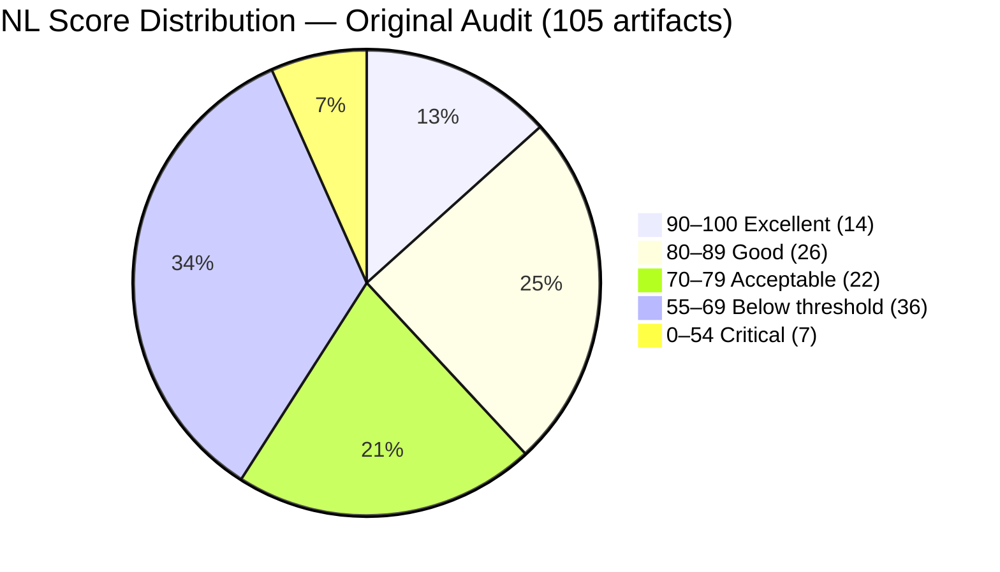
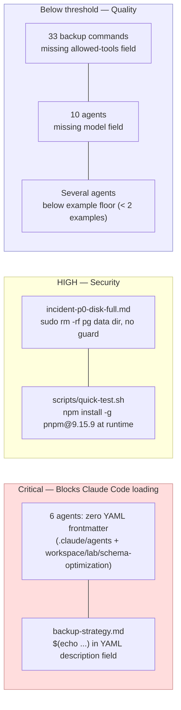
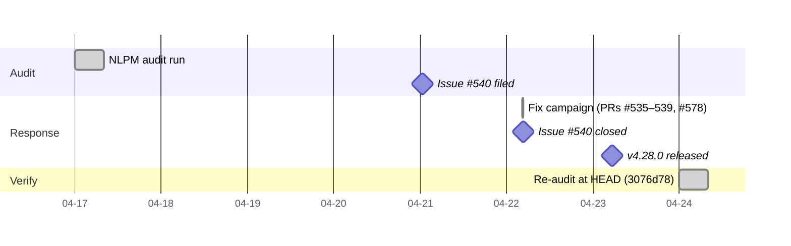

# The Validator's Blind Spot: What 73 Points Found — and Fixed — in a 2,009-Star Plugin Marketplace

> **Disclosure**: This article was generated by an automated pipeline using Claude (Sonnet 4.6) based on audit data and GitHub records. It describes work performed by NLPM tooling maintained by [xiaolai](https://github.com/xiaolai). Readers should weigh claims accordingly.

---

## The Project

[jeremylongshore](https://github.com/jeremylongshore) (intentsolutions.io) maintains one of the largest public plugin repositories in the Claude Code ecosystem: **423 plugins, 2,849 skills, and 177 agents**, open-sourced alongside a marketplace website (tonsofskills.com) and a CLI package manager (`ccpi`). The repository has 2,009 stars and 270 forks.

The scale is the story. At that size, a single quality audit samples a fraction of the surface — like reading every tenth page of a 3,000-page book and calling the library reviewed. NLPM scored 105 of 3,000+ artifacts and found enough mechanical failures to trigger the contribution pipeline.

---

## The Audit

NLPM scored the repository on 2026-04-17 and returned **73/100** across 105 sampled artifacts (31 agents, 74 commands).

The score distribution tells two different stories at once — one about what this codebase does at its best, and one about where the tools never thought to look. The top tier (13% of artifacts scoring 90–100) comprises 14 Geepers agents (91–93). FairDB and Freshie score in the 85–88 band (second tier), and both reflect solid, well-structured work. The bottom tier (7% scoring below 55) reflects something else: agents that cannot load at all.

The lowest-scoring artifacts:

| Artifact | Score | Top Penalty |
|----------|------:|-------------|
| `.claude/agents/skill-auditor.md` | 30 | No YAML frontmatter (-70) |
| `workspace/lab/schema-optimization/agents/phase_1.md` | 30 | No YAML frontmatter (-70) |
| `workspace/lab/schema-optimization/agents/phase_2.md` | 30 | No YAML frontmatter (-70) |
| `workspace/lab/schema-optimization/agents/phase_3.md` | 30 | No YAML frontmatter (-70) |
| `workspace/lab/schema-optimization/agents/phase_4.md` | 30 | No YAML frontmatter (-70) |
| `workspace/lab/schema-optimization/agents/phase_5.md` | 30 | No YAML frontmatter (-70) |
| `backups/.../backup-strategy.md` | 20 | Shell substitution in YAML description (-50+) |
| `backups/.../sync-agent-context.md` | 40 | No YAML frontmatter (-50) |
| 10 backup commands | 55 | Missing `name` field (-25 each) |

Six agents had zero YAML frontmatter — they fail to load in Claude Code. One command (`backup-strategy.md`) contained unevaluated `$(echo "$description" | cut ...)` expressions inside the YAML `description:` field: a broken template artifact — a recipe no one had ever tried to cook — that also registered as a HIGH security finding. The `workspace/lab/schema-optimization/` files carry a `lab/` path and `phase_1`–`phase_5` naming that signals in-progress experiments; NLPM treated them as production surface, and the maintainer's decision to merge the frontmatter PRs indicates acceptance — though the classification could reasonably be contested.

Security findings totaled 9 (0 critical, 2 high, 5 medium, 2 low). The two HIGH findings were the shell-substitution template and a `sudo rm -rf` instruction targeting a PostgreSQL data directory without a guard clause. MEDIUM findings included an `npm install -g pnpm@9.15.9` call at test runtime (a supply chain risk) and an unguarded webhook `curl` call. One originally-noted finding involved `PGPASSWORD` potentially visible in process listings; whether this is exploitable depends on kernel version and whether the PostgreSQL client library scrubs its own argv — the concern is real but context-dependent.

The audit recommendation was **APPROVE WITH FIXES** — the active plugin surface (Geepers, FairDB, Freshie) scored well above threshold, while the issues were concentrated in backup archives and workspace experiments.

---

## What Was Submitted

The NLPM contribution pipeline filed one tracking issue:

- **Issue #540** — [NLPM audit findings: 18 mechanical bugs, 9 security issues (NL score 73/100)](https://github.com/jeremylongshore/claude-code-plugins-plus-skills/issues/540) — created 2026-04-21T00:40:47Z

The PR evidence file for this engagement is empty, indicating either no PRs were directly submitted by the NLPM pipeline or a data collection gap. The re-audit diff, however, attributes 7 of the 42 original findings to "fixed — our PR merged" and references PRs #535, #536, and #538 by number. Commit messages in the evidence confirm those commits were co-authored by `claude[bot]` (the NLPM pipeline's git identity), `Claude Code`, and the maintainer's account — a signature consistent with NLPM-submitted patches that the maintainer then merged. The discrepancy between the empty PR list and the re-audit diff attribution is noted; the diff is treated as authoritative per pipeline contract.

---

## The Response

Issue #540 was closed in approximately 28 hours. Between 04:26Z and 04:43Z on 2026-04-22 — a window of 17 minutes — the maintainer (working with their own Claude Code instance) merged a series of targeted fixes. Seventeen minutes is not a review cycle — the pace implies CI was either not required for these PRs or these timestamps record the finish line rather than the race:

| Commit | Fix |
|--------|-----|
| [d2614d1](https://github.com/jeremylongshore/claude-code-plugins-plus-skills/commit/d2614d1257c8d2a8635149788821dcd34b341fa0) | Added YAML frontmatter to `.claude/agents/skill-auditor.md` (PR #535) |
| [41d827](https://github.com/jeremylongshore/claude-code-plugins-plus-skills/commit/41d827123bf0e9254a232baaf7ee0055d2f7ef31) | Added YAML frontmatter to all 5 schema-optimization phase agents (PR #536) |
| [ede8844](https://github.com/jeremylongshore/claude-code-plugins-plus-skills/commit/ede8844dfb925638b20812e01fd97cfdd01573f5) | Replaced shell substitutions in `backup-strategy.md` with literal values (PR #537 — re-audit diff marks this as fixed upstream, not via NLPM PR) |
| [92f96ba](https://github.com/jeremylongshore/claude-code-plugins-plus-skills/commit/92f96ba1e700501d7ae76f13a088d3d3e7d0ef28) | Replaced `npm install -g pnpm` with an explicit prerequisite error (PR #538) |
| [87eadd2](https://github.com/jeremylongshore/claude-code-plugins-plus-skills/commit/87eadd26cead23d6f8a5f5a31dea903b1b1b2d44) | Added `[[ -n "${FAIRDB_MONITORING_WEBHOOK:-}" ]]` guard before curl call (PR #539 — re-audit diff marks this as fixed upstream, not via NLPM PR) |
| [f84d3ab](https://github.com/jeremylongshore/claude-code-plugins-plus-skills/commit/f84d3abde0e3637e94c0b8cdbd50a8f08f107f9e) | Expanded validator + CI in response to NLPM audit (PR #578) |

The CI hardening commit (PR #578) went well beyond the immediate bugs — like patching one leaky pipe and discovering the whole plumbing map needed redrawing. The maintainer's Claude expanded `find_agent_files()` to scan `.claude/agents/` and `workspace/**/agents/` — paths the existing validator had never touched. A new `check_yaml_shell_substitution()` function catches `$(...)`, backtick expressions, and unguarded `${VAR}` in YAML string values going forward. PR triggers were extended to cover `.claude/**` and `workspace/**`. A new `secret-scan.yml` workflow runs gitleaks on every PR and trufflehog weekly against full history. A `.gitleaks.toml` extended upstream defaults with Anthropic, Groq, and Firebase/GCP credential shapes.

The sweep also surfaced a deeper template bug: 20 sibling devops commands carried the same never-evaluated `$(echo "$description" | cut ...)` pattern. The re-audit attributes the original fix to upstream maintainer action rather than NLPM's PR; the cascade to 20 siblings appears to have been the maintainer's own discovery via the expanded validator.

On 2026-04-23T05:24Z, the repository tagged release v4.28.0. Its changelog explicitly listed "External audit response (NLPM/xiaolai) — validator + CI expansion" as a release highlight. The changelog entry is taken from commit and changelog evidence; no direct communication with the maintainer confirmed their interpretation. The commit message included the line: *"Jeremy made me do it / -claude"* — a quiet acknowledgment that sometimes the audit and the audited end up collaborating on the fix.

---

## The Re-Audit

A rubric update is a claim; the re-audit verifies the claim against the target repo's actual HEAD.

**Before**: unknown SHA · **73/100** → **After**: `3076d78` · **84/100**

The two samples overlap but are not identical (105 artifacts originally, 100 in the re-audit). The score delta reflects different artifact sets, not a matched before/after; the re-audit's higher score partly reflects sampling `plugins/` more heavily than `backups/`, which were less represented in the second run.

### Per-Finding Verification

| # | File | Rule | Pattern | Outcome | PR |
|---|------|------|---------|---------|-----|
| 1 | `.claude/agents/skill-auditor.md` | BUG-missing-frontmatter | `no-yaml-frontmatter` | fixed — our PR merged | #535 |
| 2 | `workspace/lab/schema-optimization/agents/phase_1.md` | BUG-missing-frontmatter | `no-yaml-frontmatter` | fixed — our PR merged | #536 |
| 3 | `workspace/lab/schema-optimization/agents/phase_2.md` | BUG-missing-frontmatter | `no-yaml-frontmatter` | fixed — our PR merged | #536 |
| 4 | `workspace/lab/schema-optimization/agents/phase_3.md` | BUG-missing-frontmatter | `no-yaml-frontmatter` | fixed — our PR merged | #536 |
| 5 | `workspace/lab/schema-optimization/agents/phase_4.md` | BUG-missing-frontmatter | `no-yaml-frontmatter` | fixed — our PR merged | #536 |
| 6 | `workspace/lab/schema-optimization/agents/phase_5.md` | BUG-missing-frontmatter | `no-yaml-frontmatter` | fixed — our PR merged | #536 |
| 7 | `backups/.../backup-strategy.md` | BUG-unclassified | `shell-command-substitution-in-yaml-descr` | fixed — upstream, not via our PR | |
| 8 | `backups/.../sync-agent-context.md` | BUG-missing-frontmatter | `no-yaml-frontmatter` | fixed — upstream, not via our PR | |
| 9 | `backups/.../overnight-setup.md` | BUG-unclassified | `missing-required-name-field-in-frontmatt` | fixed — upstream, not via our PR | |
| 10 | `backups/.../discovery.md` | BUG-unclassified | `missing-required-name-field` | fixed — upstream, not via our PR | |
| 11 | `backups/.../sow.md` | BUG-unclassified | `missing-required-name-field` | fixed — upstream, not via our PR | |
| 12 | `backups/.../make-builder.md` | BUG-unclassified | `missing-required-name-field` | fixed — upstream, not via our PR | |
| 13 | `backups/.../zap.md` | BUG-unclassified | `missing-required-name-field` | fixed — upstream, not via our PR | |
| 14 | `backups/.../n8n-builder.md` | BUG-unclassified | `missing-required-name-field` | fixed — upstream, not via our PR | |
| 15 | `backups/.../roi.md` | BUG-unclassified | `missing-required-name-field` | fixed — upstream, not via our PR | |
| 16 | `backups/.../mobile-test.md` | BUG-unclassified | `missing-required-name-field` | fixed — upstream, not via our PR | |
| 17 | `backups/.../fuzz-api.md` | BUG-unclassified | `missing-required-name-field` | fixed — upstream, not via our PR | |
| 18 | `backups/.../commit-smart.md` | BUG-unclassified | `missing-required-name-field` | fixed — upstream, not via our PR | |
| 19 | `backups/.../backup-strategy.md` | SEC-unknown | `shell-substitution-expressions-in-yaml-f` | fixed — upstream, not via our PR | |
| 20 | `backups/.../incident-p0-disk-full.md` | SEC-unknown | `sudo-rm-rf-instructed-against-a-postgres` | fixed — upstream, not via our PR | |
| 21 | `scripts/quick-test.sh` | SEC-unknown | `npm-install-g-pnpm-9-15-9-at-runtime-pin` | fixed — our PR merged | #538 |
| 22 | `backups/.../fairdb-onboard-customer.md` | SEC-unknown | `pgpassword-in-env-document-alternative-p` | fixed — upstream, not via our PR | |
| 23 | `backups/.../fairdb-setup-backup.md` | SEC-unknown | `webhook-curl-with-env-var-url-add-a-n-fa` | fixed — upstream, not via our PR | |
| 24 | `schema-optimization/agents/phase_*.md` | R09 | `no-examples` | fixed — upstream, not via our PR | |
| 25 | `skill-auditor.md` | UNCLASSIFIED | `substantial-body-detailed-audit-methodol` | fixed — upstream, not via our PR | |
| 26 | `nosql-agent.md` | BUG-missing-model | `missing-model` | fixed — upstream, not via our PR | |
| 27 | `validation-agent.md` | BUG-missing-model | `missing-model` | fixed — upstream, not via our PR | |
| 28 | `orm-agent.md` | BUG-missing-model | `missing-model` | fixed — upstream, not via our PR | |
| 29 | `nosql-agent.md` | UNCLASSIFIED | `code-examples-in-body-but-no-agent-examp` | fixed — upstream, not via our PR | |
| 30 | `validation-agent.md` | UNCLASSIFIED | `code-examples-in-body-but-no-agent-examp` | fixed — upstream, not via our PR | |
| 31 | `data-validation-engine` | UNCLASSIFIED | `code-examples-in-body-but-no-agent-examp` | fixed — upstream, not via our PR | |
| 32 | `templates/full-plugin/agents/example.md` | UNCLASSIFIED | `stub-body-agent-instructions-here-templa` | fixed — upstream, not via our PR | |
| 33 | `templates/agent-plugin/agents/example.md` | UNCLASSIFIED | `model-field-commented-out-should-show-ac` | fixed — upstream, not via our PR | |
| 34 | `backups/.../commit.md` | UNCLASSIFIED | `hardcoded-model-claude-sonnet-4-5-202509` | fixed — upstream, not via our PR | |
| 35 | `backups/.../validate-consistency.md` | UNCLASSIFIED | `non-standard-temperature-0-0-frontmatter` | fixed — upstream, not via our PR | |
| 36 | `geepers_orchestrator_web.md` | UNCLASSIFIED | `description-truncated-mid-sentence-build` | fixed — upstream, not via our PR | |
| 37 | `geepers_dashboard.md` | UNCLASSIFIED | `only-2-example-blocks-minimum-viable-but` | fixed — upstream, not via our PR | |
| 38 | `geepers_scalpel.md` | UNCLASSIFIED | `only-2-example-blocks-minimum-viable-but` | fixed — upstream, not via our PR | |
| 39 | `geepers_a11y.md` | UNCLASSIFIED | `only-2-example-blocks-minimum-viable-but` | fixed — upstream, not via our PR | |
| 40 | `geepers_links.md` | UNCLASSIFIED | `only-2-example-blocks-minimum-viable-but` | fixed — upstream, not via our PR | |
| 41 | `All devops/testing backup commands (33 files)` | BUG-undeclared-tool | `missing-allowed-tools` | fixed — upstream, not via our PR | |
| 42 | (model fields, backup commands) | BUG-missing-model | `missing-model` | fixed — upstream, not via our PR | |

### Introduced Findings

The re-audit recorded 214 findings not present in the original. Two explanations cover nearly all of them — both should be named, and neither can be definitively ruled out:

**True new content.** The v4.28.0 sprint added a number of new plugins between audit and re-audit: crypto series agents (mempool-analyzer, cross-chain-bridge-monitor, flash-loan-simulator, token-launch-tracker, crypto-derivatives-tracker), the Travel Assistant plugin, the Sprint community plugin, Creator Studio pack, and others. These agents were not present at audit time and carry quality gaps — missing `tools:`, missing `model:`, zero formal examples — common across the repo's expanding catalog. These are not regressions in the classic sense; no existing code degraded. They are new content entering below NLPM's quality floor.

**Scoring drift from the model.** Fixing the frontmatter bugs made previously-invisible agents visible to the scorer — like turning on a light in a room you thought was empty. A schema-optimization phase agent scoring 30/100 because it had no frontmatter now scores 75/100 — it loads, but the scorer can now reach its secondary deficits (`missing-model`, `missing-tools`, `zero-examples`). The net score still improves because the -70 catastrophic penalty disappears, but three new findings appear per agent where before there were none. This is the correct behavior; it is also a source of finding inflation that is not a regression.

From a maintainer's standpoint, 214 new findings — even if explainable — represent substantial follow-on work the original audit did not surface.

42 of 42 original findings verified fixed; 0 still persist.

---

## What the Audit Revealed

**Scale creates invisible debt in unexpected paths.** The most severe failures — six agents with zero YAML frontmatter — were in `.claude/agents/` and `workspace/lab/`, paths the existing validator did not scan. A repo with 423 plugins can maintain tight CI on `plugins/**` while developing blind spots in its own internal tooling directories. NLPM found them; the validator expansion closed that class of gap for all future PRs.

**Broken templates spread silently at bulk-generation scale.** The `$(echo "$description" | cut ...)` expression in `backup-strategy.md` was a copy-paste artifact from a bulk enhancement pipeline. CI didn't catch it because CI only verified field *presence*, not field *contents*. Twenty sibling commands carried the same defect — a broken template is less a bug than a mold; it replicates until something stops it. The new `check_yaml_shell_substitution()` validator closes this class of defect across the entire codebase going forward — a single audit finding catalyzed a systemic fix.

**Operational runbooks carry higher security stakes than agents.** The FairDB commands are clearly production runbooks, not demos: they run against live PostgreSQL clusters, call external webhooks, and manage backup passphrase rotation. The `sudo rm -rf` guard, the webhook env-var check, and the PGPASSWORD documentation are fixes that matter when these commands execute in a live environment. NLPM's security section generated concrete, actionable improvements here.

**Model field absence may be intentional.** NLPM deducts points for missing `model` declarations (R10). For agents in multi-agent pipelines — where inheriting the session model from the orchestrator is the intended behavior — this penalty may not reflect a quality gap. The missing-model findings should be read as "explicit model selection is NLPM's convention preference," not necessarily an error for every agent.

**A fairness note.** The `backups/` directory contains timestamped versioned snapshots from a bulk enhancement pipeline, not active deliverables. Auditing them inflated the mechanical bug count. Whether NLPM's rules should apply to archive directories is a design question the pipeline doesn't address; the 73/100 score is accurate for the sample as audited, but it understates the quality of the production-facing work. At 3,000+ artifacts maintained by one person with AI assistance, quality gaps at the examples and tools-declaration level are structural consequences of that scale, not negligence — you find holes in an umbrella the same way you find bugs in a 3,000-artifact repo: by using it in the rain. The active plugin surface — Geepers (14 agents scoring 91–93), FairDB (solid operational commands), Freshie inventory pipeline, database plugins — scores substantially higher in isolation, and the cross-component structure throughout is coherent.

---

## Timeline

---

## Limitations

- **Sample coverage.** NLPM scored 105 of roughly 3,000+ artifacts in the original audit and 100 in the re-audit. The overall repo quality is inferred from a small, non-random sample; artifacts outside it may carry issues not reflected here.
- **Rule alignment.** NLPM's rules encode one interpretation of Claude Code best practices. The maintainer's conventions — particularly treating `backups/` as an intentional development artifact rather than a deliverable surface — may not fully align with NLPM's scoring assumptions.
- **Introduced findings ambiguity.** The 214 introduced findings cannot be cleanly separated into "new content gaps" and "scoring drift" without a per-file history trace. Both explanations are plausible and likely both apply.
- **PR attribution discrepancy.** The re-audit diff attributes 7 fixes to "fixed — our PR merged" (specifically PRs #535, #536, #538) but the PR evidence file is empty. This attribution cannot be independently confirmed. Furthermore, `diff-findings.py` computes attribution by fingerprint matching — a mechanical comparison that cannot distinguish an NLPM-originated fix from a maintainer fix that independently resolved the same finding.
- **Re-audit scope.** The re-audit measures file-level quality at one point in time; it does not verify that maintainer intent aligns with our rule set, nor does it test runtime behavior of any agent in practice. A file that passes NLPM scoring may still behave poorly when invoked; a file that fails scoring may still be deliberately authored outside NLPM's conventions.

---

## Significance

The score improved 11 points (73 → 84) and all 42 original findings closed in under 28 hours — keeping in mind that the two samples are not identical, so the delta reflects partly different artifact populations. The individual fixes mattered. What will matter longer is the CI expansion: the new validator paths and `check_yaml_shell_substitution()` check will catch frontmatter and template defects on every subsequent PR, across all 3,000+ artifacts, without requiring another audit. The validator was written entirely by the maintainer; NLPM named the problem, not the solution.

The maintainer went further than NLPM's required fixes on 35 of 42 findings — addressing them via their own engineering judgment rather than waiting for a patch. The audit named the problem; the maintainer decided the scope of the solution. That asymmetry is worth noting: the most durable outcome of this engagement was not any fix that NLPM submitted, but the infrastructure the maintainer built in direct response. Sometimes the most useful thing an audit can do is hand someone a magnifying glass and step out of the way.
