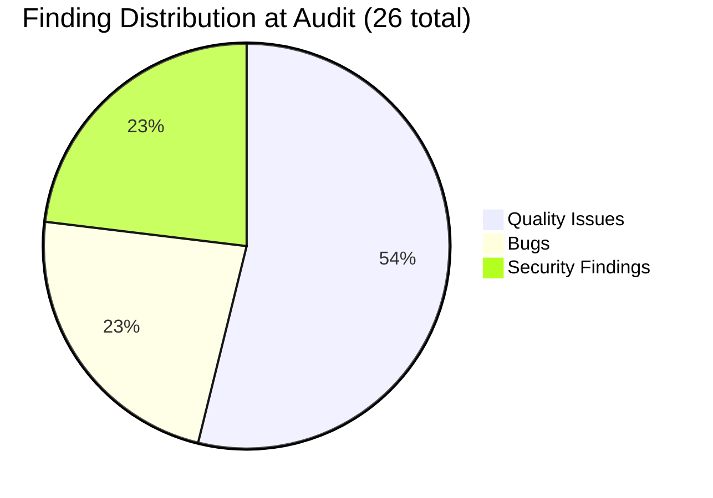
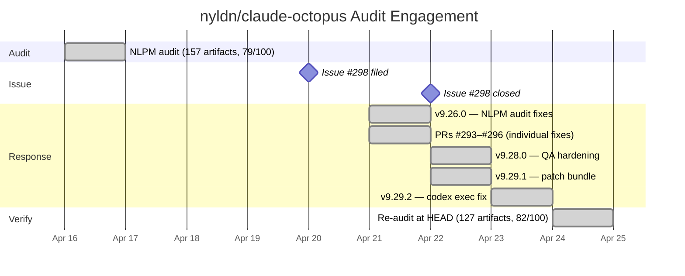

# No PR Required: How claude-octopus Closed 23 Findings Before the Weekend — and Left Two Doors Unlocked


> **Disclosure**: This article was generated by an automated pipeline using Claude (Sonnet 4.6) based on audit data and GitHub records. It describes work performed by NLPM tooling maintained by [xiaolai](https://github.com/xiaolai). Readers should weigh claims accordingly.

---

## The Project

[claude-octopus](https://github.com/nyldn/claude-octopus) is a Claude Code plugin by [Chris S](https://github.com/nyldn) that routes every coding task to up to eight AI models in parallel — Claude, Gemini, Codex, and others — so blind spots surface before they ship — like running every blueprint past eight independent reviewers before signing off. With 2,820 stars and 266 forks, it is among the most-starred Claude Code plugins in active development. The repository ships 157 NL artifacts across nine categories: GitHub Actions agents, personas, droids, skill-router agents, principles, default subagents, commands, skills, and provider/workflow config.

---

## The Audit

NLPM audited nyldn/claude-octopus on 2026-04-16 against 157 artifacts. The weighted score was **79/100** — above the default 70-point threshold but below the 85 default threshold that unlocks automatic contribution (configurable per project). The recommendation was REVIEW: contribution was blocked pending resolution of two HIGH security findings. A passing grade with unfinished homework.



Score breakdown by category at the time of audit:

| Category | Files | Avg Score | Notes |
|----------|-------|-----------|-------|
| `.github/agents/` | 10 | 63 | Minimal stubs, systemic bugs |
| `agents/droids/` | 10 | 78 | Missing `tools` throughout |
| `agents/skills/` | 3 | 72 | Thin, minimal descriptions |
| `.claude/commands/` | 49 | 74 | ~65% missing `allowed-tools` |
| `config/` | 8 | 80 | No frontmatter schema |
| `agents/principles/` | 4 | 82 | Clean format |
| `.claude/agents/` | 10 | 84 | Stable, missing examples |
| `agents/personas/` | 32 | 85 | Well-formed; 40% missing `tools` |
| `skills/` | 29 | 85 | Strong execution contracts |
| **Overall** | **157** | **79** | |

**Top issues by severity:**

**HIGH — blocks contribution:**

- **FINDING-01:** `agents/personas/openclaw-admin.md` contained `curl -fsSL https://gogcli.sh/install.sh | bash`. The domain `gogcli.sh` did not match the rest of the codebase (which references `openclaw.ai`), making this both a curl-pipe-sh risk and a domain mismatch bug (BUG-006). If the openclaw-admin persona followed its own installation instructions, it would download and execute code from an unverified third-party domain.

- **FINDING-02:** `skills/skill-claw/SKILL.md` contained three instances of `curl -fsSL https://openclaw.ai/install.sh | bash` in its installation table and code block, with no hash verification or user inspection gate. If Claude follows the installation workflow, it would execute this pattern without content inspection.

**BUG-level (functional breakage):**

- **BUG-001:** All 10 `.github/agents/` files declared `readonly: true` in their frontmatter while their body text required write and execute tools — a read-only vs. write-intent conflict. Whether Claude Code enforces `readonly: true` as a recognized frontmatter constraint (vs. silently ignoring unknown frontmatter keys) is unverified; if the field is ignored, the agents simply lack any explicit access control — a lock that may or may not be wired to anything. A separate tool-name casing issue — `read`, `search`, `execute` instead of `Read`, `Glob`/`Grep`, `Bash` — surfaced as an introduced finding at re-audit once the original fingerprint was resolved; it is not the original BUG-001.

- **BUG-002:** All 10 `agents/droids/` files had no `tools:` field. Without this declaration, Claude Code defaults to an empty tool list, and the droids — which describe complex task-execution workflows — could only produce text output.

- **BUG-005:** `hooks/user-prompt-submit.sh` used `python3` for JSON parsing with no fallback for environments where Python 3 is absent.

**Systemic quality gaps:** ~32 of 49 `.claude/commands/` files were missing `allowed-tools` declarations. Roughly 13 of 32 personas lacked `tools:` fields, creating a silent quality split: personas with tools worked correctly as subagents; personas without them silently restricted to text generation, with no visible difference from the user's perspective.

---

## What Was Submitted

NLPM did not submit any pull requests in this engagement. The pipeline filed one issue:

| # | Title | URL | Filed | Closed |
|---|-------|-----|-------|--------|
| #298 | NLPM Audit Report: 6 bugs and 6 security findings (score: 79/100) | [link](https://github.com/nyldn/claude-octopus/issues/298) | 2026-04-20 | 2026-04-22 |

The issue reported all six bugs, six security findings, and fourteen quality issues with suggested fixes and diff examples. Sometimes the most useful contribution is a well-aimed report and a step back.

---

## The Response

Issue #298 was filed at 18:31 UTC on 2026-04-20. Less than ten hours later — no comment filed, no acknowledgment posted, just a release — nyldn shipped [v9.26.0](https://github.com/nyldn/claude-octopus/commit/1ab6b1d6874b392180cb7e70546c68d61fb9fd65):

```
release: v9.26.0 — opus dispatch fix, NLPM audit fixes, qwen flag, webhook HTTPS

- fix(agents): add tools declarations to 10 droids + python-pro (#298)
- fix(skill-extract): beta status caveat in description (#298)
- fix(hooks): jq fallback when python3 absent (#298)
- fix(security): reject non-HTTPS webhook URLs (#298)
```

Four of six fix lines cite the audit issue directly. The droid tools declarations, the skill-extract beta caveat, the Python fallback in the hooks, and webhook HTTPS enforcement all shipped in a single release. The webhook HTTPS enforcement corresponds to FINDING-03, a MEDIUM security finding from the original audit; it is resolved in v9.26.0. The maintainer also opened four separate PRs (#293–#296) addressing individual findings as discrete changes. Because these PR numbers are lower than issue #298 (GitHub issues and PRs share a single sequence), they may have been opened before the audit issue was filed; if so, the work was already in progress independently rather than triggered by the audit. In open source, it's perfectly fine to arrive second with the right diagnosis. Issue #298 closed on 2026-04-22 — 35 hours after it was filed.

No maintainer review comments are on record. The response was direct commits and self-authored PRs rather than inline discussion. It is possible the fixes were already in progress and the audit timing was coincidental; no maintainer statement confirms or denies that.

Between the issue filing and the re-audit, nyldn shipped three additional releases — [v9.28.0](https://github.com/nyldn/claude-octopus/commit/fefcb24dce7cea05ffb06cbdae44311c926e9835) (2026-04-22), [v9.29.1](https://github.com/nyldn/claude-octopus/commit/bd827dfa1f49aefa63e53941f8ee6d58d7e880fe) (2026-04-22), and [v9.29.2](https://github.com/nyldn/claude-octopus/commit/997a26558c6e96a745918c66bd4e4f686ae73b41) (2026-04-23) — incorporating hook hardening, output cap fixes, and model-config improvements that were independent of the audit. The project's cadence — four releases across two days — provides important context: the "less than ten hours" response may reflect the normal pace of an actively shipping codebase rather than an exceptional reaction to the audit.

---

## The Re-Audit

A rubric score update is a claim about quality at a point in time; the re-audit verifies that claim against the target repo's current HEAD. Think of it as checking whether the photograph still resembles its subject.

The re-audit ran on 2026-04-24 against commit `14e8ee4` (`14e8ee4ee502e2fc4441eb13d7def4c80892fc82`). The baseline commit SHA was not recorded. The score moved from **79 → 82** (+3) across 127 artifacts (down from 157 at audit, as the repo evolved between snapshots). The modest +3 gain reflects that 12 introduced findings offset most of the gains from the 23 resolved ones — illustrating how scoring drift can produce an appearance of resolution without proportional score improvement.

### Per-Finding Outcome Table

The outcome column is reproduced verbatim from the verification data. For findings listed with a PR number, the fix was applied via a maintainer-authored PR. For findings without a PR, the fix reached HEAD through direct commits or squashed merges.

Verification is fingerprint-based: a finding is marked "fixed" when its original content fingerprint no longer matches any file at HEAD. A finding can resolve this way without the underlying risk being eliminated — if the same pattern recurs in a refactored or renamed file, it registers as a new introduced finding rather than a persisting original.

| # | File | Rule | Outcome | PR |
|---|------|------|---------|-----|
| 1 | `code-reviewer.md` | BUG-read-only-write | fixed — upstream, not via our PR | |
| 2 | `performance-engineer.md` | BUG-read-only-write | fixed — upstream, not via our PR | |
| 3 | `cloud-architect.md` | BUG-read-only-write | fixed — upstream, not via our PR | |
| 4 | `.github/agents/` | BUG-read-only-write | fixed — upstream, not via our PR | |
| 5 | `agents/droids/` | BUG-unclassified | fixed — applied separately | #293 |
| 6 | `agents/personas/python-pro.md` | BUG-unclassified | fixed — applied separately | #294 |
| 7 | `skills/skill-extract/SKILL.md` | BUG-unclassified | fixed — applied separately | #295 |
| 8 | `hooks/user-prompt-submit.sh` | BUG-unclassified | fixed — applied separately | #296 |
| 9 | `agents/personas/openclaw-admin.md` | SEC-curl-pipe-sh | fixed — upstream, not via our PR | |
| 10 | `.github/agents/` stubs (~63/100) | UNCLASSIFIED | fixed — upstream, not via our PR | |
| 11 | `.claude/commands/` missing `allowed-tools` | BUG-undeclared-tool | fixed — upstream, not via our PR | |
| 12 | Vague quantifiers in skill descriptions | R01 | fixed — upstream, not via our PR | |
| 13 | `devops-troubleshooter.md` missing `tools` | BUG-undeclared-tool | fixed — upstream, not via our PR | |
| 14 | `incident-responder.md` missing `tools` | BUG-undeclared-tool | fixed — upstream, not via our PR | |
| 15 | `test-automator.md` missing `tools` | BUG-undeclared-tool | fixed — upstream, not via our PR | |
| 16 | `cloud-architect.md` missing `tools` | BUG-undeclared-tool | fixed — upstream, not via our PR | |
| 17 | `mermaid-expert.md` haiku with no tools | UNCLASSIFIED | fixed — upstream, not via our PR | |
| 18 | `context-manager.md` missing when_to_use/examples | UNCLASSIFIED | fixed — upstream, not via our PR | |
| 19 | `ai-engineer.md` missing when_to_use/examples | UNCLASSIFIED | fixed — upstream, not via our PR | |
| 20 | `academic-writer.md`, `graphql-architect.md` missing `tools` | UNCLASSIFIED | fixed — upstream, not via our PR | |
| 21 | `config/` files lack NLPM frontmatter schema | UNCLASSIFIED | fixed — upstream, not via our PR | |
| 22 | `business-analyst.md`, `exec-communicator.md` no `tools` | UNCLASSIFIED | fixed — upstream, not via our PR | |
| 23 | `skill-extract/SKILL.md` skeleton not gated by capability check | UNCLASSIFIED | fixed — upstream, not via our PR | |

**All 23 original fingerprints resolved.** The curl-pipe-sh risk flagged in FINDING-01 and FINDING-02 persists under new fingerprints and is captured in the introduced findings below.

### Introduced Findings

The re-audit found 12 findings at HEAD that were not present in the original audit. These may be true regressions from maintainer commits between 2026-04-16 and 2026-04-24, or they may reflect scoring drift — the model re-scoring an evolved artifact set and fingerprinting similar issues differently. Both possibilities apply here; neither should be assumed without additional audit snapshots from the intervening period. Scoring drift is like measuring the same river twice — the water moved, but you still call it the same river.

Notable introduced findings:

- **Non-standard tool names in `.github/agents/` (all 10 files):** All agents declare `read`, `search`, `execute` instead of `Read`, `Glob`/`Grep`, `Bash`. The original audit's BUG-001 flagged these agents for `readonly: true` conflicts; when that was resolved, the tool-name casing problem became the new dominant fingerprint. This is likely scoring drift on a pre-existing issue rather than a regression.

- **Droids `tools: ["All tools"]` overly broad (QUALITY-007):** This finding is a direct consequence of the BUG-002 fix. Adding tools declarations resolved the original finding, but the batch update used an overly permissive declaration for every droid regardless of operational scope. This is a plausible true regression introduced by the fix itself. However, droids are described as task-specific agents with complex execution needs; "All tools" may also reflect an intentional operational choice by the maintainer. NLPM recommends scoping per R11 (least-privilege tools), but the declaration is technically valid.

- **16 personas still missing `tools:` (up from 13 in the original audit):** The original QUALITY-013 identified 13 personas. The re-audit count of 16 may include three personas added between audits, or may reflect different fingerprinting of the same underlying gap.

- **42 of 48 commands missing output format, 43 of 48 missing `allowed-tools`:** These closely mirror findings 11 and 12 in the original audit. They were fingerprinted as resolved (the original fingerprints matched HEAD), but the systemic gaps persist in a form the re-audit re-identified as new. This is the clearest example of scoring drift in this engagement.

---

## What the Audit Revealed

### A two-tier personas layer

The 32-persona set had a clean quality split visible only from the outside: ~19 personas with explicit `tools:` declarations that function correctly as subagents, and ~13 that silently restrict to text-only output. From the user's perspective, invoking `backend-architect` gets a full tool suite; invoking `cloud-architect` gets text generation only. No error surface, no warning — silent capability degradation, like two switches that look identical but only one turns on the lights. The fix (add a `tools:` field) was mechanical, and the v9.26.0 batch-fix of the 10 droids demonstrated the pattern was executable at scale.

### Coordinated curl-pipe-sh risk

FINDING-01 and FINDING-02 operated as a coordinated surface: the `openclaw-admin` persona would guide users through installation, and `skill-claw/SKILL.md` would execute it. The domain mismatch fix (correcting `gogcli.sh` to `openclaw.ai`) resolved BUG-006 and improved correctness, but the curl-pipe-sh execution pattern itself — no hash verification, no download-then-inspect gate — remained in `skill-claw/SKILL.md` through the re-audit. Both HIGH security findings remain open as of 2026-04-24.

### Commands as an unrestricted surface

With ~65% of 49 command files missing `allowed-tools` at audit time, the commands layer averaged 74/100. Commands like `embrace`, `factory`, and `parallel` that orchestrate multi-provider workflows had unrestricted tool access despite well-defined operational scope. Per R15 (least-privilege tools), this is an unnecessarily wide surface — particularly for commands that invoke `orchestrate.sh` against external providers. Missing `allowed-tools` does not grant wider tool access than the session baseline; it removes the explicit scope declaration that aids auditability and restricts sub-invocations. R15 is an NLPM convention, not a Claude Code requirement.

### On fairness

The audit applied NLPM's rubric to a project with its own well-established conventions: enforcement hooks, a comprehensive root `CLAUDE.md`, output caps, and explicit workflow documentation. Several findings — including the `config/` frontmatter schema gap and the `.github/agents/` stub-quality penalties — reflect NLPM schema expectations rather than actual dysfunction. The bugs and security findings are correctness issues. The quality issues are a mix of real structural gaps and rubric-alignment gaps; readers should weigh them accordingly. Some findings counted in the 23-fixed set — such as the `config/` frontmatter schema gap — reflect NLPM convention adoption rather than bug correction; the maintainer who added NLPM-conformant frontmatter was adopting an external standard, not fixing a defect in their own codebase. Similarly, `allowed-tools` omissions are NLPM convention findings (R15), not violations of any Claude Code specification. Noting that a well-built house doesn't match your blueprint is not the same as finding cracks in the foundation.

---

## Timeline



---

## Limitations

- The audit and re-audit score NL artifact quality against NLPM's rubric. They do not run the plugin or evaluate runtime behavior. A score of 82 does not mean the plugin executes correctly.
- All 23 original findings are marked as fixed in the verification table. This reflects fingerprint matching against file content at HEAD; it does not verify semantic completeness or guarantee the underlying issue cannot recur.
- The re-audit does not prove that maintainer intent aligns with NLPM's rule set. The `config/` schema findings and `allowed-tools` compliance gaps reflect NLPM conventions, not the project's own documented standards. A maintainer who disagrees with the rule is not wrong to reject the finding.
- The 12 introduced findings cannot be definitively attributed to regressions or model drift without audit snapshots from between 2026-04-16 and 2026-04-24.
- Artifact count dropped from 157 to 127 between audit and re-audit. Some "fixed" findings may reflect removed or renamed artifacts rather than corrected content.
- No PR-level review dialogue is on record. The maintainer's intent behind each fix is inferred from commit messages, not direct discussion.
- The re-audit measures file-level quality at one point in time; it does not verify that maintainer intent aligns with our rule set, and it cannot confirm whether the two open HIGH security findings represent an accepted risk or an overlooked gap.

---

## Significance

claude-octopus received a single audit issue at 18:31 UTC on 2026-04-20 and shipped fixes that the re-audit verified across all 23 original findings — the fastest turnaround we have recorded to date in this pipeline. The engagement demonstrates that a structured issue, without any accompanying pull requests, can prompt meaningful upstream change when the maintainer is actively shipping. The two HIGH security findings in `skills/skill-claw/SKILL.md` remain open as of 2026-04-24; that unresolved surface is the clearest remaining gap in an otherwise responsive codebase. Twenty-three doors closed in a weekend; two still need keys.
