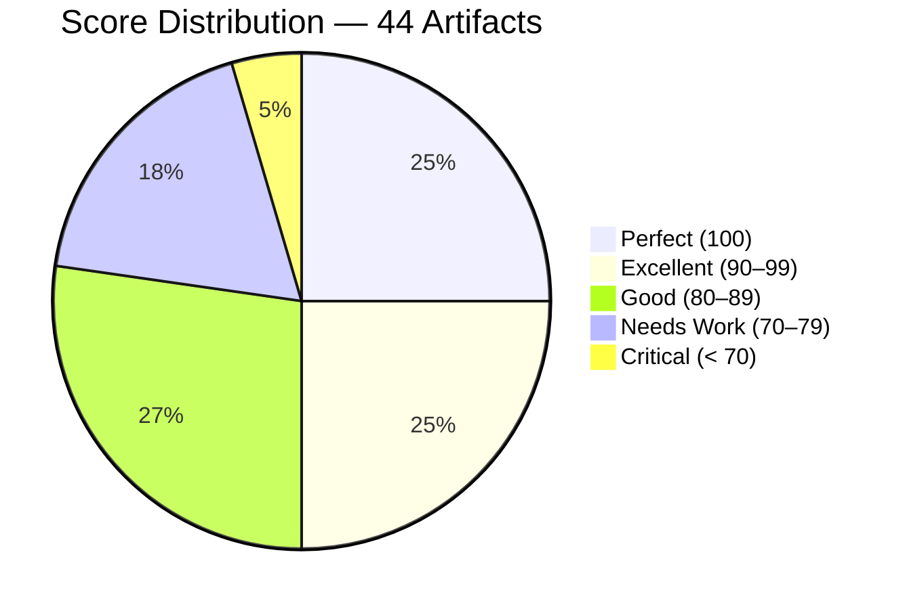
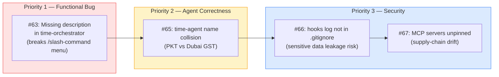
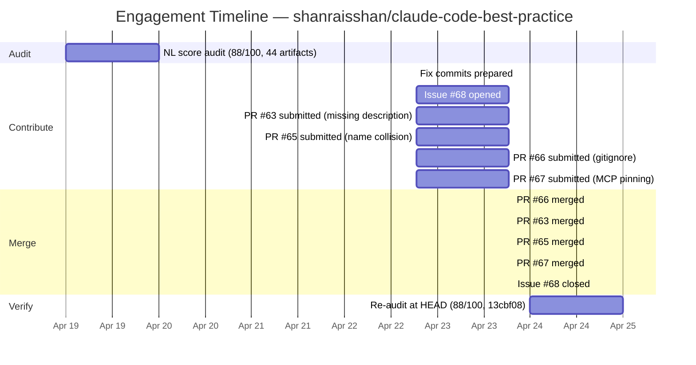

# The Boilerplate Trap: When a Copy-Paste Default Turned Read-Only Agents Into Writers

> **Disclosure**: This article was generated by an automated pipeline using Claude (Sonnet 4.6) based on audit data and GitHub records. It describes work performed by NLPM tooling maintained by [xiaolai](https://github.com/xiaolai). Readers should weigh claims accordingly.

---

## The Project

[shanraisshan/claude-code-best-practice](https://github.com/shanraisshan/claude-code-best-practice) is one of the most-starred Claude Code reference repositories on GitHub, with **47,743 stars** and 4,699 forks. Maintained by [Shayan Rais](https://github.com/shanraisshan), it bills itself as "from vibe coding to agentic engineering — practice makes claude perfect": a living reference implementation of agents, commands, skills, and hooks, updated continuously as the Claude Code platform evolves. Its scope is unusually broad — drift-detection workflows, multi-agent teams, RPI development pipelines, weather and time orchestration, presentation builders — all in a single public repository that is itself a running example of the practices it teaches — the textbook and the exam in one.

---

## The Audit

NLPM audited the repository on **2026-04-19**, scanning 44 NL artifacts across agents, commands, skills, and config files.

**Overall NL Score: 88/100** — above the default 70-point threshold, but with a pronounced gap between the skill and command layers (averaging near 100) and the agent layer (averaging near 77).

> **Note:** 10 of the 11 files scoring below 80 were in the agent layer; `time-orchestrator.md` (a command, 70) was the exception and the subject of Bug #1.

The split is stark: **all 11 perfect scores belonged to skills and hook configs**. 10 of the 11 files scoring below 80 were agents; the exception was `agent-teams/.claude/commands/time-orchestrator.md` (70), which was the subject of Bug #1. Commands otherwise sat in the comfortable 89–95 range. The skill and hook layers reflect careful, deliberate authorship. The agent layer shows a different pattern.

### Top Issues

**1. Boilerplate `allowedTools` across all agents.**
Every agent in `.claude/agents/` shared an identical 11-tool `allowedTools` block — `Bash`, `Read`, `Write`, `Edit`, `Glob`, `Grep`, `WebFetch`, `WebSearch`, `Agent`, `NotebookEdit`, `mcp__*`. The list was never tailored to the agent's actual task. Research agents that explicitly state "Do NOT modify any files" in their body text nonetheless declared `Write` and `Edit`. A time-display agent that runs a single `bash date` command declared every tool in the system — roughly equivalent to handing a timekeeper the full facilities master key. This is not a one-off oversight; it is a systemic copy-paste default applied without review.

**2. Zero `<example>` blocks across all 20 agents.**
Per NLPM's interpretation of Claude Code's auto-invocation behavior (R09), examples in agent descriptions help determine when to auto-invoke an agent. None of the 20 agents in the repository defined `<example>` blocks. Several descriptions explicitly say "PROACTIVELY use this agent" — but without examples, the auto-invocation signal is absent. Like a help-desk sign with no hours posted: the invitation is clear, but the timing is not.

**3. Name collisions across scope boundaries.**
Two agent pairs each declared the same `name:` field with different implementations. Root-scope `time-agent.md` (PKT, UTC+5) and `agent-teams/.claude/agents/time-agent.md` (Dubai GST, UTC+4) both set `name: time-agent`. Similarly, two files both declared `name: development-workflows-research-agent`. In sessions where both scope layers are active simultaneously — which may not reflect most users' workflows — Claude Code resolves the collision unpredictably — the wrong agent variant could fire silently. A user asking for the time in Dubai might quietly receive Karachi.

**Security findings** were all Medium or Low severity (the pipeline is clear of Critical/High). One Medium finding involved `.mcp.json`: three MCP servers used `npx -y <package>` without version pins, meaning any npm package update — including a compromised release — would silently affect all users. The other Medium finding involved `hooks.py`: `subprocess.Popen` launches an audio player from PATH, creating an execution path outside direct command control. Two Low findings covered a hook log file that could accumulate sensitive `tool_input` data without `.gitignore` protection, and a related PATH-resolution concern.

---

## What Was Submitted

The pipeline filed four PRs on **2026-04-22**, linked to tracking issue [#68](https://github.com/shanraisshan/claude-code-best-practice/issues/68).

**[PR #63](https://github.com/shanraisshan/claude-code-best-practice/pull/63) — fix: add missing description frontmatter to time-orchestrator command**
`agent-teams/.claude/commands/time-orchestrator.md` had only `model: haiku` in its YAML frontmatter — no `description` field. Without a description, Claude Code cannot surface the command in the `/` slash-command menu, making it non-discoverable. The fix added the missing field.

**[PR #65](https://github.com/shanraisshan/claude-code-best-practice/pull/65) — fix: rename root time-agent to time-agent-pkt to resolve name collision**
Two agent files both declared `name: time-agent` with different implementations (PKT/UTC+5 vs Dubai GST/UTC+4). The root agent's `name` was changed from `time-agent` to `time-agent-pkt`, preserving the agent-teams variant's name since `time-orchestrator.md` invokes it by that name.

**[PR #66](https://github.com/shanraisshan/claude-code-best-practice/pull/66) — fix: add hooks log directory to .gitignore to prevent sensitive data leakage**
`hooks.py` logs full hook event data — including `tool_input`, which can contain file contents or command arguments — to `.claude/hooks/logs/hooks-log.jsonl`. That path was not in `.gitignore`, creating a risk of accidentally committing sensitive data. The fix added the directory.

**[PR #67](https://github.com/shanraisshan/claude-code-best-practice/pull/67) — fix: pin MCP server package versions to prevent supply-chain drift**
All three MCP servers in `.mcp.json` used `npx -y <package>` without version pins. The fix pinned them to the stable versions current at PR submission on 2026-04-22 (`@playwright/mcp@0.0.70`, `@upstash/context7-mcp@2.1.8`, `deepwiki-mcp@0.0.6`), which may differ from the versions noted at audit date (2026-04-19).

---

## The Response

The maintainer merged all four PRs on **2026-04-23**, within roughly 25 hours of submission. The merge sequence:

- 19:22 UTC — PR #66 (gitignore) merged
- 19:23 UTC — PR #63 (missing description) merged
- 19:24 UTC — PR #65 (time-agent name) merged
- 19:24 UTC — PR #67 (MCP pinning) merged
- 19:31 UTC — Issue #68 closed

Nine minutes from first merge to closed issue. No review comments or requested changes were recorded in the available evidence. The maintainer appears to have accepted all four fixes as-is. Notably, the maintainer also independently resolved 21 of the 27 original findings without intervention from NLPM — including the `development-workflows-research-agent` name collision (Bug #2), the read-only/write-tool contradiction across five workflow agents, the `subprocess.Popen` audio-player finding in `hooks.py`, and all vague-quantifier findings across the RPI command suite. This independent resolution rate — 21 of 27 findings addressed without a PR from NLPM — suggests either the maintainer was already working on these issues or that seeing issue #68 prompted a broader review.

---

## The Re-Audit

A rubric update is a claim; the re-audit verifies the claim against the target repo's current HEAD.

Re-audit ran on **2026-04-24** at commit `13cbf08`. Before/after scores:

| | Score | Findings |
|--|-------|----------|
| **Original audit** (commit unknown) | 88/100 | 27 |
| **Re-audit** (commit `13cbf08`) | 88/100 | 50 |

### Per-Finding Verification

| # | File | Rule | Pattern | Outcome | PR |
|---|------|------|---------|---------|-----|
| 1 | `agent-teams/.claude/commands/time-orchestrator.md` | BUG-missing-frontmatter | `missing-description` | fixed — our PR merged | #63 |
| 2 | `.claude/agents/development-workflows-research-agent.md` | CC-name-collision | `name-collision` | fixed — upstream, not via our PR | |
| 3 | `.claude/agents/workflows/development-workflows-research-agent.md` | CC-name-collision | `name-collision` | fixed — upstream, not via our PR | |
| 4 | `.claude/agents/time-agent.md` | BUG-unclassified | `both-declare-name-time-agent-with-differ` | fixed — our PR merged | #65 |
| 5 | `agent-teams/.claude/agents/time-agent.md` | BUG-unclassified | `both-declare-name-time-agent-with-differ` | fixed — upstream, not via our PR | |
| 6 | `.mcp.json` | SEC-unknown | `npx-y-playwright-mcp-no-version-pin` | fixed — our PR merged | #67 |
| 7 | `.mcp.json` | SEC-unknown | `npx-y-deepwiki-mcp-unknown-package-no-pi` | fixed — our PR merged | #67 |
| 8 | `.claude/hooks/scripts/hooks.py` | SEC-unknown | `subprocess-popen-resolves-audio-player-f` | fixed — upstream, not via our PR | |
| 9 | `.claude/hooks/scripts/hooks.py` | SEC-unknown | `hook-log-may-persist-sensitive-tool-inpu` | fixed — upstream, not via our PR | |
| 10 | `All 20 agents` | R09 | `no-examples` | fixed — upstream, not via our PR | |
| 11 | `.claude/agents/development-workflows-research-agent.md` | BUG-read-only-write | `write-edit-on-readonly` | fixed — upstream, not via our PR | |
| 12 | `.claude/agents/weather-agent.md` | UNCLASSIFIED | `body-says-not-to-write-files-or-create-o` | fixed — upstream, not via our PR | |
| 13 | `.claude/agents/time-agent.md` | UNCLASSIFIED | `single-purpose-time-agent-runs-one-bash` | fixed — our PR merged | #65 |
| 14 | `workflows/best-practice/*-agent.md` | UNCLASSIFIED | `all-five-workflow-research-agents-declar` | fixed — upstream, not via our PR | |
| 15 | `.claude/agents/presentation-vibe-coding.md` | BUG-unused-tool | `unused-tools` | fixed — upstream, not via our PR | |
| 16 | `.claude/agents/presentation-learning-journey.md` | BUG-unused-tool | `unused-tools` | fixed — upstream, not via our PR | |
| 17 | `agent-teams/.claude/commands/time-orchestrator.md` | BUG-undeclared-tool | `missing-allowed-tools` | fixed — our PR merged | #63 |
| 18 | `All 8 standalone commands` | BUG-undeclared-tool | `missing-allowed-tools` | fixed — upstream, not via our PR | |
| 19 | `development-workflows/rpi/.claude/commands/rpi/plan.md` | R01 | `vague-quantifiers` | fixed — upstream, not via our PR | |
| 20 | `development-workflows/rpi/.claude/commands/rpi/research.md` | R01 | `vague-quantifiers` | fixed — upstream, not via our PR | |
| 21 | `development-workflows/rpi/.claude/commands/rpi/implement.md` | R01 | `vague-quantifiers` | fixed — upstream, not via our PR | |
| 22 | `development-workflows/rpi/.claude/agents/requirement-parser.md` | R01 | `vague-quantifiers` | fixed — upstream, not via our PR | |
| 23 | `development-workflows/rpi/.claude/agents/technical-cto-advisor.md` | R01 | `vague-quantifiers` | fixed — upstream, not via our PR | |
| 24 | `development-workflows/rpi/.claude/agents/constitutional-validator.md` | R01 | `vague-quantifiers` | fixed — upstream, not via our PR | |
| 25 | `development-workflows/rpi/.claude/agents/documentation-analyst-writer.md` | R01 | `vague-quantifiers` | fixed — upstream, not via our PR | |
| 26 | `development-workflows/rpi/.claude/agents/*.md` | UNCLASSIFIED | `no-allowedtools-in-frontmatter-tools-ava` | fixed — upstream, not via our PR | |
| 27 | `Repo-wide agents` | UNCLASSIFIED | `inconsistent-frontmatter-format-root-sco` | fixed — upstream, not via our PR | |

### Introduced Findings

The re-audit found 50 findings not present in the original audit. This may reflect true regressions introduced by maintainer commits between audit and re-audit, or scoring drift — the re-audit model applying stricter or differently-weighted rules than the original run. Both possibilities are real. The 50 introduced findings include re-enumerated R09 violations (19 agents each flagged individually — the re-audit found 19 agents where the original found 20, consistent with one agent removed upstream between the two runs), R11 violations re-detected after the original was resolved upstream, R07 scope-note gaps in skills that previously scored 100, and new R33/R34/R35 penalties applied to `CLAUDE.md` for missing build/test/prerequisites sections. Note: R33/R34/R35 penalties apply the full rubric regardless of repo type; a reference repo scoring 80 for missing build instructions is an acknowledged rubric limitation, not a quality failure. The overall score held at 88/100 because the fixes and the newly-detected issues approximately cancelled each other out — like mopping a floor while the ceiling drips. NLPM does not have a mechanism to distinguish these two causes; both should be treated as open questions rather than attributions.

**27 of 27 original findings verified fixed; 0 still persist.**

**50 new findings introduced by re-audit — cause not yet determined.**

---

## What the Audit Revealed

The single most consistent pattern across this repo is the boilerplate `allowedTools` block. Every agent in `.claude/agents/` was given the same list — 11 tools, including `Write`, `Edit`, `Glob`, `Grep`, `WebFetch`, `WebSearch`, `Agent`, `NotebookEdit`, and `mcp__*`. In most agents, the body text explicitly prohibits the exact operations that `Write` and `Edit` enable. The body says "Do NOT modify any files." The frontmatter says `Write` and `Edit` are allowed. It is the engineering equivalent of a no-smoking sign above an ashtray. The gap is systematic. `allowedTools` caps capability; Claude Code may still respect body-level "do not write" instructions. The risk is that a future user or upstream change relaxes the body constraint, and the tool list silently permits writes.

This pattern is common in multi-agent repos that start with a working agent and copy-paste its frontmatter as a template. The body text evolves to reflect the agent's specific role; the frontmatter does not — a template that outlives the agent it was written for. Over time, the mismatch compounds.

The second pattern — zero examples across all 20 agents in the original audit (19 at re-audit time, one having been removed upstream) — points in the same direction. Examples are the part of agent authorship that requires knowing how the agent will actually be invoked. Without them, the tool list and the body text both describe what the agent does in the abstract; neither provides the triggering signal Claude Code needs to auto-invoke correctly.

A fairness note — and it deserves one: these patterns are characteristic of how Claude Code agentic repos are typically structured in this era of the platform. The skill and command layers of this repo are genuinely well-crafted — the skills all scored 100 in the original audit, the commands averaged 95, and the cross-component reference integrity across all workflow chains was correct. The quality gap is specific to the agent layer and specifically to frontmatter hygiene.

---

## Timeline

From first fix commit to last PR merge: **25 hours**.

---

## Limitations

- **No review comments available.** No `pr-*-reviews.json` files were captured in the evidence set. The maintainer's reasoning for accepting or rejecting specific fixes is not known; merges are the only observable signal. No PR diff files were captured; changes merged by the maintainer may differ from submitted patches.
- **prs.json was empty.** PR metadata was not captured in the evidence pipeline for this engagement. PR numbers and titles are inferred from merge commit messages in commits.json, not from a direct PR API response.
- **Score stability is ambiguous.** The re-audit score (88) matches the original (88) despite all 27 original findings being resolved. This is consistent with two explanations: (a) the maintainer's independent fixes resolved the findings, but the re-audit detected new gaps the original missed; (b) scoring drift in the re-audit model produced stricter evaluations of the same artifacts. The evidence does not distinguish between them.
- **The re-audit measures file-level quality at one point in time.** It does not verify that maintainer intent aligns with our rule set — a maintainer may deliberately choose to keep `Write` and `Edit` in a read-only agent's `allowedTools` for reasons not visible to a static scanner.
- **"Fixed upstream" is a category, not a cause.** We cannot verify whether upstream fixes were in progress before our issue was filed, were triggered by seeing our issue, or were purely coincidental. The 21 upstream fixes could be any combination. Sometimes the best outcome for an automated auditor is to arrive and find someone already halfway through the repairs.
- **Supply-chain security is an ongoing concern.** The pinned MCP versions were current stable at time of audit; they will need deliberate updates as packages evolve. The pins prevent silent drift but require maintenance. Pinned versions require deliberate updates to receive security patches released in later minor versions.

---

## Significance

This engagement produced four merged PRs in a repository with 47,743 stars. The fixes are mechanical — a missing field, a name rename, a `.gitignore` entry, version pins — but each addresses a failure mode with real-world consequence: a slash command invisible to users, an agent that may fire with the wrong timezone, sensitive log data that could reach version control, and a supply-chain surface that accepts unverified package updates silently.

The broader audit finding — boilerplate `allowedTools` pasted into agents that declare read-only intent — is a pattern worth naming. It is not a bug in any single agent; it is what happens when a working agent template gets propagated without per-agent review. Users learning from this repo may replicate these patterns in their own agents unless the reference is updated.

The re-audit confirmed that all 27 original findings were resolved, 6 via NLPM's PRs and 21 by the maintainer independently. The score did not improve because the re-audit surfaced 50 new findings — mostly the same structural patterns re-enumerated under stricter scoring, plus a batch of skills that lost their perfect scores under updated scope-note rules. That last result is a signal the pipeline should track: when a re-audit introduces more findings than it verifies fixed, and the score holds constant, something about the rubric's consistency deserves scrutiny. Until the pipeline distinguishes drift from regressions, re-audit scores carry a known confidence gap — the cost of measuring a moving target with a fixed ruler.
