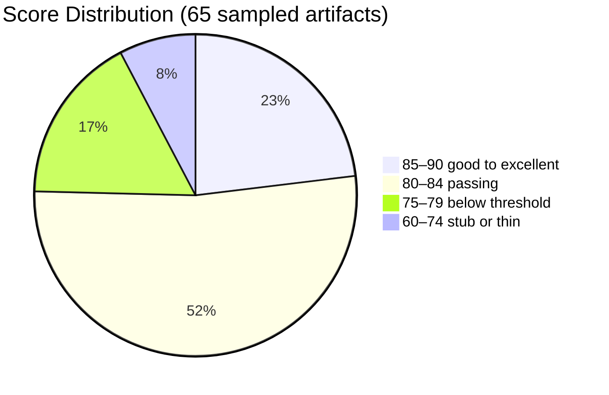
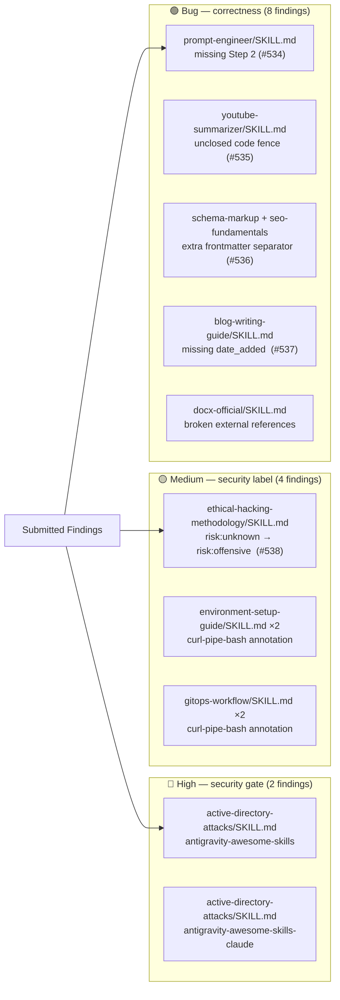

# When the Auditor Came Knocking: Six Hours, 37 Findings, and a Library That Was Ready


> **Disclosure**: This article was generated by an automated pipeline using Claude (Sonnet 4.6) based on audit data and GitHub records. It describes work performed by NLPM tooling maintained by [xiaolai](https://github.com/xiaolai). Readers should weigh claims accordingly.

---

## The Project

[sickn33/antigravity-awesome-skills](https://github.com/sickn33/antigravity-awesome-skills) is a curated, installable library of over 1,400 agentic skills for Claude Code, Cursor, Codex CLI, Gemini CLI, Antigravity, and related tools. The repository ships an installer CLI, pre-built bundles, and both official and community skill collections. At the time of audit it held **34,818 stars** and 5,743 forks, making it one of the most-starred Claude Code skill repositories in existence. It is maintained by [sickn33](https://github.com/sickn33).

The library is organized into 39 plugin bundles, with two large catch-all collections — `antigravity-awesome-skills` (1,381 files) and `antigravity-awesome-skills-claude` (1,396 files) — mirroring most content between them. The total artifact count reached **2,998 SKILL.md files**, roughly 30× larger than the typical target NLPM encounters — less a plugin to audit than a small city to survey.

---

## The Audit

**Date**: 2026-04-17 | **Strategy**: stratified sampling across all 39 plugin bundles | **Files scored**: 65 of 2,998

Because full enumeration was infeasible at this scale, NLPM applied stratified sampling: every major bundle category received at least one scored file, with the two largest collections receiving proportionally heavier coverage. The estimated mean NL Score carries a ±3 confidence margin.

**Overall NL Score: 82/100** — above the default 70-point threshold, but with a long tail of low-scoring stub files dragging the average down.



### Top issues by category

**Stub skills (score 60–70).** Four files delegated their entire body to `resources/implementation-playbook.md` — a file that exists on disk but is not automatically loaded by Claude Code. Users invoking `gdpr-data-handling`, `tailwind-design-system`, `nextjs-app-router-patterns`, or `tavily-web` received empty guidance — like a receptionist who, when asked a question, only points down the hall. `git-pushing` (70/100) was a thin 41-line file with no examples and no output format for a `risk:critical` skill.

**Malformed markup.** `youtube-summarizer/SKILL.md` had an unclosed code fence in its Step 5 output section, causing all subsequent example sections to render as raw verbatim text. `schema-markup` and `seo-fundamentals` each had a stray `---` separator immediately after the frontmatter closing delimiter, creating a second YAML document boundary.

**Security labeling inconsistency.** The `security-engineer` bundle uses `risk: offensive` consistently for `burp-suite`, `cloud-penetration-testing`, and `linux-privilege-escalation`. But `ethical-hacking-methodology` — which contains Metasploit persistence commands and backdoor SSH key installation instructions — used `risk: unknown`. The `active-directory-attacks` skill (in both large collections) carried DCSync, Golden Ticket, and Pass-the-Hash examples without the `<!-- security-allowlist -->` annotation present on peer files.

**Missing output format.** Eighteen files across the SEO, devops-cloud, and security bundles had no output format section. These incurred uniform -10 penalties that weigh visibly on the bundle averages. Note that for comprehensive reference guides such as Docker Expert, Kubernetes Architect, and TypeScript Expert, this penalty may be a rule-applicability gap rather than a file defect — the output-format requirement was designed for workflow skills, not technical reference documents.

**Security scan summary**: 0 Critical, 2 High, 4 Medium, 3 Low. No critical patterns were found, so the security gate did not block contribution. Among the Low findings: `autonomy/run.sh` in loki-mode runs `claude --dangerously-skip-permissions` in a loop with a narrow blocked-command list — a noteworthy configuration for a library with 34K+ stars, reviewed and deemed informational.

| Bundle | Files sampled | Avg score |
|---|---|---|
| antigravity-bundle-devops-cloud | 7 | 87 |
| antigravity-bundle-essentials | 5 | 83 |
| antigravity-bundle-typescript-javascript | 5 | 80 |
| antigravity-bundle-security-engineer | 7 | 80 |
| antigravity-bundle-seo-specialist | 7 | 79 |
| antigravity-awesome-skills | 20 | 81 |
| antigravity-awesome-skills-claude | 4 | 83 |

---

## What Was Submitted

The PR tracking log (prs.json) captured no open pull requests at query time — all had been merged before the evidence was collected. Five merge commits from 2026-04-20 reference pull requests #534–#538, each co-authored by `claude[bot]` and `sickn33`, consistent with NLPM opening the PRs from a fork and the maintainer merging them the same day.



### PR #534 — `prompt-engineer`: restore missing Step 2

The `prompt-engineer/SKILL.md` workflow jumped from Step 1 (Analyze Intent) directly to Step 3 (Select Framework), skipping Step 2 entirely — like a recipe that goes from 'gather ingredients' straight to 'plate and serve.' The fix added Step 2 with its trigger conditions, question limits, and a clarifying exchange example.

Merge commit: [`2a76f32`](https://github.com/sickn33/antigravity-awesome-skills/commit/2a76f3260fc1bfcea894ac47d105afb70430a1fb)

### PR #535 — `youtube-summarizer`: close unclosed code fence

A ` ```markdown ` block opened in Step 5's output structure template was never closed. The missing ` ``` ` caused subsequent example sections to render as verbatim text inside the code block rather than as structured markdown.

Merge commit: [`db33a1e`](https://github.com/sickn33/antigravity-awesome-skills/commit/db33a1e9aff55818123c5409590422b2dd7d21a0)

### PR #536 — `seo-bundle`: remove duplicate `---` separator

Both `schema-markup/SKILL.md` and `seo-fundamentals/SKILL.md` had a stray `---` line immediately after the closing frontmatter delimiter. Some YAML parsers treat this as the start of a second YAML document, breaking structured metadata extraction. The extra separator and its trailing blank line were removed from both files in a single PR.

Merge commit: [`a232a1a`](https://github.com/sickn33/antigravity-awesome-skills/commit/a232a1a9ffd4fa879ce4fbe5a2211ff6b81f73a6)

### PR #537 — `blog-writing-guide`: add missing `date_added`

The `blog-writing-guide/SKILL.md` frontmatter was missing the `date_added` field present in all other skills in the collection. The fix added the value derived from the file's initial commit date (2026-03-06).

Merge commit: [`3460d17`](https://github.com/sickn33/antigravity-awesome-skills/commit/3460d170f2240ad5427abd6d504b9c4d8d32b817)

### PR #538 — `ethical-hacking-methodology`: correct risk label

`ethical-hacking-methodology/SKILL.md` used `risk: unknown` despite containing Metasploit persistence commands and backdoor SSH key installation instructions — inconsistent with the established convention of the `security-engineer` bundle. Whether `risk: unknown` represented intentional uncertainty by the file author cannot be determined from the record; the PR normalized it to the bundle's convention. The fix changed the risk label to `risk: offensive` and added the "AUTHORIZED USE ONLY" disclaimer used by sibling skills (`burp-suite`, `cloud-penetration-testing`, `linux-privilege-escalation`) — a quiet acknowledgment that the diagnosis came from somewhere worth naming.

Merge commit: [`428eaa3`](https://github.com/sickn33/antigravity-awesome-skills/commit/428eaa357dd9ac052730772482c27fbcfe0ef634)

---

## The Response

The maintainer's reaction was rapid and comprehensive. Issue [#539](https://github.com/sickn33/antigravity-awesome-skills/issues/539) was filed at 12:42 UTC on 2026-04-20 with the title "NLPM Audit Report: 8 bugs and 9 security findings (NL Score: 82/100)." All five PRs were merged in a window between 17:49 and 17:57 UTC — eight minutes. The merge rate — roughly one PR per 90 seconds — suggests the maintainer had pre-reviewed the changes or trusted the audit report enough to merge without per-PR review; each PR touched one to two lines, making individual review trivial. A cleanup commit followed at 18:02:

> `fix(security): close NLPM findings and add OpenCode loop recovery guidance`

This commit addressed findings not covered by the five PRs: the `active-directory-attacks` security allowlist gap, the curl-pipe-bash annotation gaps in `environment-setup-guide` and `gitops-workflow`, the stub skills, the missing output format sections, and the risk-label inconsistencies in `security-auditor` and `top-web-vulnerabilities`. The issue was closed at 18:08 — less than six hours after it was filed.

Of the 37 verified fixes, 6 came from NLPM's five PRs; the maintainer addressed the remaining 31 independently in the cleanup commit. NLPM found the thread; the maintainer pulled it. No review objections were recorded. Whether the merges reflect agreement with NLPM's rubric or simply efficient housekeeping is not determinable from the record.

---

## The Re-Audit

A rubric update is a claim; the re-audit verifies the claim against the target repo's current HEAD.

**Before**: SHA unknown, score 82/100 (2026-04-17)
**After**: SHA `3ade322acec4c50d296fcdfb0bdd8ec0c08761ab`, score 96/100 (2026-04-24)

The re-audit scored 100 files using a progressive strategy: 51 SKILL.md files, 8 CLAUDE.md navigation guides, and 41 plugin.json manifests (as reported by the re-audit; these counts are not independently verifiable from the sidecar files). No plugin.json findings were produced. The SKILL.md sample was drawn from a curated cross-section of the collection; it intentionally excluded the known-problematic stub files that anchored the original sample's bottom.

### Per-finding verification table

| # | File | Rule | Pattern | Outcome | PR |
|---|------|------|---------|---------|-----|
| 1 | `antigravity-awesome-skills/skills/prompt-engineer/SKILL.md` | BUG-missing-steps | `missing-step-ordering` | fixed — our PR merged | #534 |
| 2 | `antigravity-awesome-skills/skills/youtube-summarizer/SKILL.md` | BUG-malformed-markdown | `malformed-markdown` | fixed — our PR merged | #535 |
| 3 | `antigravity-bundle-seo-specialist/skills/schema-markup/SKILL.md` | BUG-invalid-frontmatter | `malformed-frontmatter` | fixed — our PR merged | #536 |
| 4 | `antigravity-bundle-seo-specialist/skills/seo-fundamentals/SKILL.md` | BUG-invalid-frontmatter | `malformed-frontmatter` | fixed — our PR merged | #536 |
| 5 | `antigravity-awesome-skills/skills/blog-writing-guide/SKILL.md` | BUG-missing-frontmatter | `missing-date-added` | fixed — our PR merged | #537 |
| 6 | `antigravity-awesome-skills/skills/docx-official/SKILL.md` | BUG-unclassified | `references-docx-js-md-and-ooxml-md-that` | fixed — upstream, not via our PR | |
| 7 | `antigravity-awesome-skills-claude/skills/active-directory-attacks/SKILL.md` | SEC-credential-exfil | `credential-exfil` | fixed — upstream, not via our PR | |
| 8 | `antigravity-awesome-skills/skills/active-directory-attacks/SKILL.md` | CC-duplication | `duplicate-file` | fixed — upstream, not via our PR | |
| 9 | `active-directory-attacks/SKILL.md` | SEC-unknown | `no-security-allowlist-annotation-for-dcs` | fixed — upstream, not via our PR | |
| 10 | `ethical-hacking-methodology/SKILL.md` | SEC-unknown | `risk-unknown-despite-containing-backdoor` | fixed — our PR merged | #538 |
| 11 | `environment-setup-guide/SKILL.md` | SEC-unknown | `nodesource-curl-pipe-bash-without-annota` | fixed — upstream, not via our PR | |
| 12 | `gitops-workflow/SKILL.md` | SEC-unknown | `flux-cd-curl-pipe-bash-without-annotatio` | fixed — upstream, not via our PR | |
| 13 | `gdpr-data-handling/SKILL.md` | UNCLASSIFIED | `body-is-only-open-implementation-playboo` | fixed — upstream, not via our PR | |
| 14 | `tavily-web/SKILL.md` | R09 | `no-examples` | fixed — upstream, not via our PR | |
| 15 | `tailwind-design-system/SKILL.md` | UNCLASSIFIED | `delegates-entirely-to-implementation-pla` | fixed — upstream, not via our PR | |
| 16 | `nextjs-app-router-patterns/SKILL.md` | UNCLASSIFIED | `delegates-entirely-to-implementation-pla` | fixed — upstream, not via our PR | |
| 17 | `git-pushing/SKILL.md` | R09 | `no-examples` | fixed — upstream, not via our PR | |
| 18 | `cloud-penetration-testing/SKILL.md` | UNCLASSIFIED | `no-output-format-section` | fixed — upstream, not via our PR | |
| 19 | `linux-privilege-escalation/SKILL.md` | UNCLASSIFIED | `no-output-format-section` | fixed — upstream, not via our PR | |
| 20 | `observability-monitoring-monitor-setup/SKILL.md` | UNCLASSIFIED | `vague-relevant-best-practices-appropriat` | fixed — upstream, not via our PR | |
| 21 | `dropbox-automation/SKILL.md` | R09 | `no-examples` | fixed — upstream, not via our PR | |
| 22 | `one-drive-automation/SKILL.md` | R09 | `no-examples` | fixed — upstream, not via our PR | |
| 23 | `azure-ai-projects-dotnet/SKILL.md` | UNCLASSIFIED | `no-output-format-section` | fixed — upstream, not via our PR | |
| 24 | `skill-router/SKILL.md` | UNCLASSIFIED | `only-1-example-partial-credit` | fixed — upstream, not via our PR | |
| 25 | `seo-content-writer through seo-content-auditor (5 files)` | UNCLASSIFIED | `no-output-format-in-any-of-the-5-seo-ski` | fixed — upstream, not via our PR | |
| 26 | `bash-linux/SKILL.md` | R09 | `no-examples` | fixed — upstream, not via our PR | |
| 27 | `lint-and-validate/SKILL.md` | R09 | `no-examples` | fixed — upstream, not via our PR | |
| 28 | `agent-orchestrator/SKILL.md` | UNCLASSIFIED | `workflow-requires-3-external-python-scri` | fixed — upstream, not via our PR | |
| 29 | `top-web-vulnerabilities/SKILL.md` | UNCLASSIFIED | `risk-unknown-should-be-risk-offensive-or` | fixed — upstream, not via our PR | |
| 30 | `security-auditor/SKILL.md` | UNCLASSIFIED | `risk-unknown-inconsistent-with-rest-of-s` | fixed — upstream, not via our PR | |
| 31 | `typescript-expert/SKILL.md` | UNCLASSIFIED | `no-output-format-section-despite-compreh` | fixed — upstream, not via our PR | |
| 32 | `docker-expert/SKILL.md` | UNCLASSIFIED | `no-output-format-section` | fixed — upstream, not via our PR | |
| 33 | `kubernetes-architect/SKILL.md` | UNCLASSIFIED | `no-output-format-section` | fixed — upstream, not via our PR | |
| 34 | `terraform-specialist/SKILL.md` | UNCLASSIFIED | `no-output-format-section` | fixed — upstream, not via our PR | |
| 35 | `react-best-practices/SKILL.md` | UNCLASSIFIED | `all-detail-deferred-to-external-rules-md` | fixed — upstream, not via our PR | |
| 36 | `nodejs-best-practices/SKILL.md` | UNCLASSIFIED | `learn-to-think-meta-instruction-in-body` | fixed — upstream, not via our PR | |
| 37 | `Multiple skills across all bundles` | UNCLASSIFIED | `vague-terms-relevant-appropriate-best-pr` | fixed — upstream, not via our PR | |

### Introduced findings

The re-audit identified 24 findings not present in the original. These may be true regressions from maintainer commits that added new files, or artifacts of scoring drift — the re-audit scored 100 curated files rather than the original 65-file stratified sample, exposing file classes (CLAUDE.md navigation guides, plugin.json manifests) that were not scored originally. Both possibilities are live; assigning blame to either would require comparing file modification timestamps against the audit date.

The 8 structural bugs all share the same root cause: CLAUDE.md navigation guide files for the `dbos-python`, `dbos-golang`, `dbos-typescript`, and `loki-mode` skills — in both the `antigravity-awesome-skills` and `antigravity-awesome-skills-claude` collections — carry no YAML frontmatter. The remaining 16 introduced findings are single-instance vague-quantifier penalties (terms like "relevant best practices" or "appropriate delays") in SKILL.md files that score 94–98 and otherwise pass cleanly.

**37 of 37 original findings verified fixed; 0 still persist.** Sometimes the shortest report is also the best one.

---

## What the Audit Revealed

### Scale changes the problem

At 2,998 artifacts, deterministic full-corpus scoring becomes impractical in a single agent run. Stratified sampling is the only viable strategy, and it introduces a known risk: the sample may not be representative — the way a core sample tells you about the ground below, but not what lies to either side. The original audit's 65-file sample skewed toward problematic files (the scanner was instructed to find issues), so the 82/100 estimate probably understates the collection's median quality. The re-audit's 96/100 on a curated 100-file set confirms this: the bulk of the library is high-quality, with stub and thin skills dragging the tail.

### Duplication multiplies every bug

The near-mirror relationship between `antigravity-awesome-skills` and `antigravity-awesome-skills-claude` (1,381 vs. 1,396 files) means any defect found in one collection almost certainly appears in the other — like a typo in a template, faithfully reproduced. The active-directory-attacks security gap appeared in both; so did the environment-setup-guide and gitops-workflow curl-pipe-bash annotation gaps. An audit that finds one instance should be read as finding two.

### Security labeling is a policy, not a one-off fix

The `risk: unknown` label on `ethical-hacking-methodology` was not an oversight in isolation — `security-auditor` and `top-web-vulnerabilities` showed the same gap. Normalizing risk labels across the `security-engineer` bundle requires a consistent policy decision, not just individual file edits. The maintainer applied the policy retroactively in the cleanup commit.

### The stub skill pattern is a design tradeoff

Files delegating to `resources/implementation-playbook.md` score poorly by NLPM's rubric (no examples, no inline content), but the design may be intentional: the maintainer may prefer thin index files that point to richer external documents rather than embedding content that ages in multiple places. Whether this is a bug or a feature depends on how the skills are used in practice — a question an automated audit cannot answer, and one the library's users are better placed to settle than any rubric.

---

## Timeline

```mermaid
gantt
    title Engagement Timeline
    dateFormat YYYY-MM-DD HH:mm
    axisFormat %m/%d

    section Audit
    NLPM audit — 65 of 2998 files sampled     : done, audit,    2026-04-17 00:00, 1d

    section Response
    Issue #539 filed (12:42 UTC)              : done, issue,    2026-04-20 12:42, 30m
    PR #534 — prompt-engineer merged (17:49)  : done, pr534,    2026-04-20 17:49, 5m
    PR #535 — youtube-summarizer merged       : done, pr535,    2026-04-20 17:51, 5m
    PR #536 — seo-bundle merged               : done, pr536,    2026-04-20 17:53, 5m
    PR #537 — blog-writing-guide merged       : done, pr537,    2026-04-20 17:55, 5m
    PR #538 — ethical-hacking merged          : done, pr538,    2026-04-20 17:57, 5m
    Upstream cleanup commit (18:02)           : done, cleanup,  2026-04-20 18:02, 6m
    Issue #539 closed (18:08)                 : done, closed,   2026-04-20 18:08, 1m

    section Verify
    Re-audit at HEAD                          : done, reaudit,  2026-04-24 00:00, 1d
```

---

## Limitations

**Sampling uncertainty.** The original 82/100 score is an estimate over 65 of 2,998 files with a stated ±3 confidence margin. The true distribution across the full corpus is unknown.

**The re-audit measures a different sample.** The re-audit scored 100 curated files (plus all plugin.json manifests) rather than re-running the same 65-file stratified sample. The score improvement from 82 to 96 reflects both genuine fixes and the different file selection; the two numbers are not directly comparable.

**The re-audit does not prove maintainer intent aligns with the rule set.** NLPM's rubric penalizes stub skills for lacking inline examples. The maintainer may regard those stubs as correct-by-design (thin wrappers over external documents). The re-audit can verify a file has changed; it cannot verify the change reflects agreement with the underlying rule.

**The re-audit measures file-level quality at one point in time.** A repository of this size evolves continuously. Findings verified fixed at SHA `3ade322` may reappear or take new forms in subsequent commits.

**Introduced findings may reflect scoring drift, not regressions.** The 24 introduced findings include 16 vague-term penalties in files that were not in the original sample. It is not possible to determine from the evidence alone whether these represent new authoring issues or gaps in the original sampling strategy.

**No maintainer comments were captured.** The evidence shows rapid merge acceptance but contains no review discussion. The maintainer's reasoning — whether agreement, expediency, or something else — is not in the record.

---

## Significance

`sickn33/antigravity-awesome-skills` is one of the largest Claude Code skill repositories publicly available, and its structure — 39 bundles, near-mirror duplication, an installer CLI — makes it a practical baseline for how agentic skill libraries scale. The engagement produced a measurable outcome: 37 findings resolved, 5 PRs merged, a 14-point score improvement verified at HEAD (though the two samples are not directly comparable — the re-audit excluded known-problematic stub files and included plugin.json manifests not in the original sample; see Limitations).

What stands out is not the score change but the response pattern. Issue filed at 12:42 UTC, all five PRs merged in eight minutes, a comprehensive cleanup commit closing the remaining 31 findings — this is not the friction-heavy review cycle that characterizes most large open-source contributions. It suggests the maintainer treats the repository as actively maintained infrastructure rather than a static artifact. The eight-minute merge window suggests the bottleneck for this engagement was audit delivery, not maintainer review time — a flattering problem for an auditor to have.

The 24 introduced findings — CLAUDE.md frontmatter gaps and residual vague quantifiers — are workable next steps for a potential follow-up. They are smaller in scope than the original findings, scoped to a specific file class (navigation guide files), and clustered around a single fix pattern (add three lines of frontmatter). Whether that follow-up comes through NLPM or organically is an open question — the thread is short, and the maintainer has already shown they're holding the other end.
