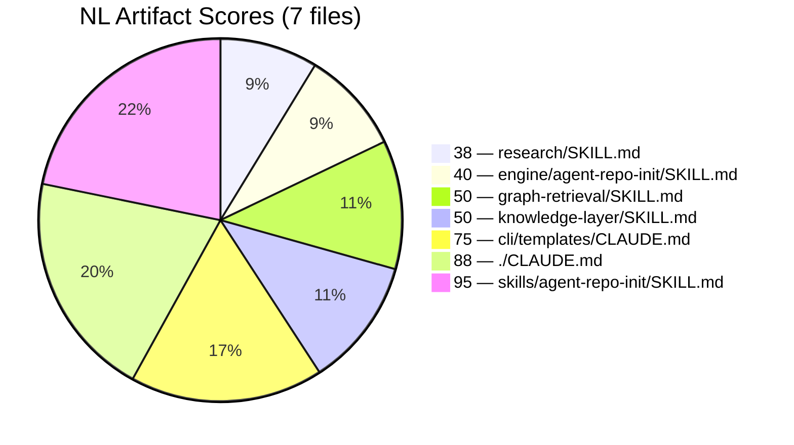
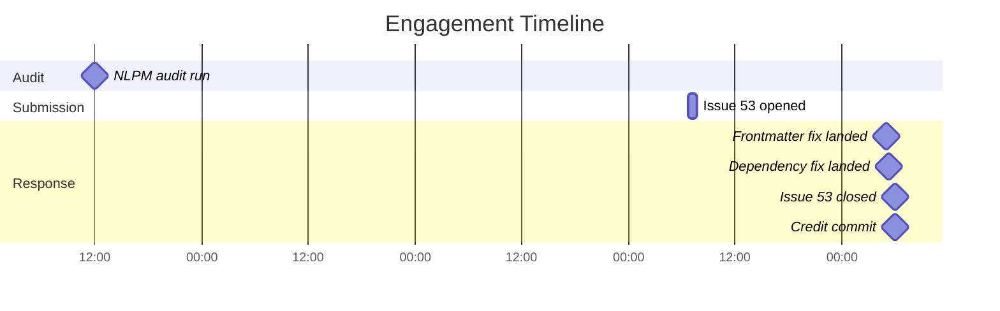

# Present but Unfindable: Four Skill Files That Were Missing Their Own Names

> **Disclosure**: This article was generated by an automated pipeline using Claude (Sonnet 4.6) based on audit data and GitHub records. It describes work performed by NLPM tooling maintained by [xiaolai](https://github.com/xiaolai). Readers should weigh claims accordingly.

## The Project

[antigravity-workspace-template](https://github.com/study8677/antigravity-workspace-template) is a starter kit for AI IDE environments — Claude Code, Codex, and other agentic coding systems. It is maintained by [JingWen Fan (study8677)](https://github.com/study8677) and has accumulated 1,145 stars and 237 forks. The repo ships a Python engine (`antigravity_engine`) that provides a knowledge hub, an ask pipeline, and a set of bundled skills; a CLI for scaffolding; and template configuration files for agentic workspaces.

## The Audit

NLPM audited the repo on 2026-04-20 and returned a score of **62/100** across 7 NL artifacts. The security scan returned no Critical, High, or Medium findings. One Low severity item was noted for informational purposes. The score shortfall was concentrated almost entirely in the engine-side skill files, which had been written without the frontmatter fields that a standards-conformant skill loader requires.

### Score Distribution

The top-level `CLAUDE.md` and the `skills/` reference copy of the agent-repo-init skill scored well. The engine-side skill definitions — the ones actually executed by the engine — accounted for all four bugs and the bulk of the penalty.

### Top Issues

**Bugs (PR-worthy)**

All four engine-side SKILL.md files under `engine/antigravity_engine/skills/` were missing both `name` and `description` frontmatter. Claude Code skill loaders use `name` and `description` frontmatter to index and surface skills; without them, the file is silently skipped — present in the repository like a book shelved with no title on its spine. Behavior within the Python engine's own loader was not independently verified — if that loader uses a separate manifest or file-path convention, these fields may be unused by that runtime.

**Security (Low)**

`engine/pyproject.toml` declared dependencies with only lower-bound version pins (`mcp[cli]>=1.0.0`) or no upper bounds at all (`pydantic`, `requests`, `openai-agents[litellm]`). A future major release of any of these packages could break the engine without any explicit upgrade action. Note: upper-bound pinning is standard hygiene for application code, but is contested for library packages — capping at `<3` can create downstream version conflicts in environments that also depend on pydantic 3.x. This fix is appropriate for the engine's application entrypoint but may need reconsideration if `antigravity_engine` is also consumed as a library dependency.

**Quality (informational)**

`research/SKILL.md` and the engine-side `agent-repo-init/SKILL.md` both had tool signatures without return-value contracts — the caller has no documented guarantee about what the string coming back contains. These were flagged informational; they did not drive a PR-worthy threshold.

### Finding Priority Tiers

```mermaid
graph LR
    subgraph P1["Priority 1 — Unblocks Skill Registration"]
        style P1 fill:#fde8e8,stroke:#e05252
        A[research/SKILL.md\nmissing name + description]
        B[agent-repo-init/SKILL.md\nmissing name + description]
        C[graph-retrieval/SKILL.md\nmissing name + description]
        D[knowledge-layer/SKILL.md\nmissing name + description]
    end
    subgraph P2["Priority 2 — Supply-Chain Hygiene"]
        style P2 fill:#fff3cd,stroke:#e6ac00
        E[engine/pyproject.toml\nunpinned upper bounds]
    end
    subgraph P3["Priority 3 — Informational Quality"]
        style P3 fill:#e8f4e8,stroke:#52a052
        F[research/SKILL.md\nno output format contract]
        G[engine/agent-repo-init/SKILL.md\nno output format contract]
        H[cli/templates/CLAUDE.md\nfully delegates, no fallback]
    end
    P1 --> P2 --> P3
```

### Fair Assessment

The score of 62 looks harsh against a repo with 1,145 stars and a substantial Python codebase. The drag came entirely from four missing header fields, not from architectural problems. The top-level documentation and the reference skill copy were well-formed. This is a gap that happens when a project iterates fast on the implementation side and the NL metadata layer does not keep pace — the sign crew falling behind a road that keeps getting paved. NLPM is one of several possible quality signals; the 62/100 aggregate may not register as meaningful to this project's maintainer, whose framework predates NLPM's metadata conventions and applies its own skill-loading logic.

## What Was Submitted

No pull requests were opened for this engagement — the findings traveled by issue alone, and that was enough. NLPM submitted findings as a single tracking issue:

- [Issue #53 — NLPM Audit: 4 skill frontmatter bugs + 1 dependency risk (score: 62/100)](https://github.com/study8677/antigravity-workspace-template/issues/53) — opened 2026-04-23, closed 2026-04-24

The issue described all four frontmatter bugs, the dependency pinning finding, the quality informational items, and the cross-component note about the dual-source inconsistency between `skills/agent-repo-init/SKILL.md` and its engine counterpart.

## The Response

JingWen Fan landed three commits the morning of 2026-04-24, less than 24 hours after the issue was opened and within roughly one hour of each other — the kind of turnaround that suggests the maintainer knew exactly where to look:

1. **[0b29887](https://github.com/study8677/antigravity-workspace-template/commit/0b29887b625bab4d02c9e226630aec39e7ab576b)** — `fix: add missing frontmatter to engine skill definitions` — added `name` and `description` to all four SKILL.md files under `engine/antigravity_engine/skills/`.

2. **[f1a3aae](https://github.com/study8677/antigravity-workspace-template/commit/f1a3aae9588717b0aa6cd8a9bfea46bdccdcd790)** — `fix: add upper-bound version pins to engine dependencies` — tightened all five unpinned dependencies to compatible-release upper bounds (e.g. `pydantic>=2.0,<3`), with a follow-up squash to tighten the ranges further.

3. **[df092cd](https://github.com/study8677/antigravity-workspace-template/commit/df092cdcc9b82e03f515c8787bf67eedea7f919f)** — `docs: credit NLPM audit feedback`

Commit `0b29887` was inspected and confirmed to add `name:` and `description:` frontmatter to the four engine-side SKILL.md files — the exact fields identified as missing. Issue #53 was closed at 05:53 UTC, four minutes before the credit commit. All priority-1 and priority-2 findings were addressed. The maintainer chose to fix directly on the main branch rather than through a pull request — a common pattern in solo-maintained repos.

The maintainer left no written commentary on the findings; the credit commit and fast closure are interpreted as acceptance — a quiet acknowledgment that the diagnosis came from somewhere worth naming — but this interpretation is not directly confirmed. Additionally, the repo had four commits on 2026-04-20 — the same day as the audit run, three days before the issue was filed. It cannot be ruled out that some of the frontmatter fixes were already in progress independently of this engagement.

## What the Audit Revealed

**The engine-side skill layer is a maintenance blind spot.** The `skills/` directory at the repo root holds a well-formed reference copy of `agent-repo-init/SKILL.md` — complete frontmatter, bash examples, expected output. The corresponding file under `engine/antigravity_engine/skills/` had none of those things. The engine is the execution path; the reference copy is for Claude Code browsing — the showroom polished, the workshop dusty. The audit surfaced that only one of those two was being maintained. Whether the engine copies are intended to be full-featured SKILL.md files or minimal execution stubs is not documented and was not independently verified; the duplication may be intentional for packaging or performance reasons.

**Dependency pinning is a late-stage concern for fast-moving projects.** All five unpinned packages are active upstream projects. Without upper bounds, a `pip install` on a fresh machine in six months could silently pick up a major release. The fix is low-effort but easy to defer until something breaks — the kind of thing you notice, as a rule, only when it rains.

**Informational findings did not land.** The missing output format contracts and the `cli/templates/CLAUDE.md` delegation issue were flagged informational. Neither the fix commits nor the credit commit reference them. This is expected behavior — the audit correctly distinguished between structural bugs and quality suggestions.

A note on fairness: the four frontmatter bugs are genuinely mechanical. NLPM's scoring model applies a substantial penalty for missing required fields because a skill without them is unregisterable, not because the prose is weak. The underlying skill logic is present and functional; the metadata layer simply did not match.

## Timeline

## Limitations

- **Post-merge re-audit was skipped for this engagement; before/after quality change is not independently verified.** The fixes look correct from commit inspection, but the scorer was not re-run at HEAD.
- The audit scored 7 NL artifacts. The repo contains a large Python engine, a CLI, test suites, and multiple README variants — none of which are within NLPM's scope. A high NL score does not say anything about the engineering quality of the Python codebase.
- A single issue with no PR means there is no maintainer review comment record. The response speed suggests the findings were clear enough to act on directly, but we cannot observe whether any findings were considered incorrect or out of scope.
- The audit was run on 2026-04-20, four days before the issue was filed. The repo was active during that window — four commits on 2026-04-20 alone. It is possible some findings were already in flight.

## Significance

This engagement produced a fast, complete response to a narrow class of findings: missing metadata fields that affect Claude Code skill registration. Whether these fields are required depends on which skill loader is in use — teams relying on their own loading logic may treat them as optional or non-applicable. The maintainer fixed both the structural bugs and the security hygiene item, committed a credit note, and closed the issue — all within roughly 56 minutes. Sometimes the fastest code review is the one the maintainer runs on themselves.

The broader pattern is worth noting. The repo's Python engine is actively developed, with commits referencing Claude Opus and Sonnet as co-authors throughout 2026. The NL artifact layer — SKILL.md files, CLAUDE.md templates — appears to receive less systematic attention. NLPM's value here was not in finding complex quality problems but in catching a class of omission that automated linters are well-suited to catch — precisely because the affected files look complete at a glance. A skill file with no `name:` field looks fine; it just never answers when called.
