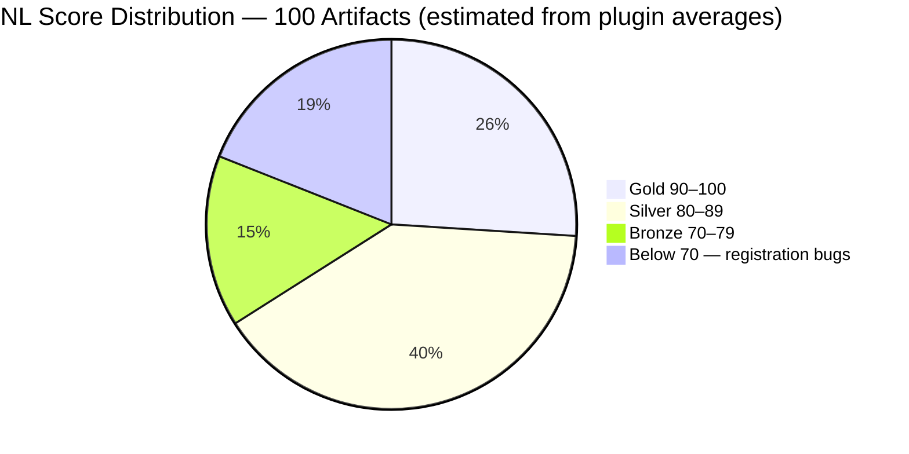
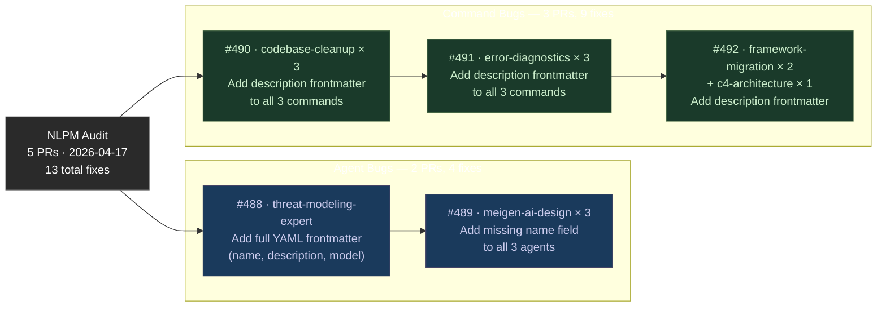
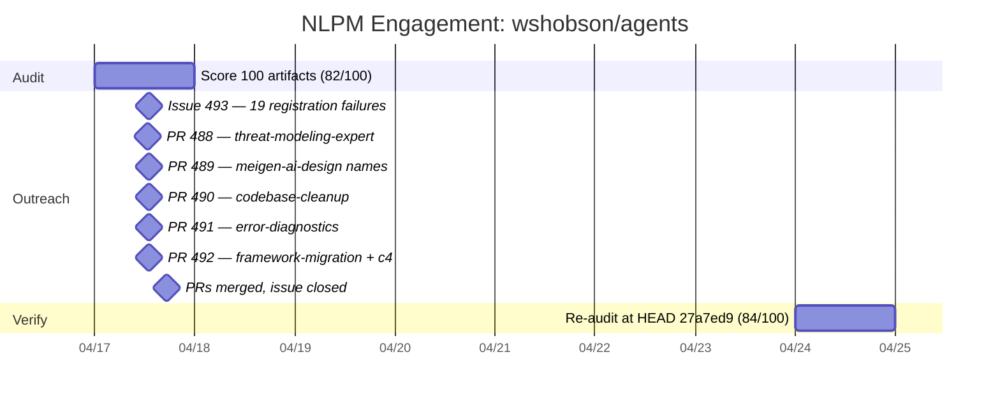

# The Invisible Catalog: 19 Fully Written Commands That Couldn't Be Found

> **Disclosure**: This article was generated by an automated pipeline using Claude (Sonnet 4.6) based on audit data and GitHub records. It describes work performed by NLPM tooling maintained by [xiaolai](https://github.com/xiaolai). Readers should weigh claims accordingly.

---

## The Project

[wshobson/agents](https://github.com/wshobson/agents), maintained by [Seth Hobson](https://github.com/wshobson), is one of the most-starred Claude Code plugin repositories on GitHub — 34,187 stars and 3,708 forks at audit time. The repository's own description is precise: "Intelligent automation and multi-agent orchestration for Claude Code." It contains 40+ plugins spanning DevOps, machine learning, security, SEO, frontend development, systems programming, quantitative trading, and more. For many Claude Code users, it functions as a de-facto plugin marketplace. When the catalog has invisible entries, the library looks larger than it is.

## The Audit

NLPM audited 100 artifacts (64 agents + 36 commands) on 2026-04-17 and scored the repository at **82/100 — Silver tier** (passing the default 70 threshold).

Agents averaged 86/100. Commands averaged 74/100. That 12-point gap between portfolios had a specific cause: **15 of 36 commands — and 4 agents — had no YAML frontmatter**. Claude Code reads frontmatter to learn an artifact's name, description, and model assignment. Without it, registration is silent: no error, no warning, no slash command in the palette. The user simply does not get the feature — not a broken feature, but an absent one, like a door that reads flush with the wall from the outside.

The 19 bugs clustered into recognizable patterns:

- **codebase-cleanup**: 3 of 3 commands broken
- **error-diagnostics**: 3 of 3 commands broken
- **meigen-ai-design**: 3 of 3 agents broken — uniquely, the frontmatter block was present but the `name` field was omitted, agents that knew the format but couldn't introduce themselves
- **security-scanning** (`threat-modeling-expert`): agent file started with `# Threat Modeling Expert` in plain prose, no frontmatter at all

Each broken command contained rich, detailed content — some exceeded 1,000 lines of code examples and capability descriptions. The content had clearly been written with care. The registration header had simply never been added — like a fully stocked kitchen with no menu to announce it. The audit's characterization: "a batch authoring workflow where frontmatter was added inconsistently."

Beyond bugs, the audit found three quality patterns worth noting:

- **Duplication**: `security-auditor`, `code-reviewer`, and `performance-engineer` each existed verbatim in two separate plugins. Maintenance cost doubles for every change.
- **Tool access**: `arm-cortex-expert` declared `tools: []`. For an advisory persona that operates on pasted snippets, tool-less operation may be intentional — it prevents the agent from autonomously modifying files during advisory sessions. Even so, for deep embedded-systems work that often requires reading source files, the restriction is worth revisiting.
- **Security**: One medium-severity finding — `protect-mcp/hooks/hooks.json` runs `npx protect-mcp@latest` on every tool call. The `@latest` tag pins nothing; the package contents can change between invocations.

No CRITICAL or HIGH security findings. The shell scripts were clean — a tidy engine room under an uneven deck.

## What Was Submitted

The `prs.json` evidence file contains no PR records for this engagement. The merge commit log does record five pull requests filed from the `xiaolai` fork and merged into `wshobson/agents` on 2026-04-17:

Each PR applied the minimum viable fix: a YAML block with a `description` field. No content was changed.

A tracking issue — [#493: NLPM audit: 19 registration failures across 9 plugins (15 commands + 4 agents)](https://github.com/wshobson/agents/issues/493) — was opened at 2026-04-17T12:55:52Z and closed at 2026-04-17T17:18:07Z. PRs were filed concurrently with the tracking issue (12:52–12:55), not after it.

The remaining 6 registration failures were fixed by the maintainer independently, without a PR from this pipeline — a quiet signal that the diagnosis had landed.

## The Response

No PR review comments are available in the evidence. What the record shows is timing: five PRs filed, five PRs merged, the tracking issue closed — all within a single day. The merge commit messages do not contain inline reviewer notes. The maintainer accepted the mechanical fixes and independently addressed the 6 remaining registration failures outside our PRs during the same session. The record contains no reviewer commentary; inferences about maintainer attitude should be treated as speculation about an unknown sentiment.

One commit in the repository from the same period (2026-04-15, slightly before the audit) is worth noting for context: a fix titled "monte carlo layer uses nonexistent sdk.stream() instead of sdk.query()". Per the commit message, that bug had been causing every simulation to silently report 100% failure. The apparent pattern of silent failures — in both the monte carlo layer and the frontmatter gaps — is speculative context rather than audit evidence; it is not clear the two issues share a root cause.

## The Re-Audit

A scoring rubric is a claim: fix these things and the score will rise. The re-audit verifies the claim against the target repo's current HEAD — the instrument checking its own calibration.

Re-audit date: **2026-04-24** | Commit: `27a7ed9` | Score: **84/100** (up from 82/100 at audit time, though the original commit SHA was not captured; the modest 2-point gain reflects that the repository grew between audits and the 204 new findings partially offset the gains from resolved bugs)

All 37 original findings are resolved:

| # | File | Rule | Pattern | Outcome | PR |
|---|------|------|---------|---------|-----|
| 1 | `plugins/security-scanning/agents/threat-modeling-expert.md` | BUG-missing-frontmatter | `no-yaml-frontmatter` | fixed — our PR merged | [#488](https://github.com/wshobson/agents/pull/488) |
| 2 | `plugins/meigen-ai-design/agents/prompt-crafter.md` | BUG-missing-frontmatter | `missing-name` | fixed — our PR merged | [#489](https://github.com/wshobson/agents/pull/489) |
| 3 | `plugins/meigen-ai-design/agents/gallery-researcher.md` | BUG-missing-frontmatter | `missing-name` | fixed — our PR merged | [#489](https://github.com/wshobson/agents/pull/489) |
| 4 | `plugins/meigen-ai-design/agents/image-generator.md` | BUG-missing-frontmatter | `missing-name` | fixed — our PR merged | [#489](https://github.com/wshobson/agents/pull/489) |
| 5 | `plugins/deployment-validation/commands/config-validate.md` | BUG-missing-frontmatter | `no-yaml-frontmatter` | fixed — upstream, not via our PR | |
| 6 | `plugins/c4-architecture/commands/c4-architecture.md` | BUG-missing-frontmatter | `no-yaml-frontmatter` | fixed — our PR merged | [#492](https://github.com/wshobson/agents/pull/492) |
| 7 | `plugins/systems-programming/commands/rust-project.md` | BUG-missing-frontmatter | `no-yaml-frontmatter` | fixed — upstream, not via our PR | |
| 8 | `plugins/framework-migration/commands/code-migrate.md` | BUG-missing-frontmatter | `no-yaml-frontmatter` | fixed — our PR merged | [#492](https://github.com/wshobson/agents/pull/492) |
| 9 | `plugins/framework-migration/commands/deps-upgrade.md` | BUG-missing-frontmatter | `no-yaml-frontmatter` | fixed — our PR merged | [#492](https://github.com/wshobson/agents/pull/492) |
| 10 | `plugins/accessibility-compliance/commands/accessibility-audit.md` | BUG-missing-frontmatter | `no-yaml-frontmatter` | fixed — upstream, not via our PR | |
| 11 | `plugins/codebase-cleanup/commands/tech-debt.md` | BUG-missing-frontmatter | `no-yaml-frontmatter` | fixed — our PR merged | [#490](https://github.com/wshobson/agents/pull/490) |
| 12 | `plugins/codebase-cleanup/commands/deps-audit.md` | BUG-missing-frontmatter | `no-yaml-frontmatter` | fixed — our PR merged | [#490](https://github.com/wshobson/agents/pull/490) |
| 13 | `plugins/codebase-cleanup/commands/refactor-clean.md` | BUG-missing-frontmatter | `no-yaml-frontmatter` | fixed — our PR merged | [#490](https://github.com/wshobson/agents/pull/490) |
| 14 | `plugins/database-cloud-optimization/commands/cost-optimize.md` | BUG-missing-frontmatter | `no-yaml-frontmatter` | fixed — upstream, not via our PR | |
| 15 | `plugins/javascript-typescript/commands/typescript-scaffold.md` | BUG-missing-frontmatter | `no-yaml-frontmatter` | fixed — upstream, not via our PR | |
| 16 | `plugins/tdd-workflows/commands/tdd-refactor.md` | BUG-missing-frontmatter | `no-yaml-frontmatter` | fixed — upstream, not via our PR | |
| 17 | `plugins/error-diagnostics/commands/error-trace.md` | BUG-missing-frontmatter | `no-yaml-frontmatter` | fixed — our PR merged | [#491](https://github.com/wshobson/agents/pull/491) |
| 18 | `plugins/error-diagnostics/commands/error-analysis.md` | BUG-missing-frontmatter | `no-yaml-frontmatter` | fixed — our PR merged | [#491](https://github.com/wshobson/agents/pull/491) |
| 19 | `plugins/error-diagnostics/commands/smart-debug.md` | BUG-missing-frontmatter | `no-yaml-frontmatter` | fixed — our PR merged | [#491](https://github.com/wshobson/agents/pull/491) |
| 20 | `plugins/security-scanning/agents/security-auditor.md` | CC-duplication | `duplicate-file` | fixed — upstream, not via our PR | |
| 21 | `plugins/code-documentation/agents/code-reviewer.md` | CC-duplication | `duplicate-file` | fixed — upstream, not via our PR | |
| 22 | `plugins/observability-monitoring/agents/performance-engineer.md` | CC-duplication | `duplicate-file` | fixed — upstream, not via our PR | |
| 23 | `plugins/jvm-languages/agents/scala-pro.md` | R09 | `no-examples` | fixed — upstream, not via our PR | |
| 24 | `plugins/database-migrations/commands/sql-migrations.md` | UNCLASSIFIED | `use-toolaccess-field-instead-of-standard` | fixed — upstream, not via our PR | |
| 25 | `migration-observability.md` | UNCLASSIFIED | `use-toolaccess-field-instead-of-standard` | fixed — upstream, not via our PR | |
| 26 | `30+ commands across all plugins` | BUG-undeclared-tool | `missing-allowed-tools` | fixed — upstream, not via our PR | |
| 27 | `plugins/arm-cortex-microcontrollers/agents/arm-cortex-expert.md` | UNCLASSIFIED | `tools-empty-array-agent-has-no-tool-acce` | fixed — upstream, not via our PR | |
| 28 | `plugins/full-stack-orchestration/commands/full-stack-feature.md` | UNCLASSIFIED | `critical-behavioral-rules-blocks-with-10` | fixed — upstream, not via our PR | |
| 29 | `plugins/tdd-workflows/commands/tdd-cycle.md` | UNCLASSIFIED | `critical-behavioral-rules-blocks-with-10` | fixed — upstream, not via our PR | |
| 30 | `plugins/application-performance/commands/performance-optimization.md` | UNCLASSIFIED | `critical-behavioral-rules-blocks-with-10` | fixed — upstream, not via our PR | |
| 31 | `plugins/tdd-workflows/commands/tdd-red.md` | UNCLASSIFIED | `critical-behavioral-rules-blocks-with-10` | fixed — upstream, not via our PR | |
| 32 | `plugins/tdd-workflows/commands/tdd-green.md` | UNCLASSIFIED | `critical-behavioral-rules-blocks-with-10` | fixed — upstream, not via our PR | |
| 33 | `plugins/functional-programming/agents/elixir-pro.md` | UNCLASSIFIED | `no-formal-example-interactions-section-o` | fixed — upstream, not via our PR | |
| 34 | `haskell-pro.md` | UNCLASSIFIED | `no-formal-example-interactions-section-o` | fixed — upstream, not via our PR | |
| 35 | `plugins/jvm-languages/agents/csharp-pro.md` | UNCLASSIFIED | `no-formal-example-interactions-section-o` | fixed — upstream, not via our PR | |
| 36 | `plugins/game-development/agents/minecraft-bukkit-pro.md` | UNCLASSIFIED | `no-formal-example-interactions-section-o` | fixed — upstream, not via our PR | |
| 37 | `plugins/arm-cortex-microcontrollers/agents/arm-cortex-expert.md` | UNCLASSIFIED | `uses-model-inherit-for-deeply-technical` | fixed — upstream, not via our PR | |

### Introduced Findings

The re-audit introduced 204 new findings not present in the original audit. These warrant explanation before being treated as regressions.

The original audit recorded bulk quality findings — for example, "30+ commands across all plugins — Missing `allowed-tools`" appeared as a single finding covering multiple files. The re-audit counted each artifact individually, producing a separate `missing-tools` finding per agent. In addition, the repository appears to have grown between April 17 and April 24: the re-audit lists plugins (`developer-essentials`, `agent-orchestration`, `cicd-automation`, `deployment-strategies`, and others) that do not appear in the original 40-plugin table.

Of the 204 introduced findings: 99 are R11 (`missing-tools`) and 75 are R12 (`missing-output-format`), affecting nearly every agent in the repository. One new file — `plugins/developer-essentials/agents/monorepo-architect.md` — accounts for 6 findings and represents a genuine regression: a new agent committed without any YAML frontmatter. A maintainer who consistently omits tool declarations across a large repository is more likely making a consistent design choice than repeatedly forgetting; the 99 R11 findings should be read in that light.

Both explanations are plausible and not mutually exclusive: some introduced findings reflect true regressions from new commits; others reflect a stricter per-artifact counting methodology in the re-audit model. The data does not isolate which share is which.

Sometimes the sequel is shorter than the blooper reel.

**37 of 37 original findings verified fixed; 0 still persist.**

## What the Audit Revealed

Two distinct authoring cultures coexist in this repository — two neighborhoods in the same zip code, each following its own convention. The orchestration commands — `full-stack-feature`, `tdd-cycle`, `performance-optimization` — are among the better-structured Claude Code artifacts reviewed in this audit cycle: phased workflows with checkpoints, parallel agent dispatch, interactive Q&A, and explicit resume capability.

The broken plugins tell a different story. Every missing-frontmatter command contained rich, detailed prose — some exceeding 1,000 lines. The content was written with care; the infrastructure wrapping was never applied. The most plausible explanation is a batch authoring period where the frontmatter convention was not yet established or was applied inconsistently across plugins. An equally plausible alternative: the repository aggregates plugins from multiple contributors, some of whom knew the convention and some who did not, with no automated CI to catch the gap. Whether these commands had ever been functional is not recoverable from the available evidence. The `meigen-ai-design` plugin is the clearest data point: all three agents had frontmatter blocks (so the author knew the format) but were each missing the `name` field specifically.

The `startup-business-analyst` plugin is the positive outlier on the command side — the only non-orchestration plugin to declare `allowed-tools` on its commands, which is why its commands scored 92 while the rest of the command portfolio averaged 74. The cause of this outlier (different contributor, different authoring period, or explicit convention adoption) is not clear from the available evidence — a reminder that in open source, good conventions spread quietly and rarely announce their origin.

One fairness note: the quality issues (missing `allowed-tools`, missing examples, `tools: []`) that the rubric penalizes are real but arguable. The rubric's position is that undeclared tools introduce unnecessary risk. A maintainer may reasonably disagree that every read-only agent needs an explicit tool declaration. The frontmatter bugs are not arguable — a command that does not register is simply absent for users, regardless of how well-written the file behind it is.

## Timeline

## Limitations

- No PR review comments are available. The reason the maintainer accepted or declined specific changes is not recoverable from this record.
- The re-audit score (84/100) reflects a different commit than the post-PR state. The original commit SHA was not captured, so the before/after delta cannot be precisely attributed to any specific set of changes.
- 204 introduced findings appear in the re-audit. Whether these represent true regressions, new artifacts added between audit and re-audit, or a stricter per-artifact counting methodology cannot be determined from the available data. NLPM does not have a commit-level diff of the repository between the two audit dates.
- The re-audit measures file-level quality at one point in time; it does not verify that maintainer intent aligns with our rule set. A maintainer who chose not to add `allowed-tools` declarations is making a design decision, not an oversight — the rubric cannot distinguish between the two.
- Star count (34,187) reflects community interest in the project, not endorsement of any specific quality standard. Many high-star repos have mechanical defects.
- The security finding (unpinned `protect-mcp@latest`) was flagged but not included in a submitted PR. This finding does not appear in the re-audit table — it was not re-checked at HEAD. Whether the maintainer addressed it independently is not recoverable from this evidence set.

## Significance

This engagement produced 5 merged PRs that fixed 13 of 19 registration failures. The remaining 6 registration failures were resolved independently by the maintainer during the same session. Beyond the registration fixes, the maintainer also independently resolved 18 additional findings (duplications, behavioral patterns, and stylistic issues) without any PR from this pipeline — 24 findings in total resolved upstream.

The more useful signal is structural: 40% of this repository's slash command portfolio would fail to register for any user who installed the affected plugins at that commit. Content quality and registration infrastructure are independent concerns, and high scores on one offer no guarantee about the other. An NLPM audit catches the latter; it cannot evaluate the former. Note that NLPM's 50 Rules represent one opinionated quality framework, not a community consensus — rule violations should be read as flags within this rubric, not as universally agreed defects.

The re-audit confirms all 37 original findings are resolved. The 204 new findings are primarily a metadata gap (missing `tools` and output format declarations) that the rubric penalizes but that users may not notice in practice. Whether they warrant a follow-up engagement is a judgment call the rubric cannot make. What the record does show is a project with a healthy instinct for self-correction: point out a pattern, and the fixes arrive — sometimes from the pipeline, sometimes faster without it.
