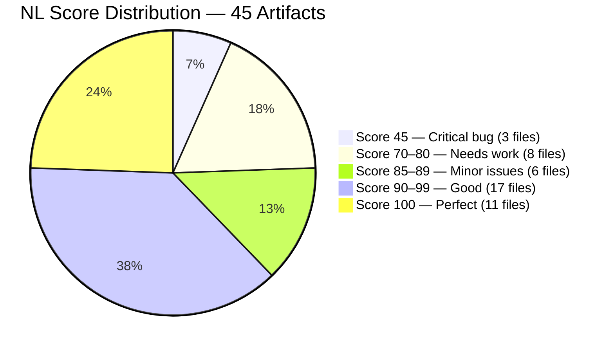
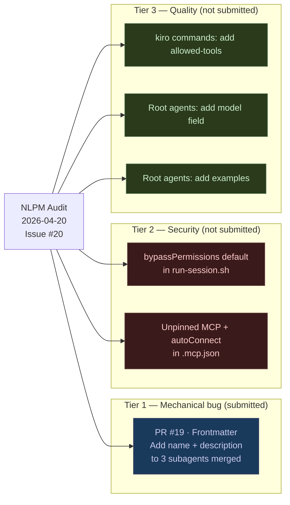
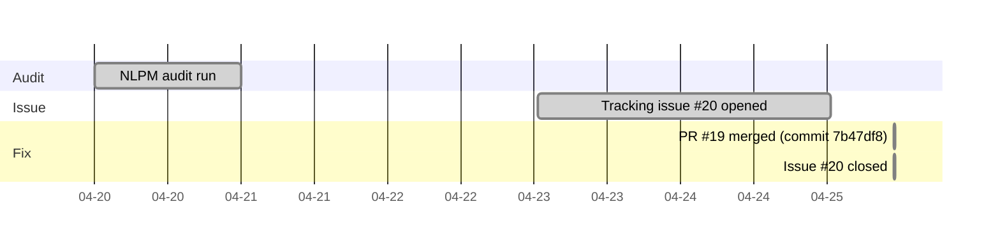

# Name Required: How Three Invisible Agents Dragged a Near-Perfect Repo to 85

> **Disclosure**: This article was generated by an automated pipeline using Claude (Sonnet 4.6) based on audit data and GitHub records. It describes work performed by NLPM tooling maintained by [xiaolai](https://github.com/xiaolai). Readers should weigh claims accordingly.

---

## The Project

[feiskyer/claude-code-settings](https://github.com/feiskyer/claude-code-settings) is a curated collection of Claude Code settings, commands, agents, and skills oriented toward vibe coding — the practice of letting an LLM drive most of the code authoring while the developer steers intent — less like programming, more like directing. The repository is maintained by [Pengfei Ni](https://github.com/feiskyer) and, at the time of audit, held 1,465 stars and 218 forks. That level of adoption in a space where most repositories are personal dotfiles suggests the project functions as a reference point — a place developers look when configuring their own Claude Code environments.

The repository is architecturally ambitious. It includes standalone skills, a plugin bundle, a multi-step skill-creation pipeline (`skill-creator`), and a secondary `autonomous-skill` that runs full Claude sessions in a loop. The NL artifact count (45 total, 35 content files) reflects that breadth.

---

## The Audit

NLPM audited 45 artifacts on 2026-04-20 and returned an overall NL score of **85/100** across the 35 NL content files. Configuration artifacts (three `hooks.json` files and seven `plugin.json` manifests) all scored 100 and are counted separately. The security scan found no Critical or High security findings.

The distribution tells a clean story: most of the repository is well-authored. Seventeen artifacts sit between 90 and 99, and eleven are perfect — a scorecard that most single-developer repositories would envy. The damage is concentrated in two pockets — three agents at 45 (a structural defect, not a runtime crash; the files execute correctly but are invisible to the registry) and eight agents and skills in the 70–80 range (missing `model` declarations, absent example blocks, and accumulated vague-language penalties).

### The Three Agents at 45

`skill-creator/agents/analyzer.md`, `grader.md`, and `comparator.md` each scored 45/100 for the same reason: both the `name` and `description` frontmatter fields were absent. Under NLPM's scoring rubric, missing `name` is a 30-point penalty and missing `description` is a 25-point penalty — together they subtract 55 points from a starting score of 100, producing 45.

These three files are subagents inside the `skill-creator` skill pipeline. The skill itself invokes them by explicit path rather than name lookup, so they function at runtime — but they are invisible to Claude Code's agent registry and to any tooling (including NLPM) that discovers agents by name. A user browsing registered agents would not see them — like books shelved without a catalog entry, present but unfindable. The audit flagged this as a structural defect rather than a quality issue. The original absence may have been deliberate — internal subagents invoked by explicit path often need no registry identity — though the maintainer's acceptance of the fix suggests the addition was welcome.

### Security

The security scan found no Critical or High risks. Two Medium and two Low findings were noted:

| Severity | Finding |
|----------|---------|
| Medium | `autonomous-skill/run-session.sh` — `DEFAULT_PERMISSION_MODE="bypassPermissions"` means every spawned Claude session runs without confirmation gates for file writes, git operations, or Bash commands |
| Medium | `.mcp.json` — `npx chrome-devtools-mcp@latest` is unpinned and uses `--autoConnect`, granting automatic access to open browser sessions |
| Low | `run-session.sh` — unsanitized task description string-interpolated into `bypassPermissions` child session (mitigated if the Medium above is fixed) |
| Low | `hooks/hooks.json` — hook script path unversioned; a symlink substitution could redirect execution |

The security findings are context-dependent. `bypassPermissions` as a default is genuinely risky in an automation context, but this is a vibe-coding tool where some users may actively want that behavior — a tradeoff the tool's own name all but acknowledges. The MCP pin is standard supply-chain hygiene that applies to any unpinned `@latest` dependency.

### Quality Issues (informational)

Thirty-five quality findings were recorded but not submitted as PRs. The dominant patterns:

- **No `model` field** in six root agents (`instruction-reflector`, `deep-reflector`, `insight-documenter`, `pr-reviewer`, `command-creator`, `github-issue-fixer`): each loses 5 points. (Omitting this field for portability — so users with different Claude subscriptions can run the repo without model-specific errors — is a reasonable design choice; the penalty reflects an NLPM convention, not a universal standard.)
- **No example blocks** in those same six agents plus `ui-engineer`: each loses 15 points.
- **Vague quantifiers** across 10 skills: words like `"appropriate"`, `"relevant"`, `"proper"`, and `"comprehensive"` appear without decision rules. Penalties range from 6 to 20 points depending on frequency and cap.
- **No `allowed-tools`** in five `kiro-skill` commands: each loses 5 points, plus 10 more for absent empty-input handling.

None of these findings prevent the artifacts from functioning. They reduce the precision available to an agent reading the instruction.

---

## What Was Submitted

The formal PR tracking log contains no entries for this engagement — the PR had already merged by the time evidence was collected. The commit record confirms that a single pull request was submitted and merged:

**PR #19 — Add missing YAML frontmatter to skill-creator subagents**

Commit [`7b47df8`](https://github.com/feiskyer/claude-code-settings/commit/7b47df88c0502674dd811fcb44c59beaca1b90e4), merged 2026-04-25, added `name` and `description` frontmatter to `analyzer.md`, `grader.md`, and `comparator.md` (inferred from the merge commit message; the PR itself was not captured in the evidence record). The fix is mechanical: six lines of YAML across three files. Sometimes the cure is shorter than the diagnosis. The commit was co-authored by `claude[bot]` and Claude Code.

The security findings and quality issues were not submitted as separate PRs. The security findings in particular are context-dependent — `bypassPermissions` may be intentional for a vibe-coding tool, and the unpinned MCP is standard supply-chain hygiene that the maintainer may prefer to manage directly — so they were withheld pending maintainer decision rather than submitted as automated PRs. The audit recommended a priority ordering of six fixes; only the first (frontmatter) reached a PR. Whether the remaining fixes are planned is not known from the available evidence.

---

## The Response

The maintainer merged PR #19 within two days of the tracking issue being opened — a turnaround that made the open-to-merge window feel almost anticlimactic. The issue ([#20](https://github.com/feiskyer/claude-code-settings/issues/20)) was created on 2026-04-23 and closed on 2026-04-25 — the same minute the merge commit landed. The co-authorship attribution (`claude[bot]`) was preserved in the merge commit, indicating the PR was not rebased or squashed in a way that stripped the attribution.

No review comments from the maintainer are available in the evidence record. The maintainer made no public comment on the quality or security findings; the merge of PR #19 is the only documented response to the overall audit. Merging a clean, mechanical PR should not be read as endorsement of the quality or security assessment — it means the specific frontmatter addition was accepted — the difference between a librarian stamping your book and a critic endorsing the plot.

---

## What the Audit Revealed

The most instructive pattern from this engagement is the gap between operational correctness and registry visibility. The three subagents functioned — the `skill-creator` skill called them by path and they executed. No user would have noticed a runtime failure. The defect required no domain judgment to find — a `grep` for missing frontmatter fields would have caught it — but it persisted in the repository unaddressed until a structured completeness check surfaced it — the way a loose thread persists on a finished garment until someone finally pulls it.

This is a common pattern in NL artifact collections that grow incrementally: a skill is added, its subagents are wired up by path for immediate utility, and the frontmatter — which matters for discoverability rather than execution — is deferred or forgotten. The files worked, so there was no signal that anything was wrong.

The secondary pattern — vague language accumulation across skills — reflects a different failure mode. Words like `"appropriate"` and `"relevant"` are not wrong in isolation; they feel correct when writing instructions in natural language — the way "add salt to taste" feels precise until someone asks how much salt. The penalty they incur is not about grammar but about decision transfer: each instance is a point where the agent must infer what the instruction means rather than follow a rule. Across 10 skills, these inferences accumulate into a meaningful reduction in instruction precision. That said, skills designed for open-ended reasoning — like `instruction-reflector` and `deep-reflector` — may intentionally use flexible language to give the model interpretive latitude; the vague-language penalty is calibrated for instruction-following agents and is a weaker signal for adaptive, open-ended skills.

**Fairness note**: The quality deductions are advisory signals, not failures. A skill that uses `"appropriate"` six times is still a useful, functional skill. The NLPM scorer penalizes imprecision because imprecision has a cost in multi-step agent chains, not because vague language makes an artifact worthless. NLPM hands the author a magnifying glass, not a red pen.

---

## Timeline

The end-to-end cycle from audit to merged fix was five days. The fix itself was simple enough that the open-to-merge window was approximately 58 hours.

---

## Limitations

- **Post-merge re-audit was skipped for this engagement; before/after quality change is not independently verified.** The commit confirms the frontmatter was added, but the net score improvement is not measured.
- The commit dates when `analyzer.md`, `grader.md`, and `comparator.md` were introduced were not checked. Whether the missing frontmatter was a recent oversight or had been present since the files were created is not known from the available evidence.
- PR metadata was not captured in the evidence record; PR #19's existence and content are inferred from the merge commit message and co-authorship attribution, not from the PR itself.
- The quality and security findings (Tiers 2 and 3 in the priority graph) were not submitted as PRs. Whether the maintainer intends to address them is unknown.
- The broken helper references flagged in cross-component analysis (`helpers/kiro-identity.md`, `helpers/workflow-diagrams.md`, `helpers/detection-logic.md`) may exist in unscanned subdirectories. The audit could not confirm whether they are genuinely absent or merely out of scan scope.
- NLPM scores NL artifacts on instruction precision, not on whether the instructions are correct. A perfectly-scored skill can still describe the wrong behavior.

---

## Significance

The feiskyer/claude-code-settings engagement is a case study in narrow impact from a targeted fix. The three subagents at 45/100 drove the bulk of the score penalty; restoring their frontmatter brings the three files from 45 to a range closer to 90+, which would move the overall NL score materially toward 90. An 85/100 score already passes the default NLPM threshold of 70 — this is not a struggling repository, but one where a concentrated structural defect in three files accounts for most of the gap from a top score.

The engagement also illustrates the value of mechanical scanning over subjective review. The frontmatter defect required no judgment to identify — it was a structural absence that a pattern matcher could find in milliseconds. The fix was equally mechanical: six lines of YAML.

The repository's overall quality, outside the three outlier files and the vague-language accumulation in skills, is high. Most of the artifacts are clear, purposeful, and well-structured. The 85/100 NL score understates the quality of the majority of the collection because three files in a single pipeline pulled the average down significantly. That is precisely the kind of signal a scorer is supposed to surface. This is a one-person project with active development; quality gaps in newer artifacts are consistent with a fast-iteration workflow rather than inattention to quality. Behind an 85 are artifacts that earned their scores honestly — and three that needed only a name.
