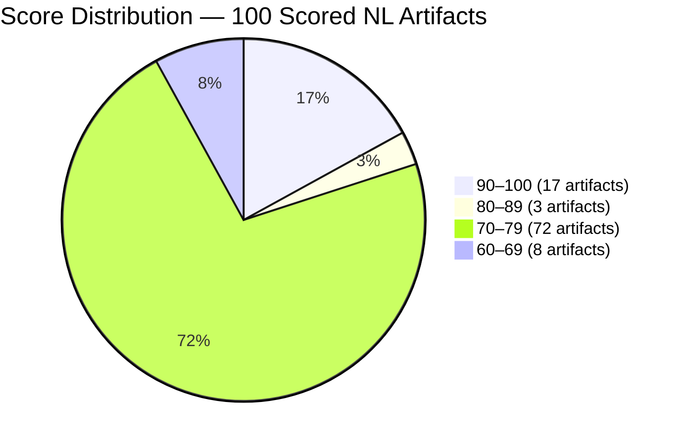
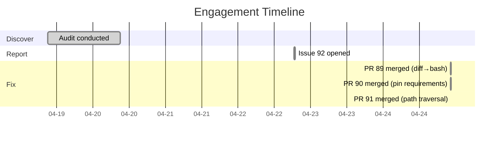

# The Textbook With Broken Pages: Auditing Claude Code's Most-Starred How-To Guide

> **Disclosure**: This article was generated by an automated pipeline using Claude (Sonnet 4.6) based on audit data and GitHub records. It describes work performed by NLPM tooling maintained by [xiaolai](https://github.com/xiaolai). Readers should weigh claims accordingly.

## The Project

[luongnv89/claude-howto](https://github.com/luongnv89/claude-howto) is a visual, example-driven guide to Claude Code — covering basic concepts, advanced agents, and copy-paste plugin templates — maintained by [Luong NGUYEN](https://github.com/luongnv89). At audit time the repository held **28,667 stars** and 3,517 forks, making it one of the most-referenced starting points for developers learning Claude Code — the kind of repository that gets bookmarked before the SDK has finished installing. The repository appears to be maintained primarily by a single contributor; creation date and broader maintenance-cadence data were not captured in the evidence record.

The repository is structured as a multilingual tutorial suite. Core English content lives under `07-plugins/`, with full translations mirrored under `vi/` (Vietnamese), `zh/` (Chinese), and `uk/` (Ukrainian). This structure means every bug and quality gap in the English source appears verbatim in all three translations — quadrupling the surface area of any finding, like a crack in a master mold that prints itself onto every copy.

## The Audit

Conducted on 2026-04-19 against 117 artifacts using a progressive scoring strategy.

**Overall NL Score: 77/100 (passes the default 70 threshold) — Security: REVIEW (no Critical or High findings)**

The bulk of the repository — 72 of 100 scored NL artifacts — lands in the 70–79 band. Skills score best (mostly 95), agents worst (68–70), and commands occupy the middle (73–75). The gap between skills and agents reflects the guide's design: the skill files are polished reference examples, while the plugin agents and commands are intentional tutorial stubs — floor models, not finished goods — meant to illustrate plugin structure rather than serve as production-ready artifacts.

**Lowest-scoring artifacts:**

| File | Type | Score | Top Issue |
|------|------|------:|-----------|
| `*/07-plugins/documentation/agents/api-documenter.md` ×4 locales | agent | 68 | No model, no examples, no output format, vague "comprehensive" |
| `*/07-plugins/documentation/agents/example-generator.md` ×4 locales | agent | 68 | No model, no examples, no output format, vague "practical" |
| `*/07-plugins/pr-review/agents/security-reviewer.md` ×4 locales | agent | 70 | No model, no examples, no output format |
| `*/07-plugins/pr-review/commands/review-pr.md` ×4 locales | command | 73 | No allowed-tools, no empty-input handling, no output format, vague "comprehensive" |

**Security findings summary:**

| Severity | Count |
|----------|------:|
| Critical | 0 |
| High | 0 |
| Medium | 3 |
| Low | 4 |

The medium-severity findings are confined to the `scripts/` Python tooling: a subprocess call that executes a caller-controlled binary path (`build_epub.py`), network requests with unvalidated markdown-sourced URLs (`check_links.py`), and an environment-influenced subprocess invoking Chrome without a sandbox (`check_mermaid.py`). None of these involve hooks or agent runtime paths. The low-severity findings include fully unpinned Python dependencies in `scripts/requirements.txt` and a theoretical path traversal in `scripts/check_cross_references.py`.

The audit identified **4 bugs** and **2 actionable security fixes**. The two security fixes and one of the four bugs were submitted as PRs; the remaining three bugs were tracked in issue #92.

## What the Audit Revealed

A structural consequence of the locale-mirroring design is a **multilingual amplification effect**: the repository's locale mirroring means that a single bug in the English source produces four identical bugs across four locales. All four `security-reviewer.md` files carried the same broken `diff` tool declaration. Every one of the 44 commands across all four locales shared the same absent `allowed-tools` declaration and missing output format. From a quality scoring perspective, 100 artifacts carry the same structural gaps because they were generated from the same template. One template, four languages: the efficiency works in both directions.

This is worth naming fairly. The plugin stubs in `07-plugins/` are tutorial artifacts. Their purpose is to show readers *what a plugin looks like*, not to ship production-ready agents. The audit score of 77/100 accurately reflects the structural gaps, but interpreting that score as "this guide is poorly built" would miss the context: the guide is teaching, and the stubs are illustrative. Grading a scaffold by production standards is a bit like criticizing a blueprint for not being load-bearing. The repository's approach — polished skill references alongside intentionally sparse plugin stubs — reflects a deliberate quality gradient that a single composite score cannot fully capture. The security findings in the Python tooling scripts are a different matter — those run in actual CI pipelines and warranted the fixes.

It is also worth noting that NLPM's model-declaration and `allowed-tools` rules were designed for production agents. In a tutorial repository, omitting these fields may be an intentional pedagogical choice — showing readers that the fields are optional and user-configurable — rather than an oversight. These rules carry a known false-positive risk against tutorial scaffolding, and readers should weigh the corresponding penalties with that context in mind.

The second pattern is **cross-component disconnection**: `review-pr.md` defines five review steps (security, test coverage, docs, quality, performance) and the plugin defines matching subagents (`security-reviewer`, `test-checker`, `performance-analyzer`), but no command dispatches to any agent. The agents and commands exist in the same plugin but are not wired together — neighbors who have never knocked on each other's door. Whether this reflects intentional "show the pieces first, wire later" scaffolding or a genuine gap is not determinable from the artifacts alone.

The `diff` tool bug is the only finding that represents a genuine factual error that would mislead readers trying to follow the guide's patterns. That finding — multiplied across four locales — is what the NLPM audit was designed to surface: a small correction with an outsized reach, exactly the kind of thing a systematic pass catches that manual review tends to miss. (Note: Claude Code's exact behavior when encountering an unknown tool identifier is described as "silently ignored" but is not exhaustively documented; if the behavior differs, or if `diff` was valid in an earlier Claude Code version, the severity of this finding changes accordingly.)

## What Was Submitted

The PR data for this engagement was not captured in the primary evidence record. However, merge commits dated 2026-04-24 confirm that three fixes were submitted and accepted. The commit messages reference PR numbers directly.

**PR #89** — Replace invalid `diff` tool with `bash` in security-reviewer agents
([commit 05f02025](https://github.com/luongnv89/claude-howto/commit/05f02025363994bc9991399be6888b9dcfab6bde))

All four `security-reviewer.md` files (en, vi, zh, uk) declared `tools: read, grep, diff` in their frontmatter. `diff` is not a recognized Claude Code tool name — the agent may lose its diff capability at runtime, as Claude Code does not recognize the identifier. The fix replaces `diff` with `bash` across all four locales, allowing the agent to invoke diff via shell.

**PR #90** — Pin `requirements.txt` to current stable versions
([commit 6740288030](https://github.com/luongnv89/claude-howto/commit/6740288030a8f566a62bbdbc167040889b9e84dd))

All six packages in `scripts/requirements.txt` were fully unpinned, meaning `pip install` would fetch whatever the latest release was at the time. A compromised upstream package release — a realistic attack vector for popular Python libraries — could silently introduce malicious code into the build environment. The fix pins to current stable versions at time of submission: `ebooklib==0.18`, `markdown==3.7`, `beautifulsoup4==4.12.3`, `httpx==0.28.1`, `pillow==11.1.0`, `tenacity==9.0.0`.

**PR #91** — Constrain cross-reference resolution to repo root
([commit 0bf754673a](https://github.com/luongnv89/claude-howto/commit/0bf754673a710f5d245e9bbbabbdd8d0fc3f421d))

`scripts/check_cross_references.py` used `(file_path.parent / link_path).resolve()` to check whether relative markdown links pointed to existing files. A crafted `../../outside/path` link in any markdown file could resolve to a path outside the repository root — the script would silently check existence of files it should never access. The fix skips any resolved path that falls outside the repository root, bounding the traversal.

An **issue (#92)** was also opened on 2026-04-22 to track the full set of audit findings (including the three agent-quality bugs not addressed in the submitted PRs) and give the maintainer visibility into the broader quality gap.

## The Response

All three PRs were merged on 2026-04-24 within a four-minute window (22:24–22:28 UTC) — three PRs, four minutes, the digital equivalent of a nod and a handshake. No review comment records were captured for this engagement; the maintainer's intent and perspective are not inferable from merge velocity alone.

Issue #92 remained open at evidence-collection time with no maintainer response recorded.

A separate commit on 2026-04-11 — co-authored by Claude Opus 4.6 — corrected hook protocol bugs in the `pre-tool-check.sh` example (PR #72). This predates the NLPM audit and appears to be independent tooling work, though it reflects the same pattern of Claude Code hook documentation requiring correction.

## Timeline

## Limitations

- **Post-merge re-audit was skipped for this engagement**; before/after quality change is not independently verified. The three merged PRs address real bugs and one security finding, but whether the NL score improved — and by how much — is not confirmed by evidence.
- The prs.json record for this engagement is empty. PR existence is inferred from merge commits and their `(#89)`, `(#90)`, `(#91)` references; no direct PR metadata (title, body, review timeline) was captured.
- No PR review comments were collected. Maintainer reaction is inferred solely from merge velocity (four minutes across three PRs) and the absence of rejection.
- The audit NL score applies to the 100 artifacts shown in the scoring table. Of 117 total artifacts, 17 are unscored in the report — likely non-NL files (scripts, configuration, markdown documentation) that fall outside the scoring rubric.
- The `diff` tool finding is grounded in the Claude Code tool schema; however, Claude Code's exact behavior when encountering an unknown tool identifier in agent frontmatter is not publicly documented beyond "silently ignored."

## Significance

Reference repositories face a specific quality risk: factual errors in examples propagate directly into readers' implementations. A high-star tutorial that declares an invalid tool identifier passes that defect to every developer who copies the pattern — the way a misprint in a recipe reaches every dinner table that follows it. The locale-mirroring structure amplifies this — one error in the English source becomes four identical errors across all translations.

The security findings illustrate a related pattern: `scripts/` directories in tutorial repositories often escape the scrutiny applied to main content, yet readers routinely adapt them for their own CI pipelines. Dependency pinning and path traversal guards are standard hygiene; their absence in scripts written for illustration is common but not without risk once adoption scales.

The broader quality gap (missing model declarations, absent examples, no output formats across all plugin agents and commands) is real but contextually appropriate for tutorial stubs. If the guide's plugin examples are intended to be copied and extended rather than used as illustration only, addressing model declarations and `allowed-tools` fields across all agents and commands would meaningfully improve the score. For a guide built around beginnings, 77 is less a grade than a starting line.
