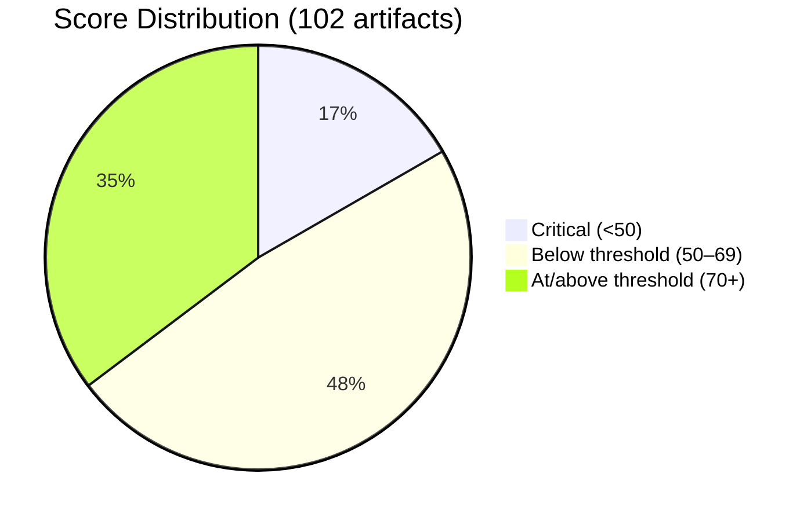
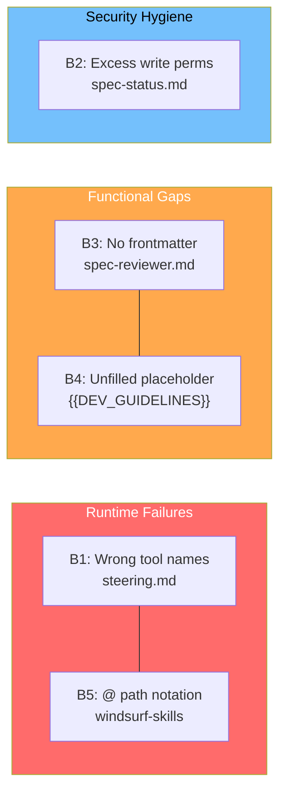
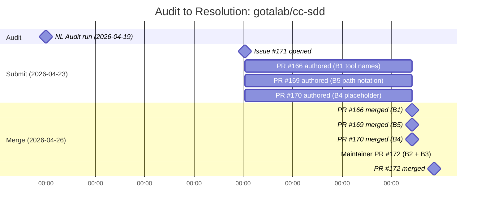

# When the Harness Needed a Harness: Auditing gotalab/cc-sdd

> **Disclosure**: This article was generated by an automated pipeline using Claude (Sonnet 4.6) based on audit data and GitHub records. It describes work performed by NLPM tooling maintained by [xiaolai](https://github.com/xiaolai). All factual claims are sourced from the evidence files collected during the audit; inferences about maintainer intent are the pipeline's interpretation, not the maintainer's stated position.

---

## The Project

[cc-sdd](https://github.com/gotalab/cc-sdd) is a Spec-Driven Development harness maintained by [Gota](https://github.com/gotalab). Its tagline cuts to the point: "Turn approved specs into long-running autonomous implementation." The project ships a minimal, adaptable SDD workflow as a set of Agent Skills targeting eight AI coding platforms — Claude Code, Codex, Cursor, GitHub Copilot, Windsurf, OpenCode, Gemini CLI, and Antigravity (an AI coding assistant platform).

At the time of the audit, cc-sdd had 3,209 stars and 244 forks. It is a well-regarded reference implementation for AI-agent-driven software development, which made the quality gaps in its own NL artifacts particularly interesting to examine — like finding the cartographer's map missing its own legend.

---

## The Audit

NLPM scored 102 NL artifacts on 2026-04-19, across eight platform subdirectories under `tools/cc-sdd/templates/agents/`. The overall NL score was **60/100** — below the default 70-point pass threshold.

Security came back clean: zero executable artifacts, zero hook definitions, zero shell scripts, zero network egress patterns. Security gate: **PASSED**.

The scoring breakdown revealed a wide gap between the project's highest-quality and lowest-quality artifacts:

The 17 critical files are the docs templates (`CLAUDE.md`, five `AGENTS.md` files, `GEMINI.md`) and the sub-agent template prompts. The 49 below-threshold files are almost entirely command and prompt files across all five command-based platforms, each missing `name`, model, `allowed-tools`, and examples in a symmetric pattern. The 36 passing files are the `SKILL.md` files in `gemini-cli-skills` and `windsurf-skills`, which reach 80–95/100 — the healthiest layer in the project.

The audit identified **5 bugs** and **42 quality issues**. Five bugs were judged PR-worthy:

| Bug | File | Issue | Impact |
|-----|------|--------|--------|
| B1 | `claude-code/commands/steering.md` | References non-existent tool names: `glob_file_search`, `read_file`, `grep`, `list_dir` | Agents calling these tools will fail at runtime |
| B2 | `claude-code/commands/spec-status.md` | `allowed-tools` declares `Write`, `Edit`, `MultiEdit`, `Update` on a read-only command | Permissions broader than typical for a status query; `Update` is not a valid Claude Code tool |
| B3 | `gemini-cli-skills/gemini-agents/spec-reviewer.md` | No frontmatter, no structure — bare 12-line markdown | Gemini CLI cannot register or execute this agent |
| B4 | All 7 docs files | `{{DEV_GUIDELINES}}` placeholder is unfilled | Users see a raw template variable in project memory/context files |
| B5 | `windsurf-skills/docs/AGENTS.md` | Skill path uses `@` separator (`.windsurf/skills@kiro-*/SKILL.md`) | Path references fail at runtime; windsurf-skills skill resolution breaks |

The audit recommended fixing B4 first (install-pipeline gap affecting all docs), then B1 (runtime failures for Claude Code users), then B2 (security hygiene), B3 (non-functional Gemini agent), and B5 (broken windsurf path).

---

## What the Audit Revealed

### The template-generation gap

The most instructive finding was not any single bug but the structural pattern behind the 42 quality issues. Every command-based platform (claude-code, opencode, github-copilot, windsurf-commands, codex) had the same four gaps: no `name` field, no model declaration, no `allowed-tools`, and no examples. The symmetry — identical deficits across all five platforms — points to a shared template that was never completed for the platform-specific fields.

cc-sdd is itself a templating tool. Its install pipeline substitutes `{{KIRO_DIR}}`, `{{FEATURE_NAME}}`, and `{{LANG_CODE}}` at setup time. But `{{DEV_GUIDELINES}}` was left unsubstituted across all seven docs files, which is a telling gap: the harness that manages template substitution had an unfinished substitution in its own templates — the tool that fills in blanks, it turns out, also had a blank of its own.

### Where quality survived

The `gemini-cli-skills` and `windsurf-skills` layers scored markedly better than the command layers. Skill files in those platforms clustered at 80–95/100, while command files across all platforms clustered at 50–65/100. The distinction makes sense architecturally: the skills layer was authored with the SDD workflow in mind, while the command layer was likely mass-generated without a per-file completion pass. Quality, in short, went where attention went.

### The windsurf-specific anomaly

Bug B5 was the only platform-specific bug — the `@` path separator appeared in `windsurf-skills` but not in `gemini-cli-skills`, the closest structural parallel. Windsurf uses `@kiro-` as its command prefix (rather than `/kiro-`), and it appears the `@` prefix leaked into a path glob during authoring.

### A counterargument

One could argue that a cross-platform template scaffold should not be scored against Claude Code-specific completeness criteria. cc-sdd's command files are not runnable as-is; they are blueprints intended to be adapted during setup. NLPM's rubric scores artifacts as deployable, which may not reflect the project's intent — like grading a recipe card on how well it cooks the dish. The 42 quality gaps — missing `name`, model, and examples fields — presuppose standalone use; for a harness that explicitly defers those values to the installer, the score measures a different property than intended deployability.

### Fairness note

A score of 60/100 describes the NLPM rubric's take on frontmatter completeness and example coverage — a lens, not a verdict. It does not reflect the functional quality of the SDD workflow itself. The eight-phase pipeline (steering → spec-init → spec-requirements → validate-gap → spec-design → validate-design → spec-tasks → spec-impl → validate-impl) is consistently implemented across all platforms, the directory layout is clean, and the cross-skill architecture is coherent. The score penalizes what is missing from the metadata layer, not what is wrong with the logic layer.

---

## What Was Submitted

NLPM submitted three pull requests against cc-sdd from the `xiaolai` fork:

**PR #166** — Fix wrong tool names in `steering.md` (Bug B1)
- Branch: `xiaolai/fix/nlpm-wrong-tool-names-steering`
- Replaced `glob_file_search` → `Glob`, `read_file` → `Read`, `grep` → `Grep`, `list_dir` → `LS` in both the Tool guidance section and Bootstrap Flow
- Merge commit: [0549a68](https://github.com/gotalab/cc-sdd/commit/0549a68936968d4740d063646216b9d2d257ca78)

**PR #169** — Fix `@` path separator in windsurf-skills `AGENTS.md` (Bug B5)
- Branch: `xiaolai/fix/nlpm-windsurf-skills-path-notation`
- Changed `.windsurf/skills@kiro-*/SKILL.md` to `.windsurf/skills/kiro-*/SKILL.md`
- Merge commit: [3094379](https://github.com/gotalab/cc-sdd/commit/3094379867b17ef5150c499e9b89abc00fc9309f)

**PR #170** — Document `{{DEV_GUIDELINES}}` placeholder in all 7 platform docs templates (Bug B4)
- Branch: `xiaolai/fix/nlpm-dev-guidelines-placeholder`
- Added an HTML comment above each placeholder in `CLAUDE.md`, five `AGENTS.md` files, and `GEMINI.md` explaining that the value is substituted at install time by `npx cc-sdd@latest --lang <code>`
- Merge commit: [3d66bdc](https://github.com/gotalab/cc-sdd/commit/3d66bdc5a381ef9d25f7d04745c217f94a5f4d1f)
- Note: this is a documentation fix — it clarifies the placeholder's purpose but does not fill it; users still see `{{DEV_GUIDELINES}}` until the install pipeline performs the actual substitution.

Bugs B2 and B3 were not submitted as NLPM PRs. They were addressed by the maintainer in a follow-on fix (see below).

A tracking issue was opened at [gotalab/cc-sdd#171](https://github.com/gotalab/cc-sdd/issues/171) on 2026-04-23, summarizing all five findings. As of the evidence snapshot, it remained open.

The bugs sorted into three priority tiers by impact type:

---

## The Response

All three NLPM-submitted PRs were merged by the maintainer on 2026-04-26 — three days after submission. No review comments appear in the evidence; the merges were clean. Sometimes a silent merge is the warmest kind of acknowledgment.

On the same day, Gota opened and merged [PR #172](https://github.com/gotalab/cc-sdd/commit/29aee950f4addc36f9aeecb9881c46540e71ecc9) from branch `gotalab/codex/fix-nlpm-remaining-prs`, titled "fix(cc-sdd): tighten remaining NLPM audit fixes." The commit message explicitly names NLPM — a quiet acknowledgment that the diagnosis came from somewhere worth naming. This PR addressed the two bugs NLPM had not submitted PRs for — the excessive permissions on `spec-status.md` (B2) and the missing frontmatter on `spec-reviewer.md` (B3).

In total, all five bugs were closed within three days of issue #171 being opened: three via NLPM PRs, two via a maintainer-authored fix that credited the audit findings. In open source, it's perfectly fine to arrive second with the right answer.

---

## Timeline

---

## Limitations

A responsible audit lists what it cannot confirm as clearly as what it found.

- **No PR review comments in evidence**: `prs.json` returned an empty array. The maintainer's acceptance rationale is inferred from the merge commits; no inline comments were captured.
- **Post-merge re-audit was skipped for this engagement; before/after quality change is not independently verified.** The NL score impact of the five fixes cannot be confirmed from this data.
- **Tracking issue #171 remained open**: Whether the maintainer plans further quality work (addressing the 42 non-bug issues) is not known.
- **42 quality issues untouched**: NLPM submitted fixes only for the 5 bugs. The systemic `name`/model/examples gaps across all command platforms remain. Fixing those would, per the audit estimate, raise the score from 60 to approximately 75/100.
- **Template-substitution root cause unverified**: The audit identified `{{DEV_GUIDELINES}}` as an unfilled install-pipeline variable. The fix documents the placeholder; it does not confirm whether the install pipeline was also corrected to perform actual substitution.
- **NLPM precision on this audit is unmeasured**: the evidence records five findings, all of which were addressed; whether any other candidate findings were generated and filtered before submission is not captured.

---

## Significance

Three out of five bugs were fixed via NLPM-submitted PRs. The other two were fixed by the maintainer in a commit that explicitly credited the NLPM audit. All five bugs closed within three days of the tracking issue opening.

The more durable observation is structural: cc-sdd is a tool for writing and running AI-agent specs, and its own specs had the same quality gaps NLPM finds everywhere — missing metadata, unfilled placeholders, tool references copied from an older schema. This project illustrates one pattern where workflow quality and NL-layer quality diverged independently: the command templates were generated at scale, but the per-file metadata was not brought to the same standard. Whether that pattern holds broadly is not established by a single case study — though it's worth noting that the harness that needed a harness fixed five bugs in three days and then kept moving.
