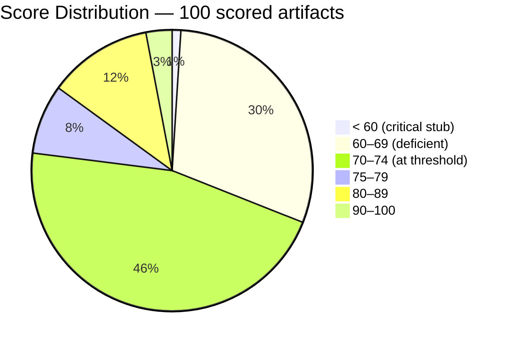
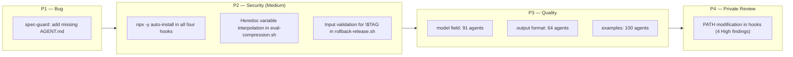
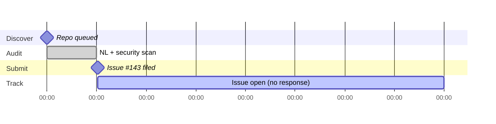

# The Hooks That Hook Back: Auditing a5c-ai/babysitter

> **Disclosure**: This article was generated by an automated pipeline using Claude (Sonnet 4.6) based on audit data and GitHub records. It describes work performed by NLPM tooling maintained by [xiaolai](https://github.com/xiaolai). Readers should weigh claims accordingly.

## The Project

[a5c-ai/babysitter](https://github.com/a5c-ai/babysitter) is an agent orchestration framework built by [a5c.ai](https://github.com/a5c-ai). Its stated purpose is to enforce obedience on agentic workforces and enable deterministic, hallucination-free self-orchestration of complex multi-agent tasks. At the time of audit it held 682 stars and 40 forks.

The project ships as a Claude Code plugin with four hook scripts that fire at every session event, a library of 4,189 natural-language agent definitions spanning quantum computing, biomedical engineering, civil engineering, electrical engineering, and mechanical engineering specializations, and a pair of utility shell scripts. The architectural ambition is wide enough to need its own card catalog: the library covers fields from post-quantum cryptography to orthopedic implant testing.

## The Audit

**Audit date**: 2026-04-20  
**Artifacts discovered**: 4,189 | **Artifacts scored**: 100  
**Overall NL score**: 70/100  
**Security verdict**: REVIEW  
**Findings**: 1 bug, 17 quality issues, 14 security findings

The 100 lowest-performing or most representative artifacts were scored individually and surfaced the distribution below.

*Score distribution covers the worst-performing 100 of 4,189 artifacts; the upper tail is uncharacterized.*

Three patterns account for nearly the entire penalty surface across the scored sample (100 lowest-performing files):

**No examples anywhere.** Zero of the 100 scored files include a concrete invocation showing agent input → output. This is the single costliest failure across all domains — like a cookbook that lists every ingredient but skips the steps; the NLPM rubric deducts 15 points per file for its absence.

**Missing output format sections.** 64 agent definitions — all 22 civil engineering agents, all 22 biomedical engineering agents, and all 20 quantum computing agents — omit any output format specification. A consumer cannot know what structure the agent produces without running it.

**No model field.** 91 of the files do not declare a preferred model. For simple agents this is a minor omission; for complex agents like `pilot-shell/unified-reviewer` or `quantum/hybrid-system-architect`, the omission means the harness picks a default that may be too weak. (Undeclared model fields are penalized by the NLPM rubric but may equally reflect intentional harness-delegation design, where the orchestrator selects models based on task complexity.)

The outliers are more revealing than the median. The ruflo README stubs (7 files, all scoring 60) are 3–4 lines: a title, a one-sentence description, and an attribution. They provide no persona, no expertise, no usage guidance — more bookmark than artifact. At the other end, the three electrical engineering agents (`test-measurement-expert`, `reliability-engineer`, `hardware-validation-engineer`) score 90 — they include output format sections and reference tables, and they demonstrate that the pattern is achievable within this codebase.

The single lowest-scoring artifact is `pilot-shell/spec-guard/README.md` at 20: it has no companion `AGENT.md`, no YAML frontmatter, and no examples. It exists as a placard on an empty shelf — documentation for an agent that cannot be registered or invoked; no `AGENT.md` was found at any path under `pilot-shell/spec-guard/` at the time of audit.

The security scan found no Critical-severity patterns. The High findings are concentrated in the hook scripts.

| Severity | Count |
|----------|-------|
| High     | 4     |
| Medium   | 8     |
| Low      | 2     |

All four High findings are the same pattern: `export PATH="$HOME/.local/bin:$PATH"` inside each of the four hook scripts (`babysitter-session-start-hook.sh`, `babysitter-stop-hook.sh`, `babysitter-pre-tool-use-hook.sh`, `babysitter-user-prompt-submit-hook.sh`). Adding a user-local directory to PATH inside a hook that runs before every Bash tool call creates a PATH-hijacking surface if `~/.local/bin` is writable by an unprivileged process — the equivalent of hiding a spare key under the mat of the building it is meant to protect. Exploitation requires a local attacker or malicious process with write access to that directory. The pre-tool-use and user-prompt-submit hooks are especially high-frequency.

The eight Medium findings split across two patterns: runtime `npm install` / `npx -y` calls that fetch `@a5c-ai/babysitter-sdk` from the npm registry during live sessions (present in all four hooks, findings #5–10), and variable interpolation into inline Node.js heredoc code in `scripts/eval-compression.sh` (findings #11–12), where filesystem-derived paths flow into executable code strings.

The two Low findings are a script that reads `~/.claude/projects/` (appropriate for its purpose but notable) and an unvalidated `$TAG` argument passed to `git push` in `scripts/rollback-release.sh`.

## What Was Submitted

No PRs were filed against the target. The pipeline submitted one tracking issue.

**[Issue #143](https://github.com/a5c-ai/babysitter/issues/143)** — opened 2026-04-21T00:37:45Z  
*"NLPM audit findings: security fixes for hook scripts and rollback script"*

The intended contribution priority order, as recorded in the audit report, was:

The four High PATH-modification findings were recommended for private maintainer review rather than a public PR, because the pattern may be intentional and the risk surface requires context only the maintainer holds. The Medium and Low findings, and the spec-guard bug, were candidates for public PRs. That none were filed is an artifact of pipeline state at the time of issue submission: the contribute step requires the audit issue to be labeled `contribute-approved`; that label had not been applied by the time this report was written. The tracking issue captures the full recommendation.

## The Response

As of 2026-04-28, issue #143 is open and, as yet, unanswered — the silence of an inbox rather than a closed door. No commits mentioning NLPM or Claude appear in the repository's history.

There is nothing to read into the silence at this point. Seven days is a short window; it is not unusual for maintainers of similarly-sized projects to take longer to triage unsolicited audit issues. The issue is public and indexed.

## What the Audit Revealed

The high score concentration at 66 and 70 is not random. It reflects a systematic authoring pattern: agent definitions were written to a consistent template that includes name, description, and persona, but stops short of the three elements the NLPM rubric weights most — examples, output format, and model declaration. The quantum computing agents are the clearest case: at least 18 of the 20 scored 66, sharing the same four deductions (`no model`, `no output format`, `no examples`, `vague language`) with near-identical vague verbs across every file.

This uniformity is a signal about how the library was built. At scale, a machine-assisted or template-driven authoring process tends to replicate omissions as faithfully as it replicates structure — a photocopier does not skip the blank spots. The electrical engineering agents — possibly authored by a different contributor or at a different time — escape all four deductions and reach 90; whether the comparison to the rest of the library is fair given potentially different authoring conditions is not established.

The cross-component findings are the most practically significant. CLAUDE.md describes a PostToolUse hook that auto-runs `npm run lint` on TypeScript edits; no such hook is configured in the project-level `.claude/settings.json` (which contains `{}`) — user-level settings were not inspected. Whether this is stale documentation or a deferred feature is unclear, but contributors reading CLAUDE.md receive a promise the project settings cannot keep. A companion finding — the spec-guard agent exists only as a README and is referenced in orchestration flows that cannot register it — is structurally the same problem: documentation that outpaces reality.

The runtime package install pattern in the hooks deserves a direct statement: fetching `@a5c-ai/babysitter-sdk` from the npm registry on every session start, stop, tool call, and user prompt is a live supply-chain dependency. Version pinning via `versions.json` narrows the attack window but does not close it. (`versions.json` specifies the npm package version to install; the hook reads this file before calling `npm install`.) An attacker who controls or compromises that npm package at the pinned version could inject code into every Claude Code session that loads babysitter. This is not a theoretical risk — it is the standard npm supply-chain threat model applied to a hook that runs before every Bash call. The alternative — bundling or pre-installing the SDK — avoids runtime fetches but requires the plugin to ship SDK updates independently.

A fairness note: 70/100 at this artifact count is not a failing grade. The rubric starts at 100 and applies deterministic penalties; a 70 means the portfolio met the 70-point threshold across 4,189 files, with the scored subset concentrating the worst performers. The domain-specialized agents (civil, biomedical, electrical) are substantively correct; the NLPM penalties are structural gaps, not content errors. A lower score is directions, not a verdict.

## Timeline

## Limitations

- Post-merge re-audit was skipped for this engagement; before/after quality change is not independently verified.
- No PRs were submitted; the contribution step did not run. Claims about what fixes would have improved the score are projections from the penalty model, not measured outcomes.
- The 100 scored artifacts are a progressive sample of the 4,189 total, prioritized by lowest score. The upper tail of the distribution (files that scored above the threshold without appearing in the table) is uncharacterized.
- Issue #143 was open with no response as of the writing date. The maintainer's view of the findings is unknown.
- The "no examples" penalty applies uniformly across all agent types. Some agent definitions in specialized domains (medical devices, quantum hardware) may have legitimate reasons for omitting synthetic examples; the rubric does not distinguish.
- Project activity metrics (last commit date, recent commit frequency) were not collected at audit time; it is unclear how actively the library is being maintained.
- The NLPM rubric represents one approach to evaluating natural-language artifact quality. It is not an industry standard; its penalties and thresholds reflect design choices that reasonable practitioners may weigh differently.

## Significance

Babysitter is an agent orchestration layer — software whose explicit job is to supervise other agents. Finding PATH-hijacking vectors in the hook scripts that implement that supervision is not ironic by coincidence — it is the cost of giving the watchdog its teeth. It is a consequence of the same architectural choice that makes babysitter powerful: hooks that run at high frequency, with network access, resolving external packages at runtime. Those capabilities are load-bearing. The security findings are not bugs introduced by carelessness; they are the cost of the capability surface.

The more tractable findings are the structural documentation gaps. A library of 4,189 specialized agents is a significant artifact, and the gap between the electrical engineering agents (which model what the rest could be) and the quantum computing agents (which share the same four omissions across 20 files) is an authoring-process gap, not a knowledge gap. Adding output format sections, model declarations, and one representative example per agent across the quantum and civil specializations would make those definitions usable without running them — consumers could inspect expected inputs, outputs, and model requirements directly from the definition rather than discovering them at runtime.

The unresolved question — whether the runtime npm install pattern will be addressed — is the one finding worth watching. If the pipeline's tracking issue prompts the maintainer to move SDK resolution to a pre-verified step, the four High PATH-modification findings and eight Medium supply-chain findings collapse into a solved problem. If not, every Claude Code user who installs babysitter carries those hooks — quietly, at the start of every session.
