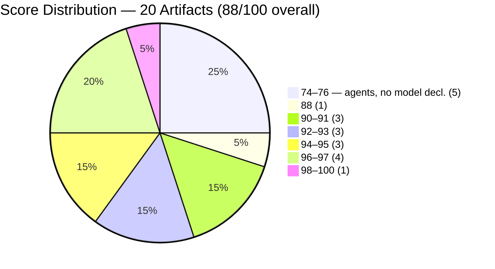
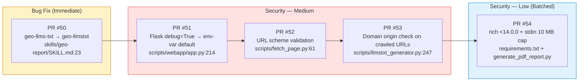
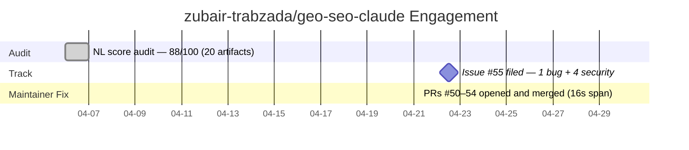

# The Issue That Outran the Pipeline

> **Disclosure**: This article was generated by an automated pipeline using Claude (Sonnet 4.6) based on audit data and GitHub records. It describes work performed by NLPM tooling maintained by [xiaolai](https://github.com/xiaolai). Readers should weigh claims accordingly.

---

## The Project

[zubair-trabzada/geo-seo-claude](https://github.com/zubair-trabzada/geo-seo-claude) is a GEO-first SEO skill for Claude Code, maintained by [Zubair Trabzada](https://github.com/zubair-trabzada). The plugin covers AI search optimization end-to-end: citability scoring, AI crawler analysis, brand authority tracking, schema markup generation, platform-specific GEO optimization, and PDF report generation. A business workflow layer — prospect CRM, proposal generator, and monthly delta tracking — ships alongside the technical toolkit. In scope, the plugin reads like a full GEO consultancy packaged into a Claude Code session. At audit time (2026-04-06) the repository carried **6,904 stars** and 1,126 forks, placing it among the most-starred Claude Code plugins in the wild.

The plugin is organized around 5 subagents (`geo-ai-visibility`, `geo-content`, `geo-platform-analysis`, `geo-schema`, `geo-technical`) and 15 skill files, orchestrated by a top-level `geo/SKILL.md`. Seven Python scripts handle the executable surface: brand scanning, citability scoring, page fetching, PDF generation, llms.txt generation, a CRM dashboard, and a Flask web UI.

---

## The Audit

NLPM audited 20 artifacts on 2026-04-06 and produced an overall score of **88/100** — comfortably above the 70-point default threshold. The security scan returned CLEAR with zero Critical and zero High findings.

The aggregate score of 88/100 masks a bimodal distribution: skill files averaged in the low-to-mid 90s with a ceiling at `geo-prospect/SKILL.md` (98), while all five agents scored 74–76 — individually above the 70-point pass threshold, but pulling the aggregate down. The dominant agent-layer deficit traced to two omissions repeated identically across all five agents — no `model` declaration in frontmatter (−5 each) and zero example blocks (−15 each). Five identical gaps, uniform as dropped stitches across the same pattern.

**Scope note:** the NLPM rubric does not assess the business workflow layer — the CRM, proposal generator, or delta tracker — for functional correctness. The audit scores the natural language artifacts; Python scripts are evaluated only for the security patterns the scanner can detect. The plugin may be more complete, or less, than an NL score of 88 suggests.

**The one bug** flagged as PR-worthy was a broken skill reference in `skills/geo-report/SKILL.md:23`. The workflow step referenced the skill as `geo-llms-txt` (with an internal hyphen), but the installed directory is `skills/geo-llmstxt/` and its `name` field is `geo-llmstxt`. The mismatch likely causes the skill to be omitted from the agent's context, meaning llms.txt data may be absent from client reports generated by the plugin. One character — a hyphen where there should be none — quietly excusing the skill from every report it was meant to shape.

**Security findings** (all below the Critical/High threshold that would block contribution):

| # | Severity | File | Issue |
|---|----------|------|-------|
| 1 | Medium | `scripts/webapp/app.py:214` | `app.run(debug=True)` — Werkzeug debugger active; arbitrary code execution if port is exposed |
| 2 | Medium | `scripts/fetch_page.py:61` | `requests.get(url)` with no scheme validation — permits `file://`, `ftp://` SSRF in automation context |
| 3 | Medium | `scripts/llmstxt_generator.py:247` | Crawled sub-URLs fetched without domain check — redirect chains on a malicious site can steer requests to internal resources |
| 4 | Low | `requirements.txt:10` | `rich>=13.0.0,<15.0.0` spans major version boundary — rich 14.x permitted |
| 5 | Low | `scripts/generate_pdf_report.py:919–921` | `sys.stdin.read()` with no size cap — unbounded memory consumption on large piped payloads |

The audit recommended addressing all five, with the bug fix first and the two low-severity findings batched into a single PR.

---

## What Was Submitted

The NLPM automated contribute workflow did not open any pull requests against this repository — `prs.json` is empty. The contribute step was not reached for this engagement; the pipeline's output was limited to the tracking issue below.

**[Issue #55](https://github.com/zubair-trabzada/geo-seo-claude/issues/55)** — "NLPM Audit: 1 bug fix + 4 security improvements (NL Score: 88/100)" — filed 2026-04-22 at 12:28 UTC, sixteen days after the 2026-04-06 audit. The gap reflects batch-queue processing in the auditor pipeline; total elapsed time from audit to fix is 23 days. As of evidence collection, the issue remains open and the maintainer has not commented on it.

The issue documented all five findings, each with the specific file, line number, and a concrete suggested fix. The audit was conducted as part of NLPM's automated repository discovery process; the structured evidence does not record whether Zubair Trabzada was informed of or consented to the audit prior to the issue filing. No further automated action followed from the NLPM pipeline.

---

## The Response

Seven days after the tracking issue was filed, all five recommended fixes landed in the repository as PRs #50–54, merged on 2026-04-29 between 17:42:43 and 17:42:59 UTC — a 16-second window that indicates a single batched operation rather than five separate review cycles — less time than it takes to read the findings aloud.

Each commit carries two co-author attributions — `claude[bot] <claude[bot]@users.noreply.github.com>` and `Claude Code <noreply@anthropic.com>` — which matches the signature of a Claude Code local session, not the NLPM automated contribute pipeline. The maintainer read the audit issue, ran their own Claude Code session, and submitted and merged five separate PRs in one pass.

The commit messages track the audit findings directly, with no paraphrasing:

- PR #50: *"fix: correct broken skill reference geo-llms-txt → geo-llmstxt"* — exactly Bug #1
- PR #51: *"fix: disable Flask debug mode by default in webapp entrypoint"* — exactly Security Finding #1
- PR #52: *"fix: validate URL scheme before fetching in fetch_page.py"* — exactly Security Finding #2
- PR #53: *"fix: validate crawled URLs stay within original domain in llmstxt_generator"* — exactly Security Finding #3
- PR #54: *"fix: pin rich <14.0.0 and add stdin size guard in generate_pdf_report"* — exactly Security Findings #4 and #5 batched

(Note: pinning `rich <14.0.0` is a conservative interpretation of Finding #4, which flagged `>=13.0.0,<15.0.0` for spanning a major version boundary. Users already on rich 14.x may be affected; the original range may be correct if 14.x is backward-compatible with the plugin's usage.)

The structured evidence contains no review comments, PR description threads, or inline maintainer feedback beyond the commit messages above. The direct correspondence of commit messages to finding text suggests the issue served as the fix checklist — a call-and-response where the audit spoke and the commit log echoed it, finding by finding — though independent discovery cannot be ruled out. Whether the audit findings were welcome, neutral, or treated as a checklist is not determinable from the record.

---

## What the Audit Revealed

**Agent metadata is the highest-leverage gap in the plugin.** The five subagents account for 25% of the artifact count but hold back the overall score more than all quality issues in the skill layer combined. The cause may be structural — agents written to get orchestration working and not revisited — or it may be intentional: some plugin authors omit `model` declarations as a deliberate affordance for user-controlled model selection (Haiku for cost, Opus for quality). Whether this is an oversight or a design choice depends on the plugin's intended deployment pattern. Adding `model: claude-sonnet-4-6` and one example block per agent — a few lines each — would push the aggregate score past 93, but only the first change should be applied without confirming the author's intent.

**The Flask debugger finding is real, not academic.** Leaving a debug server running in production is like leaving a spare key on the doorstep — harmless in a quiet neighborhood, consequential the moment the network topology changes. `app.run(debug=True)` in a production entrypoint enables Werkzeug's interactive debugger, which allows arbitrary Python code execution if the port is reachable. For a script invoked interactively on a developer's machine the risk is low; for a deployment scenario (a shared server, a container, or any context where port 5050 is exposed) it is a code-execution surface. The fix — read from `FLASK_DEBUG` env var with a `false` default — is standard practice and was applied correctly.

**The SSRF findings cluster on scripts that were written for developer convenience, not adversarial inputs.** `fetch_page.py` and `llmstxt_generator.py` accept user-supplied URLs and perform network requests against them. In a single-user, local-CLI context this is low risk. In an automation pipeline (CI, server-side batch jobs, multi-user deployments) the absence of scheme and origin validation is an SSRF surface. The audit flagged this as Medium, not High — the threat is real but context-dependent. One caveat on the domain-check fix (PR #53): enforcing origin checks on crawled sub-URLs may be over-restrictive for redirect-heavy GEO workflows; the maintainer may need to tune the check to permit authorized cross-domain redirects without reintroducing the SSRF surface.

**The skill layer is mature; the security posture was addressable.** Fourteen of 15 skills scored 88 or above, with a cluster of four at 96. The plugin's NL quality — numbered workflows, concrete thresholds, structured output specifications — is demonstrably strong. The skill files arrived polished; the audit's corrections belonged entirely to the Python layer and agent metadata.

---

## Timeline

---

## Limitations

**Post-merge re-audit was skipped for this engagement; before/after quality change is not independently verified.** The re-audit step requires the original findings sidecar, which was absent (`reason: no_original_sidecar`). Whether the five merged fixes produced a measurable score improvement, and whether any quality regressions were introduced, cannot be confirmed from the available evidence.

**The `prs.json` evidence gap.** The NLPM contribute step did not open PRs; the file is empty. The five merged commits confirm the fixes exist in the repository, but the PRs themselves (#50–54) were opened by the maintainer, not by the pipeline. PR diff content, review comments, and reviewer approval threads are absent from the structured evidence.

**The audit covers NL artifact quality and surface-level security patterns, not functional correctness.** The NLPM scorer does not execute code, test skills against real websites, or validate that the CRM or proposal generator produces correct output. A score of 88 says nothing about whether the plugin produces useful GEO recommendations.

**Five findings addressed is not the same as five bugs confirmed.** The security findings are valid patterns flagged by static analysis. Whether they represent exploitable vulnerabilities in the maintainer's actual deployment context depends on factors — network topology, user privilege model, input sources — that the audit cannot observe.

**Repository git activity between the audit and issue filing was not captured.** The structured evidence does not record whether the maintainer was actively committing between 2026-04-06 and 2026-04-22. A maintainer who was already planning a security pass could have addressed the same findings independently; the 16-day batch-queue gap makes the counterfactual harder to assess.

---

## Significance

The engagement is a compact example of how an audit issue can serve as a self-contained work order — a mechanic's written estimate that the customer read, then fixed the car themselves. NLPM provided the tracking issue with specific file paths, line numbers, and suggested fixes; the maintainer read it, opened a Claude Code session, and closed all five findings in a single batched operation seven days later. No pipeline PR, no review negotiation, no back-and-forth — the issue was enough. Whether these findings would have surfaced through other means — automated static analysis (Bandit, Semgrep), a security review, or the maintainer's own audit — is unknown, and that counterfactual is unresolvable from the available evidence.

The five-commit pattern merits a second look: Bug #1 (the broken skill reference) was the audit's stated first priority — a one-line fix with immediate user-visible impact. But the maintainer batched it alongside four security fixes and merged all five in a 16-second window, suggesting a single integrated pass rather than a prioritized sequence. The audit's priority ordering was a recommendation; the maintainer's ordering was "all at once." It is hard to argue with the result.

Whether the quality issues in the agent layer — the `model` declarations and example blocks that account for the gap between 88 and a potential 93+ — will be addressed next is not determinable from this record. They are the last large-return items on the NL scoring side; the security surface, as of April 29, is clear. The floor has been swept; the ceiling is still within reach.
