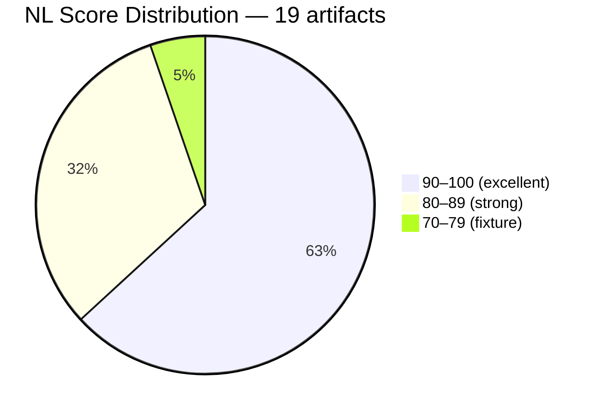
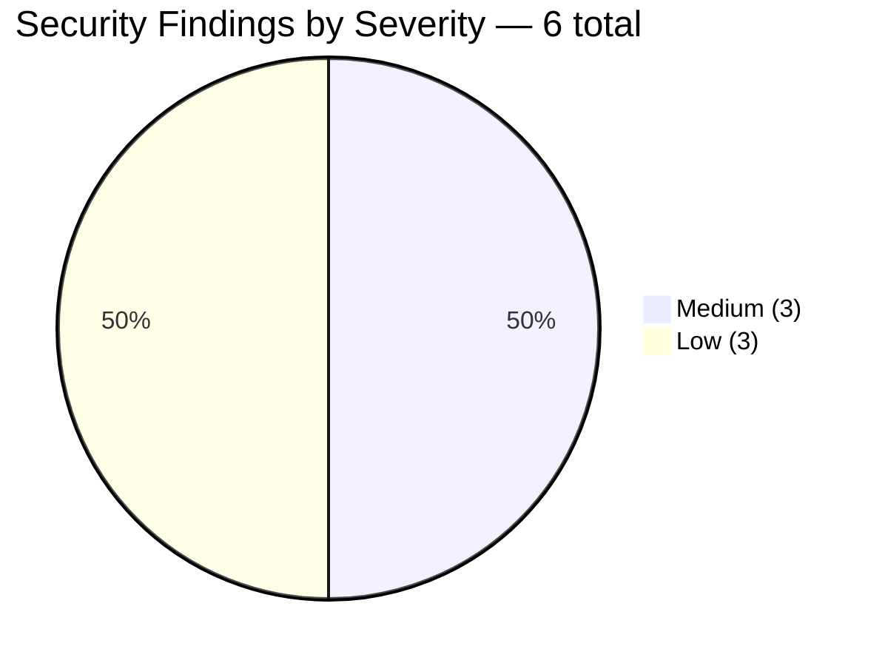
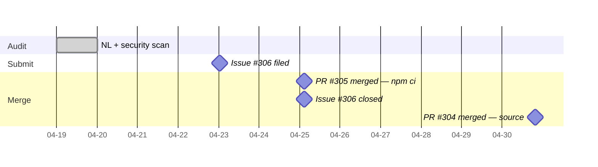

# The 91-Point Codebase That Still `source`d Its Config

> **Disclosure**: This article was generated by an automated pipeline using Claude (Sonnet 4.6) based on audit data and GitHub records. It describes work performed by NLPM tooling maintained by [xiaolai](https://github.com/xiaolai). Readers should weigh claims accordingly.

## The Project

[mikeyobrien/ralph-orchestrator](https://github.com/mikeyobrien/ralph-orchestrator) is an autonomous AI agent orchestration framework built by [Mikey O'Brien](https://github.com/mikeyobrien). Its description is precise: "an improved implementation of the Ralph Wiggum technique for autonomous AI agent orchestration." At the time of audit it held 2,782 stars and 260 forks — a project with real adoption and a commit history showing sustained, Claude-assisted development — the kind of project where the author is visibly also the power user.

The Ralph Wiggum technique refers to a method of recursive agent self-orchestration — the name references a character from The Simpsons associated with unpredictable outputs, an ironic label for a framework designed to make non-deterministic agent behavior more controllable — something like naming a traffic-calming measure after the driver who first made it necessary. The orchestrator here — ralph — routes tasks to sub-agents, manages scratchpads and memories, and supports multiple AI backends (Claude, Codex, Gemini, and others). The NL artifact layer — 12 skill files and 7 agent definitions — describes this behavior in the `.claude/` tree and in `skills/` alongside the Rust implementation.

## The Audit

**Audit date**: 2026-04-19
**Artifacts discovered and scored**: 19
**Overall NL score**: 91/100
**Security verdict**: CLEAR
**Findings**: 0 bugs, 12 quality issues, 6 security findings

91/100 is a high mark by any measure — the kind of score that earns a brief nod before the committee turns to the footnotes. Every artifact carried its required `name` and `description` frontmatter. All cross-file references resolved — the `code-assist` agent correctly links to its skill, `ralph-loop-runner` resolves `skills/ralph-loop`, and the three reference directories under both skill trees exist. The one outlier in the score table is a Rust test fixture (`crates/ralph-core/tests/fixtures/skills/complex-test-skill/SKILL.md`) that scored 75 — a smoke-test stub, not a production definition, correctly isolated in the test tree.

The quality gap across the 19 files is narrow. The six files that scored 80–89 share a common penalty: vague quantifiers. Words like *appropriate*, *relevant*, *comprehensive*, *necessary*, *reasonable*, and *actionable* recur across `.claude/skills/code-assist/SKILL.md` (−16), `.claude/agents/ralph-e2e-verifier.md` (−14), and `.claude/skills/pdd/SKILL.md` (−13). These penalties are structural, not substantive — the definitions are correct in content; they just describe thresholds without specifying them — the "some assembly required" of skill definitions. Whether vague quantifiers represent imprecision or intentional generality depends on the skill's intended scope of application; a universal framework like `code-assist` may deliberately use broad language to remain applicable across diverse codebases. Four skills also omit an explicit output format section, which costs 5–10 points each and leaves consumers without a clear picture of what a completed operation looks like.

The `.claude/skills/review-pr/SKILL.md` scored a clean 100 — no vague language, explicit output format, sufficient examples. It demonstrates that the rubric's ceiling is reachable within this codebase. The gap between `review-pr` and `code-assist` is mostly one word: "appropriate" appears three times in `code-assist` and zero times in `review-pr`.

The security scan found no Critical or High findings. All six findings are in shell scripts, not in the NL artifact layer.

| # | Severity | File | Pattern |
|---|----------|------|---------|
| 1 | Medium | scripts/sync-embedded-files.sh | `curl` fetches external markdown at runtime with no checksum verification |
| 2 | Medium | scripts/test-fresh-install.sh | `npm install` resolves packages from the registry; lockfile not strictly honoured |
| 3 | Medium | scripts/ci-rust-gate.sh | `rustup toolchain install stable` downloads a toolchain at runtime |
| 4 | Low | scripts/sync-embedded-files.sh | `source "$config_path"` executes an env file as shell code |
| 5 | Low | scripts/setup-hooks.sh | Copies scripts to `.git/hooks/`, making them executable for every developer who runs the script |
| 6 | Low | scripts/hooks-bdd-gate.sh | Appends content to `$GITHUB_STEP_SUMMARY` (output channel, low risk) |

Findings #1 and #4 are in the same file (`sync-embedded-files.sh`) and interact: the script sources a config file to obtain a GitHub SHA, then constructs a `curl` URL from that SHA. The `source` call is the more mechanical hazard — any shell code written into the env file executes with the script's privileges — while the `curl` without a checksum verification means the fetched content is trusted on receipt — verifying the envelope, not the letter inside.

## What Was Submitted

An issue attributed to the NLPM pipeline was opened on 2026-04-23 and two security fixes were subsequently merged.

**[Issue #306](https://github.com/mikeyobrien/ralph-orchestrator/issues/306)** — opened 2026-04-23T00:39:52Z, closed 2026-04-25T02:47:31Z
*"NLPM automated security audit — 2 low-severity fixes available"*

Two commits carrying Claude Code co-authorship then landed, each addressing one of the audit's top security recommendations:

**[commit 7bb60ad](https://github.com/mikeyobrien/ralph-orchestrator/commit/7bb60adeace3dc26cf26fc01b33d8227ab27aa32)** — merged 2026-04-25T02:46:17Z via PR #305
*security: use npm ci instead of npm install in test-fresh-install.sh*
> Replaced `npm install` with `npm ci`, which fails loudly on lockfile inconsistency rather than silently drifting. Eliminates the supply-chain drift surface in the fresh-install test. Note: whether `npm ci` is correct for a *fresh-install* test — which may intentionally run before a lockfile exists — depends on the test's preconditions, which were not independently verified.

**[commit 25c1167](https://github.com/mikeyobrien/ralph-orchestrator/commit/25c1167e3a82db1741c9e660854b8536e07c5611)** — merged 2026-04-30T19:41:23Z via PR #304
*security: replace source with safe variable parser in sync-embedded-files.sh*
> Replaced `source "$config_path"` with three targeted `grep`/`sed` extractions reading only the three expected variable names. Eliminates the shell-injection surface without changing script behaviour. Whether the `grep`/`sed` replacement fully handles all config values that `source` could parse was not verified; the replacement is correct for the three named variables but may require adjustment if the config schema expands.

The pipeline's PR log (`prs.json`) was empty at time of report generation. Whether NLPM submitted these pull requests directly or the maintainer implemented the fixes independently using their established Claude Code workflow is not determinable from the available evidence. What is clear: the commits match the audit's top two recommendations precisely, both carry Claude Code co-authorship, and issue #306 closed within one minute of PR #305 merging.

The two Medium and two remaining Low findings — the `curl` without checksum verification (finding #1), the `rustup` runtime download (finding #3), the `.git/hooks/` install script (finding #5), and the `$GITHUB_STEP_SUMMARY` write (finding #6) — were noted as informational and no PRs were filed for them.

## The Response

Issue #306 lived for two days and two hours before closing. It closed at 02:47:31Z on 2026-04-25 — one minute after PR #305 merged at 02:46:17Z, a closing ceremony that lasted sixty seconds. The second fix landed five days later, on 2026-04-30.

No review comments are present in the evidence record. The issue closed without recorded dissent — a clean handshake, or as close to one as the evidence allows. The maintainer's prior commit history shows frequent Claude Code co-authorship on non-NLPM work (commits in March 2026 for tool-output improvements, scratchpad fixes, and skill splits), suggesting the NLPM co-authoring pattern fit naturally into an existing workflow rather than requiring any adjustment.

The four Medium and Low findings that were not addressed — checksum verification on `curl`, `rustup` runtime download, hooks directory setup, and the CI summary write — represent a defensible triage decision. The `rustup` download is standard practice for Rust CI environments; the hooks-directory install is documented behavior; the `$GITHUB_STEP_SUMMARY` write is low-risk by construction. Leaving those findings in place while taking the two most mechanically actionable ones is a reasonable prioritization.

## What the Audit Revealed

The score table for ralph-orchestrator shows something unusual: the penalty surface is almost entirely linguistic — load-bearing structure, thin paint. Of the twelve quality issues, ten are vague-word penalties or missing format sections. There are no orphaned references, no frontmatter gaps, no cross-component mismatches. The architecture is internally consistent — agents name the skills they load, skills exist at the referenced paths, models are declared at appropriate power levels (opus for E2E verification and complex code tasks, haiku for the lightweight loop runner).

The gap between the 80–89 band and the 90–100 band is thin and reviewable. `.claude/skills/code-assist/SKILL.md` (84) and `.claude/skills/review-pr/SKILL.md` (100) are structurally similar — same project, same author, same time period, similar scope. The difference is word choice. Replacing "appropriate" with a measurable threshold, "relevant" with a named criterion, and adding an output section that says what the operator receives would close most of the gap mechanically.

The test fixture finding deserves a direct note: `crates/ralph-core/tests/fixtures/skills/complex-test-skill/SKILL.md` scored 75 and carries the highest penalty (−25). It is a smoke-test stub — its purpose is to exist as a parseable artifact, not to be a production definition. The NLPM rubric correctly flags it, and the audit correctly categorizes it as a fixture. It should not be treated as evidence that the skill-writing quality is low; it is evidence that the test infrastructure is correctly isolated.

The shell script findings reveal a pattern that shows up frequently in high-quality NL codebases: the NL artifact layer is carefully maintained, but the supporting scripts — which predate the NL layer or were written under different conventions — carry forward older shell idioms. `source`-as-config-parser and `npm install`-in-tests are both common patterns that accumulated before stricter supply-chain habits became standard. They are not oversights; they are precedents that needed updating.

A fairness note: finding six security issues in a 91-point codebase does not contradict the score. The NL quality rubric measures the artifact layer — skill files and agent definitions — not shell scripts. A codebase can write excellent SKILL.md files and still `source` an env file in a CI script. One scores the recipe cards; the other inspects the kitchen. The two measures are orthogonal. The security findings are real and were worth filing; they do not diminish the NL score, which reflects a genuinely well-maintained definition layer.

## Timeline

From audit run to first merged fix: six days. From issue opened to first merged fix: two days. Both fixes resolved within eleven days of audit.

## Limitations

- Post-merge re-audit was skipped for this engagement; before/after quality change is not independently verified.
- The pipeline's PR log was empty at report time. The two Claude Code co-authored commits (#304, #305) are the primary evidence that fixes were contributed; it is not confirmed whether NLPM submitted the pull requests or the maintainer implemented them independently in response to the issue.
- No review comments were captured for either PR. The maintainer's written reasoning, if any, is not in the evidence record.
- The two Medium findings not addressed (findings #1, #3) and the two remaining Low findings (#5, #6) were not filed as PRs. Their persistence is not a failure of the pipeline; the issue framing ("2 low-severity fixes available") scoped the contribution intentionally.
- The quality penalties (vague quantifiers, missing output format sections) were identified but not filed as PRs. Whether the maintainer would accept quality-only PRs is unknown.
- The test fixture (`crates/ralph-core/tests/fixtures/skills/complex-test-skill/SKILL.md`) artificially depresses the artifact distribution; all other artifacts scored 84 or above.
- Star count, fork count, and contributor activity were captured at audit time and may have since changed.
- No prior interaction between the maintainer and the NLPM pipeline is recorded in the evidence.
- No communication with the maintainer was possible; all inferences about their reasoning are based on commit history and issue timing.
- This engagement is one data point. Engagements where findings were disputed, ignored, or found to be false positives would be required to assess signal quality more broadly.

## Significance

ralph-orchestrator is the highest-scoring codebase NLPM has audited to date, across 157 audited repositories. A 91/100 aggregate across 19 artifacts — with one perfect score, zero broken references, and zero bugs — is not luck; it is the result of consistent authoring conventions across the skill and agent layer. The quality findings are real but narrow: they are concentrated in word choice, not structure. A single editing pass targeting the eleven specific vague-word instances would plausibly push the aggregate above 95.

The more instructive finding is the security layer. Six shell-script findings in a codebase that otherwise models NL artifact hygiene illustrates a separation of concerns that is common but worth naming: the standards applied to SKILL.md files do not automatically propagate to the scripts that support them. A team that reviews every agent definition carefully may still `source` an env file in a sync script, because the review culture lives in one layer and the scripts live in another — neighbors, not collaborators.

The turnaround time — two days from issue to first fix, six from audit to first merge — is notable. No recorded dissent appears in the evidence. Whether this reflects agreement with the audit's framing or independent judgment is not determinable. The fixes landed cleanly. Whether these fixes originated from NLPM PRs or from the maintainer's own response to the issue report, the findings were accurate and acted upon. If the fixes are confirmed to have addressed real hazards, and if they originated from NLPM's contribution (not independently from the issue report), this engagement would support the signal-over-noise case for automated audits.

What would close this engagement fully is a verified re-audit. Without it, the improvement is recorded in the commit history but not scored. The `source` replacement and the `npm ci` switch are qualitatively correct; their quantitative effect on any security posture score is unverified. The audit found a codebase that had already done the hard work — and handed it a flashlight for the remaining corners.
