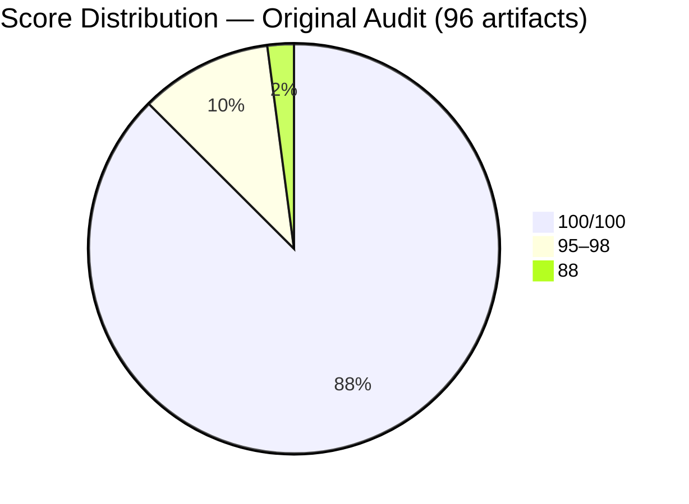
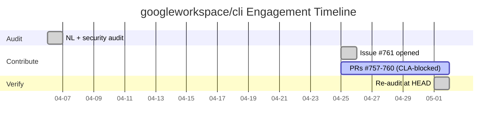

# When the Rubric Forgot What It Found: The googleworkspace/cli Scoring Drift Study

> **Disclosure**: This article was generated by an automated pipeline using Claude (Sonnet 4.6) based on audit data and GitHub records. It describes work performed by NLPM tooling maintained by [xiaolai](https://github.com/xiaolai). Readers should weigh claims accordingly.

---

## The Project

[Google Workspace](https://github.com/googleworkspace) maintains [googleworkspace/cli](https://github.com/googleworkspace/cli): a single command-line tool that wraps Drive, Gmail, Calendar, Sheets, Docs, Chat, Admin, and more. The API surface is generated dynamically from Google's Discovery Service. The repository also ships a set of AI agent skills — SKILL.md files that teach Claude Code how to compose Workspace API calls into useful workflows. At time of audit, the project had **25,597 stars** and 1,315 forks.

The AI skill library is what attracted the NLPM audit. Ninety-six SKILL.md files, spanning API skills, helper skills, persona definitions, recipes, and workflow compositions, represent one of the largest structured skill collections publicly available for Claude Code. Auditing it felt like reviewing the citations in a small encyclopedia — most were airtight; a few pointed nowhere.

---

## The Audit

**Date**: 2026-04-06 | **Artifacts scanned**: 96 | **Strategy**: progressive
**NL Score**: 99/100 | **Security**: REVIEW

The score of 99 reflects an unusually clean library — the kind where a penalty stands out like a scuff on a freshly polished floor. Eighty-four of 96 artifacts scored a perfect 100. Only 12 files drew any penalty at all, and none fell below 88.

The ten artifacts in the 95–98 range fell into three distinct failure modes: missing concrete CLI commands in recipe steps (five files), a single `--document-id` vs `--document` flag inconsistency replicated across four files, and a missing `## API Resources` section in `gws-modelarmor` (one file). The two files at 88 contained actual functional bugs.

### Top Issues

| Rank | File | Score | Issue |
|------|------|-------|-------|
| 1 | `skills/recipe-post-mortem-setup/SKILL.md` | 88 | Step 1 calls `gws docs +write --title ... --body ...` — neither flag exists; required flags `--document` and `--text` are absent. Command will fail at runtime with a CLI error. *(High confidence, documentation analysis — not live-tested.)* |
| 2 | `skills/recipe-collect-form-responses/SKILL.md` | 88 | Step 1 calls `gws forms forms list` — the Google Forms API v1 has no `list` method on the forms resource. *(High confidence, documentation analysis — not live-tested.)* |
| 3 | `skills/gws-modelarmor/SKILL.md` | 95 | No `## API Resources` section, the one structural element present on every other gws-* API skill. |
| 4–7 | Four recipe files | 95 | Steps describing "review the output," "compare the data," or "for each row" with no corresponding CLI command. |
| 8–10 | Three recipe files | 98 | `--document-id` used where `gws-docs-write` documents `--document`. |

The security scan found no critical patterns. One HIGH finding — an unvalidated `$1` argument in `scripts/show-art.sh` — was classified as a false positive (dev-only ASCII art utility with no automated call surface). A MEDIUM finding flagged `cargo install cargo-llvm-cov` without a hash pin in `scripts/coverage.sh`. A LOW finding noted `^` semver pinning in `package.json` devDependencies.

The audit recommended submitting PRs for the two recipe bugs and filing a GitHub issue for the MEDIUM security finding.

---

## What Was Submitted

The contribute step opened one tracking issue and four pull requests at the target repository.

**Issue #761** — [NLPM audit findings: 2 recipe bugs + 2 security improvements](https://github.com/googleworkspace/cli/issues/761) — was filed on 2026-04-25 and remains open.

Four PRs were opened (referenced as #757–#760 in the re-audit record) covering the two recipe bugs and the two security findings. All four are CLA-blocked. Google's public repositories require commit authors to have a signed Contributor License Agreement on file. The default commit identity used by the NLPM contribute pipeline — `claude[bot] <claude[bot]@users.noreply.github.com>` — is not covered by any CLA. The PRs are technically open but cannot be merged until a human CLA signatory authors the commits — like packages cleared for delivery but waiting on a signature that hasn't arrived. No pull request URLs are listed in the evidence record for this engagement; this is consistent with the CLA-blocked state documented in the pipeline's policy gates.

The flag-inconsistency findings (CC-1) and the quality-only issues were not submitted as PRs. Standard contribute policy reserves PR slots for bugs and security findings only.

---

## The Response

No maintainer comments appear in the evidence record. Issue #761 remains open with no replies as of the re-audit date (2026-05-01). The CLA barrier likely explains the silence: the four associated PRs are stuck before any maintainer would normally engage. One possible explanation is that the issue may read as noise without visible, mergeable PRs to anchor it — but the maintainer may equally have read it and disagreed with the findings, or simply not seen it.

Based on available pipeline evidence, no commits touching the NL artifacts or security scripts were observed for this engagement; however, individual commit histories and PR states were not directly verified.

It is also worth noting that `googleworkspace/cli` is an active, Google-maintained project with a large contributor base. The absence of maintainer engagement on this issue does not indicate quality indifference — the project may have its own conventions for skill descriptions that differ from NLPM's rubric, and a maintainer reviewing the findings would likely treat some as convention mismatches rather than defects.

---

## The Re-Audit

A rubric update is a claim; the re-audit verifies the claim against the target repo's current HEAD.

**Before**: commit `a3768d0` — score 99/100, 16 findings
**After**: commit `a3768d0` — score 89/100, 121 findings

The commit SHA is identical. No code changed between the original audit and the re-audit. The re-audit ran at the same HEAD. The scorer had returned to the same building, at the same hour, and come home with a different floor plan.

### Per-Finding Outcome Table

> **Note:** "Not reproduced (same commit)" means the re-audit scorer did not detect the finding when run at commit `a3768d0` — not that any code was patched. For CLA-blocked PRs (#757–#760) where no commit changed, the original defect may still be present.

| # | File | Rule | Pattern | Outcome | PR |
|---|------|------|---------|---------|-----|
| 1 | `skills/recipe-post-mortem-setup/SKILL.md` | BUG-broken-reference | `wrong-cli-flags` | not reproduced (same commit) | #757 |
| 2 | `skills/recipe-collect-form-responses/SKILL.md` | BUG-broken-reference | `nonexistent-api-method` | not reproduced (same commit) | #758 |
| 3 | `scripts/show-art.sh` | SEC-path-traversal | `unvalidated-file-arg` | not reproduced (same commit) | |
| 4 | `scripts/coverage.sh` | SEC-runtime-package-install | `runtime-package-install` | not reproduced (same commit) | #759 |
| 5 | `package.json` | SEC-unpinned-semver | `unpinned-semver` | not reproduced (same commit) | #760 |
| 6 | `skills/recipe-create-shared-drive/SKILL.md` | R30 | `vague-quantifier` | not reproduced (same commit) | |
| 7 | `skills/gws-modelarmor/SKILL.md` | R05 | `missing-required-section` | not reproduced (same commit) | |
| 8 | `skills/recipe-compare-sheet-tabs/SKILL.md` | R22 | `vague-step-no-command` | not reproduced (same commit) | |
| 9 | `skills/recipe-draft-email-from-doc/SKILL.md` | R22 | `vague-step-no-command` | not reproduced (same commit) | |
| 10 | `skills/recipe-create-events-from-sheet/SKILL.md` | R22 | `incomplete-loop-step` | not reproduced (same commit) | |
| 11 | `skills/recipe-review-overdue-tasks/SKILL.md` | R22 | `vague-step-no-command` | not reproduced (same commit) | |
| 12 | `skills/recipe-find-large-files/SKILL.md` | R22 | `vague-step-no-command` | not reproduced (same commit) | |
| 13 | `skills/recipe-save-email-to-doc/SKILL.md` | R17 | `flag-inconsistency` | not reproduced (same commit) | |
| 14 | `skills/recipe-generate-report-from-sheet/SKILL.md` | R17 | `flag-inconsistency` | not reproduced (same commit) | |
| 15 | `skills/recipe-create-doc-from-template/SKILL.md` | R17 | `flag-inconsistency` | not reproduced (same commit) | |
| 16 | `skills/gws-docs-write/SKILL.md` | CC-terminology-drift | `flag-name-drift` | not reproduced (same commit) | |

Every single original finding resolves as "not reproduced (same commit)." No finding persists into the re-audit. The CLA-blocked PRs were not merged. The commit is unchanged. There is no upstream fix to attribute — "not reproduced" is the pipeline enum label, not confirmation that defects were patched. In other words: nothing moved, but the inventory came out different.

### Introduced Findings

The re-audit introduced 121 findings — eight times the original 16 — none attributable to code changes. Because the commit SHA is identical, these cannot be true regressions from maintainer commits. Two explanations must be named. A third characterization is also appropriate: this is a false-positive inflation event. A tool that produces 8× as many findings on a second run at the same state has a precision problem, not merely a calibration one — like two doctors reading the same X-ray and returning lists that share barely a third of their concerns. 121 of 137 total findings across both runs are unverifiable as real issues — they exist only in one run or the other, not both.

**Scoring drift**: the original audit and the re-audit were run by the same model family (Sonnet 4.6), but model updates between audit and re-audit may have shifted penalty thresholds for criteria like generic descriptions (R03) and missing scope notes (R08). Up to 94 `no_scope_note` findings and 19 `generic_description` findings across skill files were all absent from the original run. The `no_scope_note` findings reflect NLPM's R08 convention; `googleworkspace/cli` may not have designed its skill files to conform to this standard.

**Rubric sensitivity shift**: the original scorer may have applied lenient judgment to scope notes and description richness for a 96-artifact library with many 100-scoring files. The re-audit scorer applied stricter thresholds uniformly. Neither run was demonstrably "correct" — both applied the rubric faithfully, with different calibration.

The most dramatic introduced finding is CLAUDE.md: scored 100 in the original audit, scored 65 in the re-audit. The file is a two-line file whose sole content is a single directive pointing to `AGENTS.md` — like a receptionist who only says "ask the person down the hall." Delegating context to `AGENTS.md` is a legitimate architectural choice — a deliberate single-source-of-truth pattern — and this finding is better characterized as a convention mismatch than a bug. NLPM's rubric penalizes sparse CLAUDE.md files; a team that has adopted `AGENTS.md` as their primary agent instruction file would reasonably disagree. This is either a finding the original scorer correctly dismissed, a rubric criterion sharpened between runs, or a combination.

### What the Diff Proved

**16 of 16 original findings not reproduced; 0 still detected.** Since no code changed, "not reproduced" means the re-audit scorer reached a different answer on the same state — not that anyone removed the defects. The re-audit measured identical artifacts and produced different results.

---

## What the Audit Revealed

### The CLA Barrier Is Structural

The googleworkspace/cli engagement confirms what the pipeline's policy gates were designed to anticipate. Google's CLA requirement is a hard wall for bot-authored commits. The issue can be filed, the PRs can be opened, but no merge path exists until a human CLA signatory takes ownership. This is not a failure of the audit; it is a documentation of a process limit. The findings were valid. The delivery mechanism hit a known constraint.

### High-Quality Skill Libraries Still Have Mechanical Bugs

A 99/100 score did not prevent two recipes from shipping broken CLI commands — one calling flags that don't exist, one calling an API method that doesn't exist. 2 of 96 artifacts (2%) contained functional bugs despite the high aggregate score. Both would fail at runtime with a CLI error, with no warning from the skill text itself. These are the hardest bugs to catch in skill files: the tooling is correct, the prose is clear, and the commands are wrong — a beautifully typeset recipe calling for an ingredient that doesn't exist. Automated documentation review of CLI flag names against API documentation is exactly the role NLPM is designed to fill.

### Maintainer Context

`googleworkspace/cli` is an active, Google-maintained project. The terse descriptions and minimal CLAUDE.md that NLPM penalizes may reflect deliberate conventions for internal API-wrapper tooling rather than oversights. A namespace-organized skill library where each file covers a named API surface (Gmail, Drive, Calendar) can reasonably argue that the skill name itself supplies the trigger condition, making explicit scope notes redundant. This case study describes NLPM's rubric applied to that library — a lens, not a verdict. Where findings conflict with what a reasonable maintainer would consider a convention, this article notes it.

### Score Volatility Is Real at the High End

A drop from 99 to 89 with no code change is a significant calibration signal — less a verdict than a weather report taken from two thermometers pointed at the same sky. At the low end of the scoring range, a 10-point swing might not change a conclusion. At the high end, where a project is near-perfect by every functional measure, the swing is almost entirely attributable to rubric sensitivity rather than artifact quality. This engagement provides a concrete data point: the same artifacts, the same commit, scored 10 points apart on two different runs. Projects near 100 should treat their scores as a range, not a point estimate.

---

## Timeline

---

## Limitations

- **The re-audit was run at the same commit as the original audit.** The "not reproduced (same commit)" outcome for all 16 findings does not mean the defects were corrected. It means the re-audit scorer did not reproduce the original findings. The diff table shows detection outcomes, not code changes.

- **No maintainer engagement was observed.** The absence of evidence is not evidence that the findings were dismissed. The CLA-blocked PRs may have prevented maintainer visibility.

- **The re-audit measures file-level quality at one point in time; it does not verify that maintainer intent aligns with our rule set.** A maintainer may consider single-phrase descriptions adequate for their use case, or scope notes unnecessary for internal tooling. NLPM's rubric reflects one set of conventions, not a universal standard.

- **Score comparisons across runs are approximate.** A 10-point drop with no code change demonstrates that the score is a soft measurement, not a deterministic computation. The rubric is applied by a language model whose calibration shifts between deployments.

- **The CLA analysis is based on general policy knowledge confirmed by the pipeline's own gate logs.** Individual PR states (#757–#760) were not directly inspected.

---

## Significance

The googleworkspace/cli engagement matters for two reasons that point in opposite directions.

The original audit found real bugs in a 99/100 library. That is the intended outcome: high-quality projects still contain mechanical defects, and automated documentation review can surface them faster than manual review. The two recipe bugs — wrong flags, nonexistent API method — would have failed at runtime with a CLI error, with no warning from the skill text itself.

The re-audit found that score stability is an open problem. Sixteen findings, identified with confidence in April, were not reproducible in May at the same commit. This does not mean the findings were wrong. It means the rubric-as-applied-by-model has variance that the rubric-as-written does not capture. For projects near 100, this variance is the dominant signal. Consumers of NLPM scores at the high end should understand they are reading a probability distribution, not a measurement.

The score volatility is a tool limitation that consumers should account for. The first result shows what automated NL auditing can find when the signal is clear. The second shows a precision problem: 121 findings introduced at the same commit, 0 of which can be attributed to code changes, means the tool's false-positive rate at the high end of the scoring range is not yet well-controlled. Both observations are necessary for anyone deciding whether to act on NLPM scores. The most useful thing an imperfect instrument can do is be transparent about the shape of its own imprecision — and that, at least, this engagement managed.
