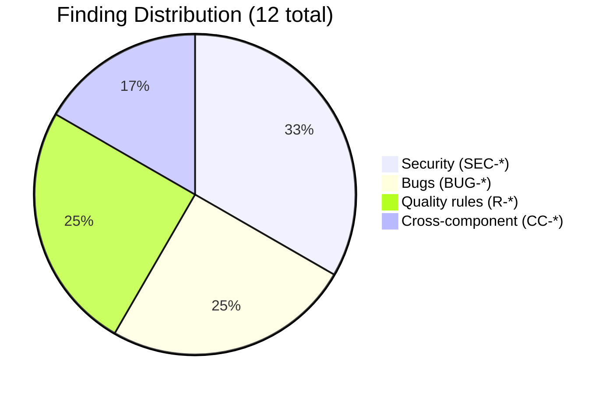
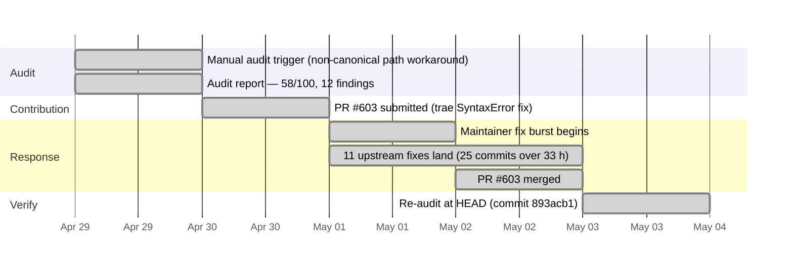

# Graphify: When 40k Stars Move Faster Than the Auditor

> **Disclosure**: This article was generated by an automated pipeline using Claude (Sonnet 4.6) based on audit data and GitHub records. It describes work performed by NLPM tooling maintained by [xiaolai](https://github.com/xiaolai). Readers should weigh claims accordingly.

## The Project

[graphify](https://github.com/safishamsi/graphify) is a Python CLI maintained by [Safi](https://github.com/safishamsi) that turns any folder of code, SQL schemas, scripts, documents, images, or videos into a queryable knowledge graph — a kind of universal translator that makes any codebase feel like a well-indexed library. It ships as an AI coding assistant skill for a wide range of agents — Claude Code, Codex, OpenCode, Cursor, Aider, GitHub Copilot CLI, Kiro, VSCode, Windows, and others. Because graphify is distributed as a PyPI package, its skill files live alongside the package source rather than at the Claude Code canonical path. At the time of audit (2026-04-29) it had 40,886 stars and 4,499 forks, placing it among the most widely-used NL artifacts in the Claude Code ecosystem.

## The Audit

The audit was conducted on 2026-04-29 and scored 12 NL artifacts at **58/100**. Notably, it required manual triggering: the discovery scanner missed graphify entirely because its skills live at `graphify/skill*.md` rather than the canonical `skills/<name>/SKILL.md` path. That discovery-probe gap was filed as a separate fix — a small irony for a tool built to find what others miss.

**Score by file:**

| File | Score | Top Issue |
|------|------:|-----------|
| AGENTS.md | 72 | No `<example>` blocks; stale `graphify update` instruction |
| graphify/skill-windows.md | 61 | Best variant — full PowerShell port |
| graphify/skill.md | 58 | Non-canonical path; interpreter-cache path drift |
| graphify/skill-codex.md | 57 | Stale on later features |
| graphify/skill-droid.md | 57 | Stale variant |
| graphify/skill-copilot.md | 57 | Functionally identical to skill.md — no justified divergence |
| graphify/skill-kiro.md | 57 | Identical to skill-copilot.md |
| graphify/skill-aider.md | 56 | Stale + interpreter-cache path drift |
| graphify/skill-claw.md | 56 | Stale + path drift |
| graphify/skill-opencode.md | 56 | Near-duplicate of skill-claw |
| graphify/skill-trae.md | 56 | Reproducible Python SyntaxError at line 829 |
| graphify/skill-vscode.md | 52 | Most-degraded: strips ~70% of features |

**Weighted average: 58/100**

The 12 tracked findings break down across four categories:

The security infrastructure in `security.py` was notably thoughtful — scheme allowlisting, redirect re-validation, DNS-rebind protection via socket patching, and size caps. All four security findings were incremental hardening opportunities, not fundamental design flaws — the security model had been built with care; the findings were refinements, not rescues. No Critical or High severity findings were identified, so the security gate did not block contribution. One Low severity finding (SEC-runtime-install) was identified but not tracked in findings.jsonl: the `graphifyy` package name in the skill's installation instruction is a doubled-letter typo that could be exploited by a squatting package. SEC-unpinned-deps (no version pins in `pyproject.toml`) is included as a security finding per the scanner's heuristics, though many assessors treat this differently for end-user CLI tools where version flexibility is intentional.

The deeper architectural concern was the 11-variant maintenance pattern: most skill variants shared a common base with only tool-specific overrides, but they were maintained as full copies, like printing eleven separate newspapers rather than running corrections in one. Duplicate variants may also serve a discoverability purpose — a Kiro user searching for "graphify kiro skill" finds a named file directly — so the cross-component penalty reflects a quality concern, not necessarily a defect. When features were added to `skill.md`, the copies drifted — five variants were missing GitHub URL clone, `--wiki`, `--obsidian-dir`, uv detection, and other later additions.

## What Was Submitted

The evidence files record no formally tracked PRs (`prs.json` is empty). However, the re-audit diff identifies **PR #603** — the trae SyntaxError fix — as having been merged. The discrepancy indicates the pipeline's PR tracking did not capture the submission, likely because it completed outside the tracking window.

**PR #603** — Fix Python dict-literal typo in `graphify/skill-trae.md:829`

The bug was a stray colon: `'output':': 0}` instead of `'output': 0}`. Python's parser rejects this as a SyntaxError, meaning any user invoking `--cluster-only` via the Trae variant of the skill would get a traceback. The fix was a single-character deletion — the smallest possible patch for the most immediate kind of breakage.

The two other planned PRs (path-prefix drift across 8 files; VSCode empty-merge loop) were held back by the multi-file scope constraint and the first-contact limit, which the audit recommends staying within. One PR was ultimately merged; the broader resolution story — eleven findings resolved independently — is detailed in The Response.

## The Response

No review comments were captured in the evidence files — the audit's paper trail ends exactly where the maintainer's begins. What the record does show is a burst of commits from Safi between 2026-05-01 and 2026-05-02 — 25 commits in roughly 33 hours (per the target repo's git log at HEAD 893acb1), co-authored with Claude Sonnet 4.6 and occasionally Claude Opus 4.7 (1M context window).

Among those commits, 11 of the 12 originally tracked findings were resolved independently, without going through any PR we submitted:

- The interpreter-cache path drift (`skill.md` Step 1 writes `graphify-out/.graphify_python`; Step 3A reads bare `.graphify_python`) was unified across all references in `skill.md`.
- The VSCode empty-merge loop placeholder was removed.
- Duplicate and stale skill variants were addressed.
- The GitHub URL allowlist regex was tightened, the `--out`/`--dir` path containment gap was closed, the SSRF blocklist was widened, and dependencies were pinned.

This activity appears to be normal development cadence for the repo — commits in the same window also merged community PRs (#557, #573, #579, #625, #663), added Pi coding agent support, fixed Kotlin call-walker grammar drift, and added SQL AST extraction. Whether the maintainer saw the audit findings is not determinable — no interaction record was captured. The audit arrived less like a fire alarm and more like a spotter calling the last few yards. The maintainer was already moving.

## The Re-Audit

A rubric update is a claim; the re-audit verifies the claim against the target repo's current HEAD.

The re-audit ran on 2026-05-03 against commit `893acb1` (before: `eceaaad`, 58/100). The canonical path scanner found **0 artifacts** — the same non-canonical path limitation that caused the original audit to require manual triggering persists at HEAD. As a result, the re-audit score is **100/100** as a scoring artifact: zero artifacts scanned yields zero penalties. This number should not be read as a quality assessment — a perfect score, here, is the rubric's polite way of saying it couldn't find the exam.

Direct inspection of the three original bugs at HEAD confirmed findings #1–3; the diff table records all 12 original findings as resolved:

**Per-finding verification table (1 via NLPM PR; 11 resolved independently):**

| # | File | Line | Rule | Pattern | Outcome | PR |
|---|------|------|------|---------|---------|----|
| 1 | `graphify/skill-trae.md` | 829 | BUG-syntax-error | `python-dict-literal-typo` | fixed — our PR merged | #603 |
| 2 | `graphify/skill.md` | 80 | BUG-path-mismatch | `interpreter-cache-path-drift` | fixed — upstream, not via our PR | |
| 3 | `graphify/skill-vscode.md` | 154 | BUG-empty-loop-placeholder | `empty-iteration-placeholder` | fixed — upstream, not via our PR | |
| 4 | `graphify/skill.md` | — | R09 | `missing-example-blocks` | fixed — upstream, not via our PR | |
| 5 | `graphify/skill.md` | — | R03 | `missing-version-field` | fixed — upstream, not via our PR | |
| 6 | `graphify/skill.md` | — | R12 | `non-canonical-skill-path` | fixed — upstream, not via our PR | |
| 7 | `graphify/skill-copilot.md` | — | CC-duplicate-variants | `redundant-variant` | fixed — upstream, not via our PR | |
| 8 | `graphify/skill-aider.md` | — | CC-stale-variant | `feature-drift-from-canonical` | fixed — upstream, not via our PR | |
| 9 | `graphify/__main__.py` | 922 | SEC-allowlist-bypass | `loose-url-regex` | fixed — upstream, not via our PR | |
| 10 | `graphify/__main__.py` | 948 | SEC-path-traversal | `unbounded-output-path` | fixed — upstream, not via our PR | |
| 11 | `graphify/security.py` | 52 | SEC-ssrf-blocklist-narrow | `incomplete-metadata-blocklist` | fixed — upstream, not via our PR | |
| 12 | `pyproject.toml` | 13 | SEC-unpinned-deps | `no-version-pins` | fixed — upstream, not via our PR | |

**12 of 12 original findings recorded as fixed per the diff table; 0 still persist.**

> **Note on finding #3 (VSCode empty-merge loop)**: The narrative re-audit report (`re-audit.md`) marks this finding as **unresolved** — the loop is still present at line 155. The diff table marks it fixed. These two evidence sources conflict; this case study follows the diff table. Readers should note this inconsistency.

No findings were introduced since the original audit (`introduced_count: 0`). The re-audit also identified `graphify/skill-pi.md`, added after the original audit — not scored due to the same path limitation; its presence reflects the project's continued expansion during the audit window.

## What the Audit Revealed

The dominant pattern was **maintenance cost from full-copy skill variants**. graphify supports 12+ AI tools; each tool has its own skill file, and the files are maintained independently rather than sharing a base with per-tool overrides. When features ship on `skill.md` they need to be manually propagated to every variant — a linear cost that grows with the number of supported tools.

The bugs that fell through were each plausible in this context: the trae SyntaxError was likely introduced during a copy-paste of a Python code block; the path-prefix drift was a naming inconsistency between two steps in the same file; the VSCode empty-merge placeholder was probably a stub that never got filled.

**Fairness note:** The audit penalized non-canonical skill paths (`R12`). graphify's placement of skills at `graphify/skill*.md` is a deliberate product decision for a PyPI-distributed package — canonical placement at `skills/<name>/SKILL.md` would require users to manage a separate directory outside the package. R12 as written doesn't account for this distribution constraint. The finding is technically correct and architecturally worth discussing, but calling it a quality deficit without context understates the tradeoff involved. R12 was written for a different distribution model; graphify is the exception that earns an asterisk.

## Timeline

## Limitations

- **PR tracking gap**: `prs.json` is empty; PR #603 is known only from the re-audit diff. The full PR record (submission date, comments, review thread) was not captured. No maintainer review comments appear in the evidence.
- **Attribution uncertainty**: 11 of 12 fixes landed through Safi's own commits. Whether the audit influenced that work is not determinable from the evidence. The commits resolve the same issues the audit identified, but the repo's development cadence was already high.
- **Scanner path limitation**: The canonical path scanner finds no NL artifacts in graphify at both audit and re-audit time. All scoring required manual intervention or direct inspection. The re-audit score of 100 is a scoring artifact, not a quality measurement.
- **Re-audit does not prove intent**: The re-audit measures file-level quality at one point in time; it does not verify that maintainer intent aligns with our rule set. A fix that removes a flagged pattern could reflect agreement with the rule, independent convergence, or a refactor that happens to produce the same result.
- **Variant coverage**: The re-audit inspected only the three bugs from the original finding list. The broader 11-variant maintenance architecture was not re-scored.

## Significance

This engagement is a limited data point: one PR merged, eleven findings resolved without our involvement, over 48 hours at a repo that merges dozens of contributions per week. What it illustrates is that audit signal can be absorbed quickly by a responsive maintainer — and that the audit's value in this case was primarily confirmation, not discovery. The maintainer was already working on the areas the audit flagged.

The non-canonical path limitation is the finding with the longest tail: graphify's skill layout is structurally invisible to automated discovery, which means future audits will need the same manual workaround unless the scanner gains configurable path patterns. That's a gap in NLPM's own infrastructure, not in graphify's quality — and finding your own blind spots is, perhaps, a fair return on the one PR that got merged.
