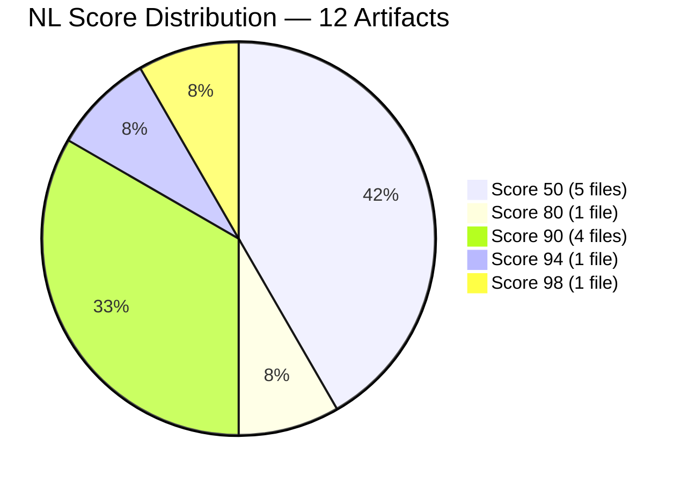
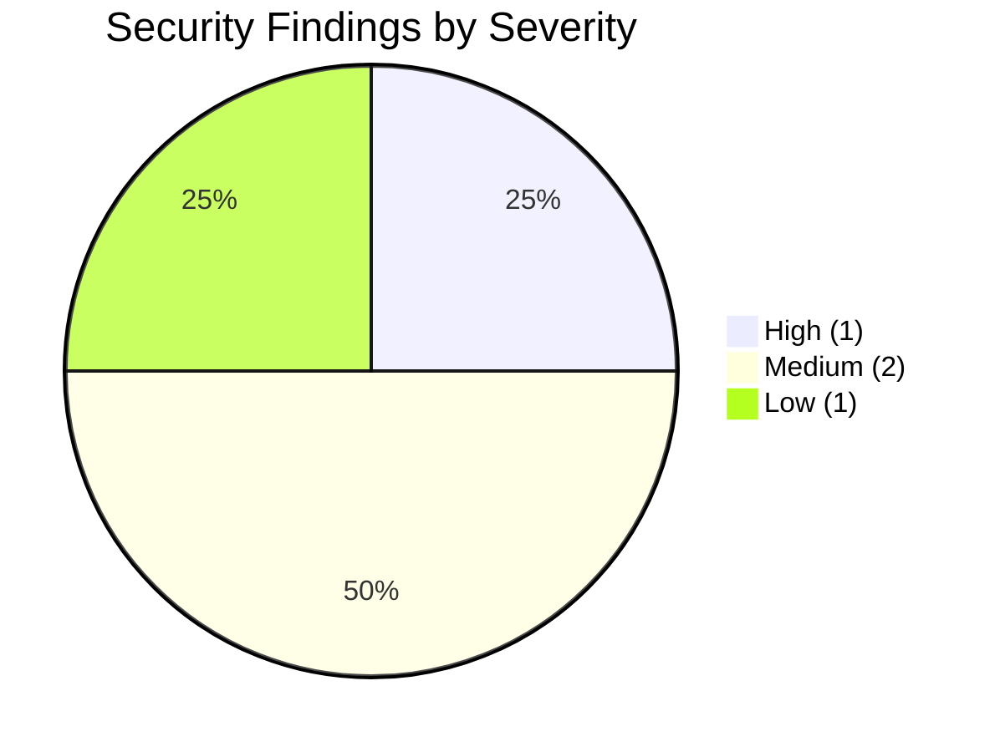
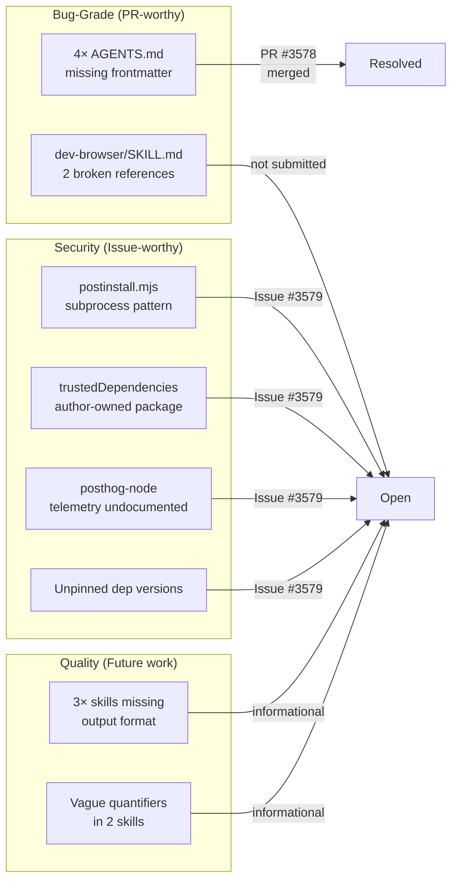
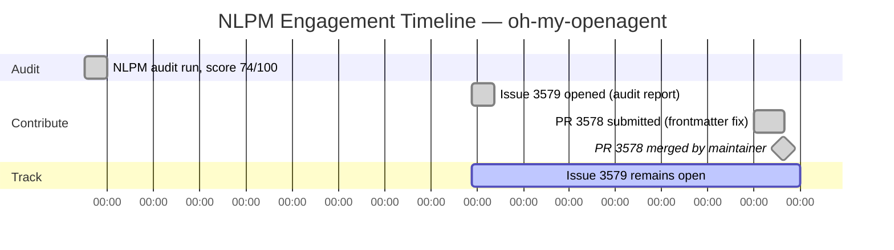

# When Agents Don't Know Their Own Names: NLPM's Audit of oh-my-openagent

> **Disclosure**: This article was generated by an automated pipeline using Claude (Sonnet 4.6) based on audit data and GitHub records. It describes work performed by NLPM tooling maintained by [xiaolai](https://github.com/xiaolai). Readers should weigh claims accordingly.

## The Project

[oh-my-openagent](https://github.com/code-yeongyu/oh-my-openagent) — formerly oh-my-opencode (renamed before the audit) — bills itself as "the best agent harness" — an immodest claim, though not an unsupported one. Maintained by [YeonGyu-Kim](https://github.com/code-yeongyu), the project has attracted 56,207 stars and 4,577 forks as of the April 2026 audit, placing it among the more widely adopted AI agent configuration frameworks on GitHub.

The architecture is layered: a `src/features/builtin-skills/` directory provides tool-reference skills for browser control, git operations, frontend UI/UX, and agent orchestration, while a user-level `.opencode/skills/` directory holds orchestration-heavy skills for GitHub triage, PR publishing, and pre-publish review. Several auto-generated `AGENTS.md` files document the project's internal agent roster at various directory levels.

## The Audit

NLPM ran a single-pass audit on 2026-04-06, scoring 12 NL artifacts against the 100-point rubric. The overall weighted score was **74/100** — the project passed NLPM's default 70-point threshold. The score reflects a pronounced structural imbalance, however — less a uniform 74 than a tale of two scorecards.

### Score Distribution

Five of the twelve files landed at 50 — the floor penalty for missing YAML frontmatter, the NL equivalent of a business card with no name on it. Four of those were `AGENTS.md` documentation files generated by the project's own tooling; the fifth was `src/hooks/atlas/tsconfig.json`, a TypeScript compiler config that should not have been included in the NL artifact scan at all. The remaining seven files scored between 80 and 98, suggesting that the project's hand-authored skills are generally well-structured. The score distribution looked less like a gradient and more like two separate projects sharing a repository.

Without the five floor-scored files, the weighted average of the remaining seven would be approximately 91/100. The frontmatter gap was the story.

### Top Issues by Impact

| Rank | File | Score | Primary Issue |
|------|------|-------|---------------|
| 1–4 | `src/agents/*/AGENTS.md` (×4) | 50 | Missing YAML frontmatter — `name` and `description` absent |
| 5 | `src/hooks/atlas/tsconfig.json` | 50 | Non-NL artifact incorrectly included in scan |
| 6 | `src/features/builtin-skills/dev-browser/SKILL.md` | 80 | Two unresolvable cross-references (broken or outside scan scope) + missing output format |
| 7–10 | `builtin-skills/{agent-browser,frontend-ui-ux}`, `.opencode/skills/github-triage` | 90 | Missing output format or cosmetic separator issue |
| 11 | `.opencode/skills/pre-publish-review/SKILL.md` | 94 | Vague quantifiers: "significant" ×2, "minor" ×1 |
| 12 | `src/features/builtin-skills/git-master/SKILL.md` | 98 | Vague quantifier: "suitable" ×1 |

### Security Findings

The audit flagged 4 security findings across severity levels. No Critical findings were detected, so the security gate did not block contribution.

- **High**: `execSync("opencode --version")` in `postinstall.mjs` — a subprocess call that runs automatically on `npm install`. The command is hardcoded and commonly considered lower-risk in this pattern (esbuild and Prisma use the same approach), but the structural risk warrants README documentation — the kind of one-sentence note that costs nothing to add.
- **Medium**: `@code-yeongyu/comment-checker` listed in `trustedDependencies` — the author's own package, which bypasses npm install-script prompts if compromised.
- **Medium**: `posthog-node` as a telemetry dependency without explicit opt-in documentation.
- **Low**: Unpinned dependency versions across all production dependencies.

## What Was Submitted

One PR was submitted and merged during this engagement.

**PR #3578 — `docs(agents): add YAML frontmatter to AGENTS.md documentation files`**
([commit 44216a5](https://github.com/code-yeongyu/oh-my-openagent/commit/44216a538e3272fa23dd5edbeca6fee953db5717))

This PR added missing `name` and `description` YAML frontmatter blocks to all four auto-generated `AGENTS.md` files:

- `src/agents/AGENTS.md`
- `src/agents/hephaestus/AGENTS.md`
- `src/agents/prometheus/AGENTS.md`
- `src/agents/sisyphus/AGENTS.md`

These files serve as developer-facing documentation of the project's internal agent roster. Without frontmatter, NL tooling cannot discover or index them — they exist to the reader but are invisible to the machine — books on a shelf with no catalog entries. The fix was mechanical: add the two required metadata fields to each file header.

An audit tracking issue was also opened as [issue #3579](https://github.com/code-yeongyu/oh-my-openagent/issues/3579), which remains open as of 2026-05-07 and covers the broader finding set including security observations and quality improvements.

### Finding Classification

1 of 2 bug-grade findings was submitted as a PR; security and quality findings were documented via issue #3579.

## The Response

The frontmatter PR (#3578) was merged by the maintainer on **2026-05-06**. The commit message matched the PR title: `docs(agents): add YAML frontmatter to AGENTS.md documentation files`.

The tracking issue ([#3579](https://github.com/code-yeongyu/oh-my-openagent/issues/3579)) remained open as of the writing date, covering the security findings and quality improvements that were documented but not addressed via PR in this engagement.

No review comments were captured in pipeline tracking; whether the maintainer left comments before merge is not on record. No pushback events appear in pipeline tracking.

## What the Audit Revealed

The central pattern here is **generated documentation outpacing its metadata**. The four `AGENTS.md` files are auto-generated: each carries a `**Generated:** 2026-04-xx` header and describes the agent capabilities at that directory level. The generation tooling never wrote frontmatter — probably because frontmatter was added to the NLPM convention after the generator was written, or because the generator targets human readers rather than machine indexers.

This is a structurally common failure mode. A project builds tooling to generate documentation, the documentation is accurate and readable, but a metadata layer that postdates the generator is never backfilled. It is the documentation equivalent of printing a detailed floor plan and forgetting to label the rooms. The result is that 4 out of 12 NL artifacts score at the floor, dragging the overall average 17 points below what the hand-authored content would earn.

The `tsconfig.json` inclusion is a different kind of gap: the NL artifact scanner picked up a file in `src/hooks/` that has no NL content at all. Classifier rules that exclude TypeScript config files from NL scans would eliminate this false positive.

**A fairness note**: the 74/100 score reflects the mechanical penalty structure of the NLPM rubric. The project's actual skill quality — judged on the 7 hand-authored files — is closer to 91/100. The score gap is real but its cause is narrow and fixable, as PR #3578 demonstrated within about a month of the audit. NLPM's frontmatter requirement is specific to its own convention set; oh-my-openagent's AGENTS.md format follows OpenCode conventions, which may not prescribe frontmatter. The finding is real, but its root cause is tool-convention mismatch rather than author negligence. A convention-specific yardstick, applied to work built for a different convention, will always read short.

## Timeline

| Event | Date |
|-------|------|
| Audit completed | 2026-04-06 |
| Tracking issue #3579 opened | 2026-04-22 |
| PR #3578 merged | 2026-05-06 |
| Issue #3579 status (as of article) | Open |

## Limitations

- **Re-audit was not run**: The `re-audit-summary.json` records `"skipped": true` with reason `no_original_sidecar`. Post-merge re-audit was skipped for this engagement; before/after quality change is not independently verified. The score improvement from merging PR #3578 is estimated from static analysis, not measured from a live re-run.
- **One PR in evidence**: `prs.json` contains no tracked PRs. PR #3578 is evidenced only through the merge commit in `commits.json`. Any review comments, approvals, or intermediate revisions are not on record.
- **Security findings are structural, not exploitable**: The High finding is a pattern flag, not a confirmed vulnerability. The audit cannot determine whether the risk was already documented in materials not visible to the scanner.
- **Scoring penalizes auto-generated files**: The NLPM rubric does not distinguish between hand-authored and generated NL artifacts. The four `AGENTS.md` files are generated outputs; penalizing them for missing frontmatter reflects a convention gap in the generator, not negligence by the author.
- **tsconfig.json should not have been scored**: The audit report itself acknowledges this artifact does not belong in the NL scan. Its 50-point floor score influenced the weighted average and slightly overstates the quality gap.

## Significance

oh-my-openagent is a large project — 56,207 stars places it in rare company for developer tooling. The audit found that its hand-authored skill content is genuinely good: six of the seven scoreable NL artifacts landed between 90 and 98. The quality gap was concentrated in auto-generated documentation missing a metadata convention.

That gap was closed in a single PR, merged one day after submission. Sometimes the fix is shorter than the finding. The PR was merged without recorded review friction — a quiet acknowledgment that the diagnosis came from somewhere worth acting on.

The remaining open items — broken references in `dev-browser/`, undocumented telemetry, unpinned dependency versions — are tracked in issue #3579. Whether they are addressed is a decision for the maintainer. In open source, the audit can name the gap; only the maintainer decides whether to close it.
