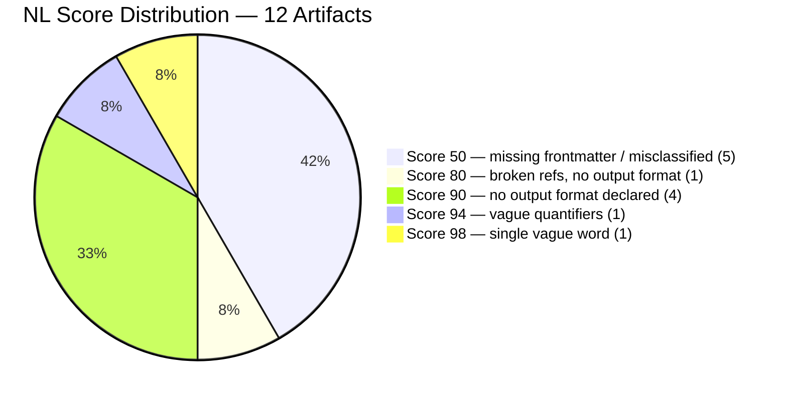
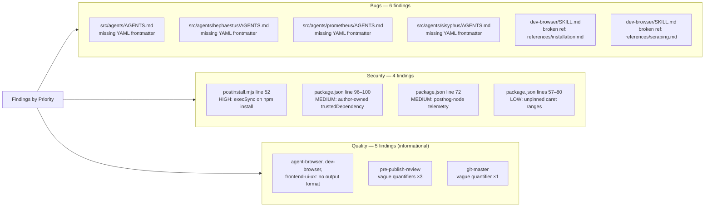
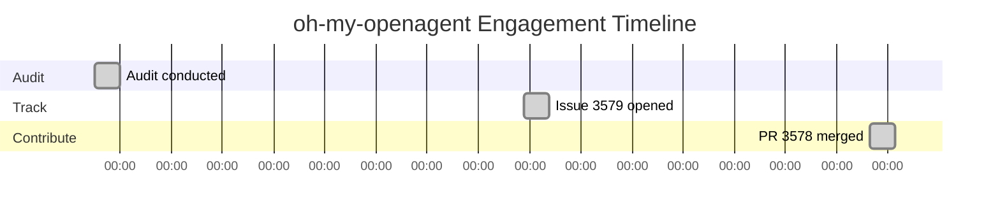

# Born Without Names: What Four Auto-Generated AGENTS.md Files Revealed About a 56k-Star Harness

> **Disclosure**: This article was generated by an automated pipeline using Claude (Sonnet 4.6) based on audit data and GitHub records. It describes work performed by NLPM tooling maintained by [xiaolai](https://github.com/xiaolai). Readers should weigh claims accordingly.

---

## The Project

[oh-my-openagent](https://github.com/code-yeongyu/oh-my-openagent) — previously "oh-my-opencode" — describes itself as "omo; the best agent harness." With 56,197 stars and 4,576 forks, it ranks among the most-watched Claude Code–adjacent projects on GitHub. The project is maintained by [YeonGyu-Kim](https://github.com/code-yeongyu).

The repository houses a layered architecture of skills (`.opencode/skills/`) and built-in features (`src/features/builtin-skills/`), with an agent layer auto-generating per-agent summary documents in `src/agents/`. The two skill directories serve different audiences: `.opencode/skills/` contains orchestration-heavy workflows, while `src/features/builtin-skills/` contains tool-reference skills for browser automation, git operations, and frontend design — two prep stations for different cooks, no overlap between the menus.

YeonGyu-Kim appears to maintain the project solo. Note that oh-my-openagent targets the OpenCode binary rather than Claude Code; NLPM's frontmatter discovery conventions are Claude Code–specific, so the frontmatter additions improve compliance with the auditing standard but may not enable functional NL tooling discovery in the project's runtime environment.

---

## The Audit

**Date**: 2026-04-06 | **Artifacts**: 12 | **Overall NL Score**: 74/100 | **Security**: REVIEW

A score of 74 at this artifact count is not a bad result — 74 is above NLPM's default 70 threshold, so the project passed the audit — but it is misleading in its distribution. Five of the twelve artifacts scored 50/100, pulling the weighted average down from what would otherwise be a low-90s result. Four of those five are auto-generated AGENTS.md files; the fifth is a TypeScript compiler configuration file that has no NL content and should not have been scored at all.

Strip out the tsconfig.json misclassification and fix the frontmatter gap, and the effective score rises to the low 90s. The audit found a concentrated problem, not a diffuse one — more a single unsealed seam than a leaky roof.

**Findings by priority:**

The security findings are structural rather than exploitable. The HIGH finding — `execSync("opencode --version")` in `postinstall.mjs` — is a hardcoded, benign command consistent with standard practice for binary npm packages. The risk is architectural: arbitrary code execution runs automatically on `npm install`, and nothing in the README documents that this occurs — it runs quietly, like most things we accept because the install succeeded. The MEDIUM finding around `@code-yeongyu/comment-checker` in `trustedDependencies` carries real supply-chain exposure: the author's own package bypasses install-script prompts for all consumers, meaning any compromise of that package propagates silently. Neither finding warranted private disclosure; both warranted public documentation.

---

## What Was Submitted

The pipeline's PR tracking data for this engagement is incomplete: `prs.json` records no open submissions. However, commit evidence confirms that at least one PR was opened and merged. The tool that monitors contributions had, on this occasion, quietly lost track of its own. On 2026-05-06, the target repository merged:

**PR #3578** — `docs(agents): add YAML frontmatter to AGENTS.md documentation files`
[https://github.com/code-yeongyu/oh-my-openagent/pull/3578](https://github.com/code-yeongyu/oh-my-openagent/pull/3578)

This PR, submitted from `xiaolai/fix/nlpm-agents-missing-frontmatter`, addressed findings 1–4: the four auto-generated AGENTS.md files in `src/agents/`, `src/agents/hephaestus/`, `src/agents/prometheus/`, and `src/agents/sisyphus/` all lacked `name` and `description` frontmatter, scoring 50/100 each.

An audit tracking issue was also opened:

**Issue #3579** — `NLPM audit: NL artifact quality report (score 74/100)`
[https://github.com/code-yeongyu/oh-my-openagent/issues/3579](https://github.com/code-yeongyu/oh-my-openagent/issues/3579)
Status: open as of 2026-05-07. This issue carries the security findings and the remaining quality notes.

Whether the broken cross-references in `dev-browser/SKILL.md` were submitted as a separate PR is not recorded in the available evidence.

---

## The Response

The frontmatter PR was merged within approximately two weeks of the tracking issue being opened (issue: 2026-04-22, merge: 2026-05-06). The audit preceded the issue by 16 days; from audit to merge was approximately 30 days in total. No review comments are available in the pipeline's evidence. The merge itself was uncontested as recorded.

The tracking issue remains open, which is consistent with the security findings requiring separate attention: the posthog-node telemetry documentation gap and the trustedDependencies risk are not the sort of items a maintainer resolves with a single commit.

---

## What the Audit Revealed

**Auto-generation creates frontmatter debt.** The four AGENTS.md files all carry `**Generated:** 2026-04-xx` headers, identifying them as pipeline output. The generation mechanism was not identified in the available evidence. When documentation is generated programmatically, frontmatter is often omitted because the generation script doesn't model NL tooling discovery requirements. The result is files that are correct in content but invisible to indexing — they score 50 not because they are poorly written but because they have no declared identity — arriving to do their jobs without signing the register at the door. Whether the missing frontmatter was an oversight or a deliberate design choice in the generator is not known. This is a pattern likely to recur in any project that auto-generates markdown from structured data without a frontmatter injection step.

**NLPM scanner misclassified one artifact.** `src/hooks/atlas/tsconfig.json` was included in the NL scan and scored 50 by default — an NLPM classifier defect, not a project issue. TypeScript compiler configs carry no NL artifact structure; this is a known NLPM scanner edge case that inflated the penalty count. The artifact should be excluded via a classifier rule on NLPM's side — a small reminder that auditing tools are not exempt from being audited.

**The skill split is coherent.** The audit found no contradictions between `.opencode/skills/` and `src/features/builtin-skills/`. The orchestration skills and the tool-reference skills serve different consumers and are internally consistent within each group. At 56k stars, this kind of structural clarity is not guaranteed — most projects that grow that fast eventually develop directories that outlive the decisions that created them.

**Security is structural, not exploitable.** The four security findings are all dependency/supply-chain posture issues rather than vulnerabilities in the NL artifacts themselves. A project this widely installed has elevated exposure: even a LOW finding (unpinned `^` ranges) matters more at scale because downstream consumers inherit the drift. The HIGH finding in `postinstall.mjs` is benign in isolation but represents an implicit trust assumption that the README does not surface.

A fairness note: a 74 from this dataset is above the default 70 threshold. The penalty is concentrated in a correctable pattern — auto-generated files missing a frontmatter declaration — not in poor writing across the skill corpus. The six skills that scored 90–98 demonstrate that the project's authors understand how to write NL artifacts well. The score reflects a tooling gap, not an authorship gap — a distinction that the six 90–98 scores make quietly but clearly.

---

## Timeline

---

## Limitations

- The pipeline's PR tracking data (`prs.json`) was empty for this engagement. The PR merge is confirmed only through commit evidence. It is not known whether all intended PRs were submitted, or whether the tracking gap reflects a submission failure or a data capture issue.
- No maintainer review comments are available. The merge dynamics — whether the PR was accepted immediately or revised — cannot be reconstructed from the available evidence.
- Post-merge re-audit was skipped for this engagement; before/after quality change is not independently verified. Whether adding frontmatter to the four AGENTS.md files raised the aggregate score as expected cannot be confirmed from pipeline data.
- The security findings were surfaced in a public issue, not via private disclosure; this was a deliberate choice given that both findings are structural dependency-posture issues rather than exploitable vulnerabilities. Whether the maintainer has acted on the telemetry documentation gap or the trustedDependencies risk is not recorded in the evidence.
- The tsconfig.json misclassification inflates the bug count. Excluding it, the effective NL artifact count is 11 and the score distribution changes slightly. The core finding (frontmatter gaps) is unaffected.

---

## Significance

oh-my-openagent is one of the highest-starred repositories this pipeline has audited. The project has an installation footprint where even LOW security findings carry elevated downstream exposure. The PR was accepted without revision, consistent with its small scope.

The more durable lesson is about auto-generation. Projects that generate markdown from structured data often omit frontmatter because the generation tooling was written before NL artifact discovery was a concern. The fix is usually a small change to the generation script — one additional frontmatter block — but it requires knowing the gap exists. The findings shared a common root cause: the four affected files all traced back to the same generator, making a targeted fix at that level the natural next step.

The tracking data gap (empty `prs.json` with confirmed merged PR) is a pipeline-level finding worth noting. For a project of this scale, accurate contribution tracking matters for measuring NLPM's actual impact. The case study reflects what the evidence supports, not what the pipeline intended — which is, after all, what any good audit should do.
