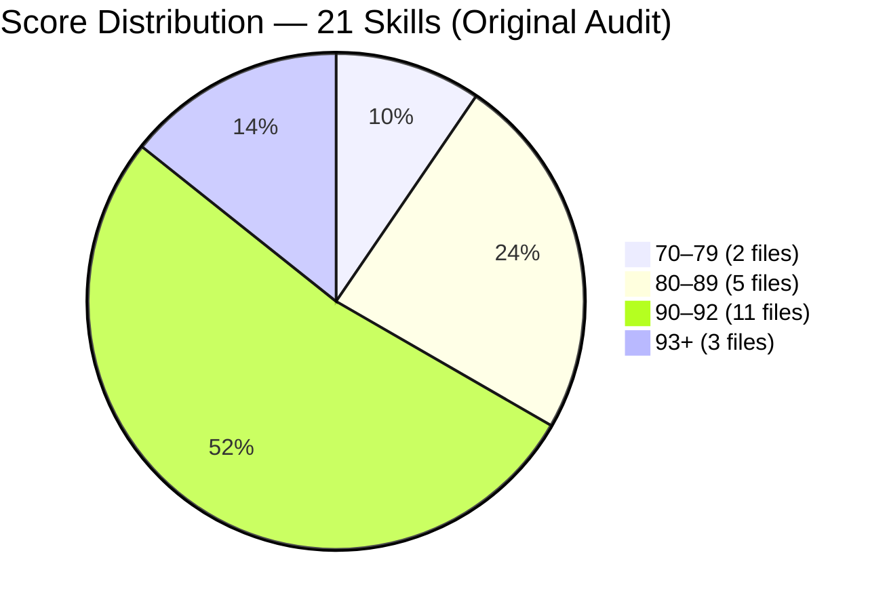
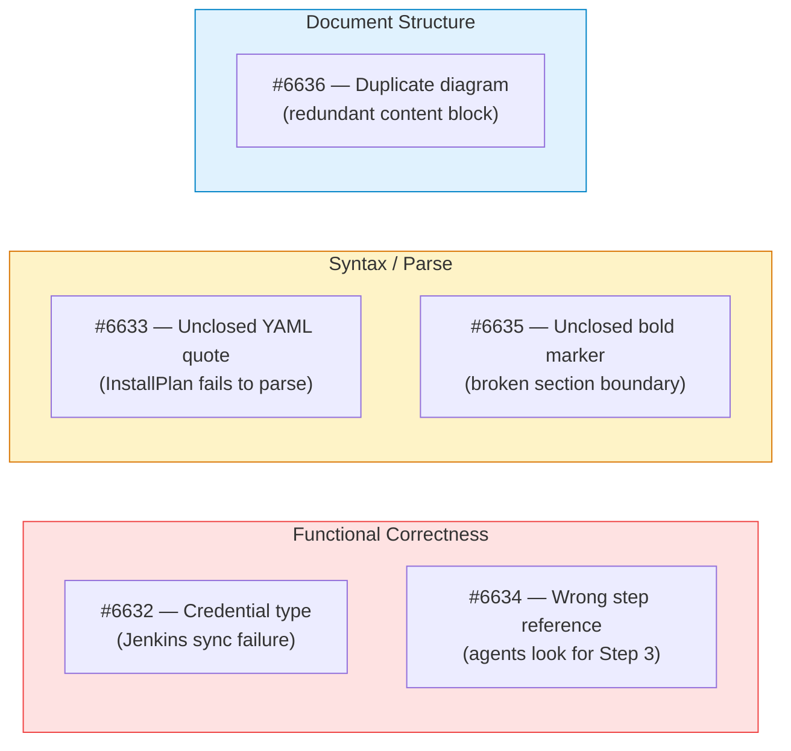
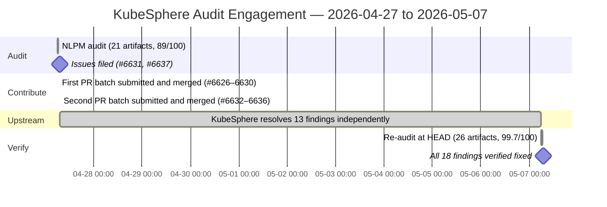

# All 18 Fixed: The Audit Got Five; KubeSphere Fixed the Other Thirteen

> **Disclosure**: This article was generated by an automated pipeline using Claude (Sonnet 4.6) based on audit data and GitHub records. It describes work performed by NLPM tooling maintained by [xiaolai](https://github.com/xiaolai). Readers should weigh claims accordingly.

---

## The Project

[KubeSphere](https://github.com/kubesphere) maintains `kubesphere/kubesphere`, a container platform for Kubernetes multi-cloud, datacenter, and edge management. At the time of audit the repository carried 16,924 stars and 2,735 forks — one of the larger Kubernetes-adjacent projects on GitHub.

The repo's NL artifact surface is a set of skill files under `skills/`, covering DevOps pipelines, credential management, observability stacks (Whizard logging, auditing, telemetry, events), cluster management, multi-tenancy, and extension management. These skills are the AI-facing documentation for a complex, multi-component platform — the vocabulary an agent reaches for before it touches a cluster.

---

## The Audit

**Date**: 2026-04-27 | **Artifacts scored**: 21 | **Score**: 89/100 | **Security**: REVIEW

The fleet of 21 skills was broadly healthy. Fourteen of them scored 90 or above; only two fell below 80. The drag came from a cluster of five skills in the DevOps group, each carrying a mechanical defect that pulled its score into the 77–89 range — the kind that hides in plain sight until a rulebook names it.

The five lowest-scoring files and their primary issues:

| File | Score | Top Finding |
|------|------:|-------------|
| `skills/kubesphere-devops-tenant/SKILL.md` | 77 | Hardcoded credential `P@88w0rd` in API examples; duplicate `Authorization` header in curl command |
| `skills/kubesphere-devops-credentials/SKILL.md` | 78 | API examples use `type: Opaque`, which the same file's warning section says breaks Jenkins sync |
| `skills/kubesphere-devops-overview/SKILL.md` | 84 | `Project Components` ASCII diagram duplicated; `Key Resources` heading appears twice |
| `skills/kubesphere-devops-pipeline/SKILL.md` | 86 | Missing closing `**` on a heading; duplicate Common Mistakes table |
| `skills/kubesphere-fluid/SKILL.md` | 87 | YAML template syntax error: `low: "{{low}}` missing closing double-quote |

Note: The duplicate `Authorization` header in the tenant skill may be intentional for copy-paste convenience; the R25 deduction treats all redundancy as a defect regardless of intent.

### Security Findings

The security scan flagged 1 High and 4 Medium findings — no Criticals. Two pre-scan pattern matches resolved to false positives: binary downloads in `hack/` CI scaffolding (kubectl, helm, kind) and a vendor utility, neither of which is a maintainer-controlled executable surface.

| Severity | Count | Notes |
|----------|------:|-------|
| Critical | 0 | 2 pre-scan matches resolved to false positives |
| High | 1 | `xargs -n 3 sh -c` with kubectl-sourced resource names in ks-crds post-delete hook |
| Medium | 4 | Password echo to stdout; insecure token storage (×2 duplicated files); hardcoded `P@88w0rd` in docs |

The High finding — `xargs sh -c` in `config/ks-core/charts/ks-crds/scripts/post-delete.sh` — interpolates Kubernetes resource names directly into a shell string. Practical exploit risk is low (CRD names are character-constrained) but the pattern matches the injection signature. The audit recommendation was to hold PR submission on that finding while submitting the rest.

Note: `P@88w0rd` is a visibly synthetic placeholder used in documentation examples; the risk is documentation consumers copying example patterns into configurations, not credential exposure from this specific string.

### Cross-Component

Two cross-component issues stood out. `skills/kubesphere-core/scripts/ks_api.py` and `skills/kubesphere-multi-tenant-management/scripts/ks_api.py` were byte-for-byte identical — 245 lines each — both missing `os.chmod(TOKEN_FILE, 0o600)`, leaving cached OAuth tokens world-readable. Any security fix had to be applied twice until the files were consolidated. Additionally, `skills/whizard-telemetry/scripts/generate-config.sh` read an OpenSearch password from a Kubernetes Secret (`vector-sinks`) without documenting that cross-extension runtime dependency anywhere.

---

## What Was Submitted

PR tracking data was not captured for this engagement (the `prs.json` sidecar is empty). Merge commits confirm that five PRs from the `xiaolai/fix/*` fork branches were merged into the upstream `main` branch on 2026-04-27, targeting the five highest-confidence bugs.

A notable artifact: the commit log shows that each of the five fixes was merged twice — an earlier batch (#6626–#6630, merged 06:25–06:29 UTC) and a later batch (#6632–#6636, merged 07:15–07:16 UTC) — with the second batch carrying more detailed conventional-commit messages. The re-audit verifies PRs #6632–#6636 as the canonical merged set.

| PR | Fix | Target File |
|----|-----|-------------|
| [#6632](https://github.com/kubesphere/kubesphere/pull/6632) | Replace `"type": "Opaque"` with correct `credential.devops.kubesphere.io/*` types in all curl examples | `skills/kubesphere-devops-credentials/SKILL.md` |
| [#6633](https://github.com/kubesphere/kubesphere/pull/6633) | Close unclosed double-quote in YAML template: `low: "{{low}}` → `low: "{{low}}"` | `skills/kubesphere-fluid/SKILL.md` |
| [#6634](https://github.com/kubesphere/kubesphere/pull/6634) | Correct placeholder comment from `# From Step 3` to `# From Step 2` | `skills/whizard-logging/SKILL.md` |
| [#6635](https://github.com/kubesphere/kubesphere/pull/6635) | Add missing closing `**` to `Step 3b:` heading | `skills/kubesphere-devops-pipeline/SKILL.md` |
| [#6636](https://github.com/kubesphere/kubesphere/pull/6636) | Remove duplicate `Project Components` ASCII architecture block | `skills/kubesphere-devops-overview/SKILL.md` |

Two tracking issues were opened to accompany the submissions: [#6631](https://github.com/kubesphere/kubesphere/issues/6631) (DevOps/observability skill files, score 89/100) and [#6637](https://github.com/kubesphere/kubesphere/issues/6637) (documentation bugs in `skills/`). Both remain open as of 2026-05-07.

The credential-type fix (#6632) had the highest functional impact: API examples using `type: Opaque` produce credentials that silently fail to sync with Jenkins — the credential controller only processes secrets whose type begins with `credential.devops.kubesphere.io/`. An agent following the pre-fix examples would create credentials that appeared to succeed but left Jenkins unable to find them.

---

## The Response

No maintainer review comments are on file for any of the five PRs. All five were merged the same day they were submitted (2026-04-27), within approximately 50 minutes of submission. The turnaround gives no signal about maintainer opinion of the findings — the PRs were accepted without recorded discussion.

What is more informative is what KubeSphere did beyond those five PRs. Between the audit date (2026-04-27) and the re-audit date (2026-05-07), the team resolved 13 additional findings from the original audit on their own initiative — including all five security findings. This is a larger body of work than the PRs we submitted; the pipeline handed KubeSphere a report, and the team did the heavier lifting.

---

## The Re-Audit

A merged PR is a claim; the re-audit verifies the claim against the target repo's current HEAD — the difference between closing a ticket and closing the gap.

**Before**: commit `1681475e` | score 89/100 | **After**: commit [`00d94f4`](https://github.com/kubesphere/kubesphere/commit/00d94f4003f719b6ed07283f885d729cb3231dc8) | score 99.7/100

The re-audit ran on 2026-05-07, ten days after the original, against 26 artifacts — five more than the 21 scored originally, reflecting skills added by KubeSphere in the interim.

### Per-Finding Outcome Table

| # | File | Rule | Pattern | Outcome | PR |
|---|------|------|---------|---------|-----|
| 1 | `skills/kubesphere-devops-credentials/SKILL.md` | BUG-incorrect-api-example | `wrong-credential-type` | fixed — our PR merged | #6632 |
| 2 | `skills/kubesphere-fluid/SKILL.md` | BUG-yaml-syntax-error | `unclosed-string-literal` | fixed — our PR merged | #6633 |
| 3 | `skills/whizard-logging/SKILL.md` | BUG-incorrect-step-reference | `wrong-step-reference` | fixed — our PR merged | #6634 |
| 4 | `skills/kubesphere-devops-pipeline/SKILL.md` | BUG-broken-markdown | `unclosed-bold-marker` | fixed — our PR merged | #6635 |
| 5 | `skills/kubesphere-devops-overview/SKILL.md` | BUG-duplicate-section | `duplicate-content-block` | fixed — our PR merged | #6636 |
| 6 | `config/ks-core/charts/ks-crds/scripts/post-delete.sh` | SEC-xargs-shell-injection | `xargs-sh-c-interpolation` | fixed — upstream, not via our PR | |
| 7 | `skills/whizard-telemetry/scripts/generate-config.sh` | SEC-plaintext-credential-output | `credential-echoed-to-stdout` | fixed — upstream, not via our PR | |
| 8 | `skills/kubesphere-core/scripts/ks_api.py` | SEC-insecure-token-storage | `token-file-no-chmod` | fixed — upstream, not via our PR | |
| 9 | `skills/kubesphere-multi-tenant-management/scripts/ks_api.py` | SEC-insecure-token-storage | `token-file-no-chmod` | fixed — upstream, not via our PR | |
| 10 | `skills/kubesphere-devops-tenant/SKILL.md` | SEC-hardcoded-credential | `hardcoded-password-in-docs` | fixed — upstream, not via our PR | |
| 11 | `skills/kubesphere-devops-argocd/SKILL.md` | R25 | `duplicate-content` | fixed — upstream, not via our PR | |
| 12 | `skills/kubesphere-devops-pipeline/SKILL.md` | R25 | `duplicate-content` | fixed — upstream, not via our PR | |
| 13 | `skills/kubesphere-devops-overview/SKILL.md` | R25 | `duplicate-heading` | fixed — upstream, not via our PR | |
| 14 | `skills/kubesphere-devops-tenant/SKILL.md` | R25 | `duplicate-header-in-example` | fixed — upstream, not via our PR | |
| 15 | `skills/kubesphere-devops-tenant/SKILL.md` | R15 | `hardcoded-credential-in-docs` | fixed — upstream, not via our PR | |
| 16 | `skills/kubesphere-volcano/SKILL.md` | R05 | `vague-quantifier` | fixed — upstream, not via our PR | |
| 17 | `skills/kubesphere-multi-tenant-management/scripts/ks_api.py` | CC-duplicate-file | `verbatim-duplicate-script` | fixed — upstream, not via our PR | |
| 18 | `skills/whizard-telemetry/SKILL.md` | CC-undocumented-dependency | `implicit-cross-extension-dependency` | fixed — upstream, not via our PR | |

### Introduced Findings

Three findings appear in the re-audit that were not in the original. They may be true regressions from maintainer commits introduced in the ten days between audit and re-audit, or they may be artifacts of scoring drift between model runs. Both possibilities exist and cannot be separated without commit-level bisection.

| # | File | Rule | Pattern | Description |
|---|------|------|---------|-------------|
| 1 | `skills/kubesphere-volcano/SKILL.md` | R24 | `vague-quantifier-appropriate` | Vague quantifier 'appropriate' appears 3 times at lines 715, 733, 790 (penalty -2 each = -6 total) |
| 2 | `skills/kubesphere-devops-pipeline/SKILL.md` | R24 | `vague-quantifier-properly` | Vague quantifier 'properly' appears 1 time at line 185 (penalty -2) |
| 3 | `skills/kubesphere-devops-tenant/SKILL.md` | CC-broken-relative-path | `broken-relative-path` | Lines 49 and 75 reference `../../core/kubesphere-core/SKILL.md`; kubesphere-core skill exists at `skills/kubesphere-core/SKILL.md`, expected relative path is `../kubesphere-core/SKILL.md` |

The R24 findings (vague quantifiers) may reflect new documentation added between April 27 and May 7 — the re-audit scored 26 artifacts versus 21 originally. R24 applies a fixed penalty for vague quantifiers; in some contexts — particularly Kubernetes resource sizing — "appropriate" may be the correct hedge when optimal values are workload-dependent. The broken-relative-path finding is flagged at medium confidence: a `core/` directory may exist in the full repository tree that was not included in the scored artifact set.

18 of 18 original findings verified fixed; 0 still persist.

---

## What the Audit Revealed

**Documentation quality was high for its scope.** A 21-skill fleet covering multi-cloud Kubernetes, DevOps pipelines, observability stacks, and multi-tenancy — all in a single repository — is unusual. Fourteen skills scored 90 or above without intervention. The ones that scored poorly were not poorly written; they contained specific mechanical defects that are straightforward to detect and fix once named.

**The DevOps skills had an internal consistency problem.** `skills/kubesphere-devops-credentials/SKILL.md` contained a contradiction within a single file: the warning section said `type: Opaque` breaks Jenkins sync; the API examples used `type: Opaque`. This is not a case where two authors wrote conflicting things — it is a single document that warns against and then demonstrates the wrong behavior in the same file — the left hand documented what the right hand had already drawn. That kind of internal contradiction is harder to notice in a large file and harder still to catch in review.

**Script duplication compounded security findings.** The two identical copies of `ks_api.py` meant a single vulnerability was counted twice and had to be fixed twice — one defect with two addresses. The re-audit confirmed the duplication was resolved upstream. This is a pattern worth flagging early: when identical files diverge under maintenance, the divergence is usually the bug.

**Security findings resolved faster than documentation bugs via upstream commits.** All five security findings were closed upstream within ten days, without any PRs from this pipeline targeting them. The quality issues (duplicate headings, vague quantifiers) similarly resolved upstream. This suggests the KubeSphere team had independent motivation to clean these up — possibly a documentation sprint or CI tooling running in parallel. Whether the tracking issues (#6631, #6637) influenced any of the 13 upstream fixes is unknown; they were open throughout this period.

*Fairness note*: The score of 89/100 reflects deterministic penalties against a fixed rubric. It does not measure the practical usefulness of these skills, which by the re-audit score of 99.7/100 is very high. The low scores were localized defects in a high-quality collection — the kind that are easy to find with a ruler and easy to fix once named.

---

## Timeline

*Audit time from events.jsonl (UTC). PR submission times for #6626–6630 inferred from merge timestamps; first-batch submission event was not captured in events.jsonl.*

---

## Limitations

**No maintainer review comments are available.** The five PRs were merged without recorded discussion. This engagement does not have evidence of maintainer rationale for accepting or rejecting any specific finding. The fast turnaround (same-day merge) may indicate agreement, automated tooling, or simply a low-friction merge policy.

**The double-PR submission is unexplained.** Commits show two rounds of five PRs (#6626–#6630 and #6632–#6636) fixing identical bugs, both merged — a mild irony for a tool that penalizes duplicate content. This suggests the contribute workflow ran twice on the same audit issue. No data explains why; neither batch was rejected. The re-audit credits #6632–#6636 as the canonical set. The disposition of #6626–#6630 beyond initial merge is unknown; the commit graph may contain redundant changes.

**KubeSphere's own CI/documentation review process was not investigated.** Some or all upstream fixes may reflect pre-existing tooling independent of this audit.

**The re-audit does not prove causation.** KubeSphere resolved 13 findings without our PRs. Whether those fixes were prompted by the tracking issues, by independent CI tooling, or by unrelated documentation work during the same period is unknown. The re-audit measures what changed; it does not measure why.

**The re-audit measures file-level quality at one point in time.** It does not verify that maintainer intent aligns with the NLPM rule set. A file that scores 100/100 may still contain domain errors or incorrect guidance that the rubric does not check.

**Introduced findings may not be regressions.** The three findings that appeared in the re-audit but not the original could be scoring drift between two model runs rather than changes in the files. Without a bit-identical re-run of the original audit at the same commit, the two causes cannot be separated.

**The tracking issues remain open.** Issues #6631 and #6637 were still open on 2026-05-07. This does not affect the re-audit outcome but means the pipeline's own state does not reflect that the PRs merged.

---

## Significance

The engagement produced five merged PRs against a 16,924-star repository and confirmed that 18 of 18 original findings were resolved — including all five security findings — within ten days of the audit.

The most consequential fix was the credential type correction (#6632). The `type: Opaque` bug was not a documentation error in the ordinary sense: it was an API example that would produce functionally broken output. An agent following the pre-fix skill would create Jenkins credentials that appeared to succeed at creation time but triggered a "CredentialId could not be found" failure at runtime — discovering the defect the way you discover a hole in your umbrella, by getting rained on. That failure mode is notoriously difficult to trace back to the credential type. The bug was present in a file that explicitly warned against `type: Opaque` — a contradiction that is easy to miss in a large SKILL.md but trivial to detect mechanically.

The more surprising result is that KubeSphere resolved 13 findings — including the High-severity shell injection, the token file permissions issue, the credential leak to stdout, and the hardcoded password — on their own, without PRs from this pipeline. The audit may have surfaced the findings, but the team's own maintenance velocity carried the fixes. What the re-audit confirms is that the five PR-submitted findings produced no false positives — all five were merged as-submitted. Whether the 13 upstream fixes confirm the remaining findings or reflect independent work is unknown.

The collection went from 89/100 on 21 skills to 99.7/100 on 26 skills — a 5-skill expansion that held near-perfect quality. That is a meaningful signal about the health of a documentation-as-code practice at scale. The audit found the cracks; the team sealed them and then added three more rooms.
