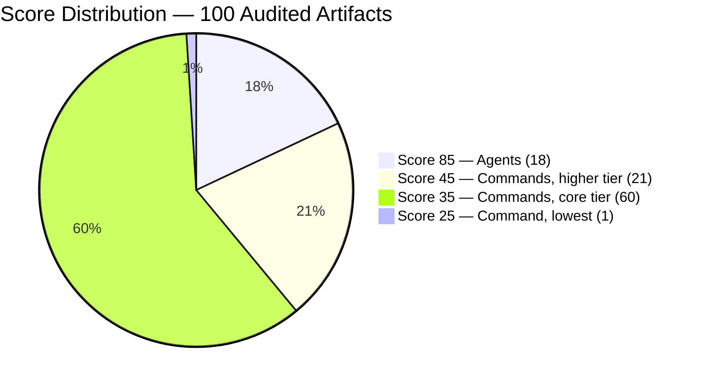
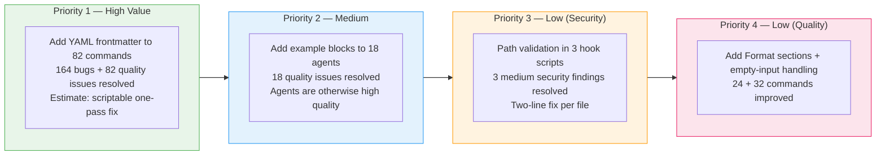
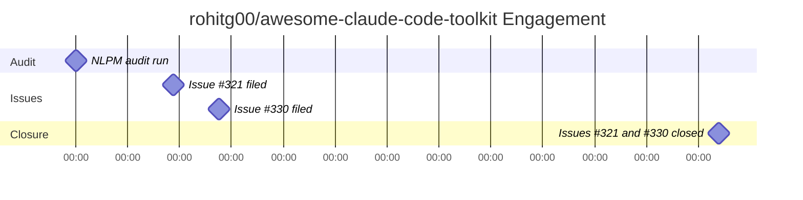

# Scale Without Schema: A 1,617-Star Toolkit's 82 Invisible Commands

> **Disclosure**: This article was generated by an automated pipeline using Claude (Sonnet 4.6) based on audit data and GitHub records. It describes work performed by NLPM tooling maintained by [xiaolai](https://github.com/xiaolai). Readers should weigh claims accordingly.

---

## The Project

[rohitg00/awesome-claude-code-toolkit](https://github.com/rohitg00/awesome-claude-code-toolkit) is the most comprehensive third-party collection of Claude Code components on GitHub. Maintained by [Rohit Ghumare](https://github.com/rohitg00), it bundles 135 agents, 42 commands, 176+ plugins, 20 hooks, 15 rules, 7 templates, 14 MCP configs, 26 companion apps, and 52 ecosystem entries — a one-stop install for teams adopting Claude Code, less a plugin and more a portable city of components. At audit time the repository counted **1,617 stars and 496 forks**.

The toolkit is organized as a plugin: users install it and gain access to dozens of domain-specific plugins covering DevOps, mobile, security, AI/ML, accessibility, and more. Each plugin is a subdirectory under `plugins/` with its own commands and, in several cases, dedicated agents.

---

## The Audit

**Date**: 2026-04-17 | **Artifacts audited**: 100 (of 558 total) | **NL Score**: **46/100** | **Security**: CLEAR

The audit sampled 100 artifacts using a progressive strategy against a repository of 558 total NL components. It found a clean security scan — no Critical or High findings — but a quality score well below the default threshold of 70.

*Scores shown represent cluster averages or band midpoints, not per-file identical values.*

The split tells a precise story — the kind where the gap is large but the cause is small. The 18 agent files averaged 85/100: well-structured, each with a clear 10-step Process section, Technical Standards, Verification steps, and strong domain coverage. The 82 command files averaged 37/100 — not because they lacked content, but because every single one was missing its YAML frontmatter — the three lines that give a command its canonical identity.

**Top findings:**

| Finding | Count | Impact |
|---------|-------|--------|
| Missing `name:` frontmatter field | 82 commands | Plugin registry cannot canonically identify commands |
| Missing `description:` frontmatter field | 82 commands | No help text in `/help` output or marketplace |
| Missing `allowed-tools:` frontmatter field | 82 commands | Tools used are undeclared |
| Missing example blocks in agents | 18 agents | Expected behavior unspecified |
| No `## Format` output section | 24 commands | No canonical output structure |
| No empty-input handling | 32 commands | Undefined behavior when argument is omitted |
| Skeletal step bodies | 24 commands | Steps contain only category labels, no action content |

Security findings were 3 Medium and 2 Low, all in hook scripts: `file_path` from hook input passed to subprocess without a working-directory bounds check; six scripts writing session state to `~/.claude/` outside the project directory; no sanitization guidance for user-supplied PR numbers; a `TMUX` environment variable used as a security gate without socket verification; and 25 hook entries firing on every Write/Edit/Bash invocation. None reached the Critical or High threshold that would block contribution.

**Fair assessment**: The agents are a standout. The team has a real quality process — 10-step structure, technical standards, verification sections. The commands are substantively sound (correct domain coverage, reasonable step lists) but were never given the three-line frontmatter block that makes them machine-readable to the plugin registry. The score of 46 is almost entirely explained by one absent pattern applied at scale — eighty-two times.

---

## What Was Submitted

No code pull requests were opened against this repository. The audit pipeline filed two issues:

| Issue | URL | Created | Title |
|-------|-----|---------|-------|
| #321 | [rohitg00/awesome-claude-code-toolkit#321](https://github.com/rohitg00/awesome-claude-code-toolkit/issues/321) | 2026-04-20 | NLPM audit findings: missing frontmatter (82 commands) + 2 hook security fixes |
| #330 | [rohitg00/awesome-claude-code-toolkit#330](https://github.com/rohitg00/awesome-claude-code-toolkit/issues/330) | 2026-04-22 | NLPM Audit Report: 164 bugs found (82 commands missing frontmatter) + 2 low-severity hook security fixes |

Issue #321 was the initial audit report. Issue #330 followed two days later with a more detailed breakdown: its title explicitly enumerates 164 bugs (82 `name:` + 82 `description:` — two missing fields per command file; the `allowed-tools:` field, also absent in all 82 commands, was treated as a structural declaration gap rather than a named-identity bug) and recategorizes the security findings as "low-severity." The two issues cover overlapping scope and were filed two days apart. From a maintainer's perspective, receiving two overlapping issue reports in quick succession could appear as duplicate reporting, and may have influenced the response.

The audit recommendation described four planned contribution tiers. None were executed as pull requests — a roadmap was drawn, but no construction crew was dispatched.

The `contribute-approved` label was never added to either issue, so the pipeline did not proceed to opening pull requests.

---

## The Response

Both issues were closed on **2026-05-11** — approximately three weeks after the initial filing. Issue #321 closed at 18:55:58 UTC and issue #330 closed at 18:56:01 UTC — a three-second gap that reads more like the timestamp of a decision than a deliberation.

No commits mentioning NLPM or Claude appear in the repository's history. No pull request review comments are available. Whether the maintainer addressed the frontmatter findings directly in the codebase, or closed the issues as informational, is not determinable from the available evidence.

---

## What the Audit Revealed

The dominant pattern is **systemic absence, not systemic error** — like a well-organized library where every book is correctly shelved but none has a spine label. Every one of the 82 sampled command files was missing frontmatter — not some, not most, all. This is not random drift. It indicates either the original command template never included a frontmatter block, or the process for adding commands never required one.

The agents follow the opposite pattern. All 18 agent files share strong structure: a clear identity, a 10-step Process, Technical Standards, and a Verification section. The two artifact classes sit in the same repository with a 48-point gap between their average scores — neighbors who were clearly handed different style guides at move-in. Whoever wrote the agents had a quality bar that the commands were never held to.

The secondary findings are consistent with the same root cause: 32 commands accepting user-supplied arguments with no empty-input handling, 24 commands with no output format section, 24 commands with skeletal step bodies (steps that name a category — "Deploy:", "Validate:" — without specifying actions; this may reflect intentional minimalism to preserve flexibility for a collection spanning diverse domains). These are the expected signature of commands generated at scale from a thin template and not individually reviewed.

One additional cross-component note from the audit: two plugins define commands with overlapping scope under different filenames (`accessibility-checker/commands/aria-fix.md` and `screen-reader-tester/commands/fix-aria.md`). Without frontmatter `name:` fields, the registry must infer canonical names from filenames; different filenames avoid a collision, but the descriptions overlap in scope — whether the commands serve distinct workflows was not determined from the audit.

**Fairness note**: A 558-artifact repository is an enormous undertaking — assembling one toolkit from forty domains is closer to curating a museum than writing a plugin. Rohit Ghumare has assembled comprehensive coverage across at least 40 distinct technical domains — mobile, cloud, observability, accessibility, AI/ML, developer workflow, and more. The gaps the audit found are structural, not substantive. Adding frontmatter to 82 files could be addressed with scripting; it does not require rewriting any command. The agents demonstrate that the team knows how to build high-quality NL artifacts when the template enforces it.

A maintainer could reasonably argue that this collection is a curated prompt library designed for human reading and adaptation, not a plugin distribution system — and that frontmatter is a valid optional enhancement rather than a required component. The audit's `name:` and `description:` penalties assume machine-registry discoverability as a design goal; that assumption may not match the project's intent. Notably, the frontmatter gap predates any NLPM engagement, so it cannot be characterized as a known standard being consciously ignored.

---

## Timeline

The engagement ran from audit (2026-04-17) through issue filing (2026-04-20 and 2026-04-22) to closure (2026-05-11), a span of approximately three and a half weeks. The three-week gap between the second issue and closure is consistent with routine triage, but no commits or maintainer comments are available to confirm whether the findings were reviewed before closure.

---

## Limitations

- The audit sampled 100 of 558 total artifacts (18%). The frontmatter finding is structurally robust — it holds for 82/82 sampled command files — but quality findings in unsampled artifacts are unknown.
- No code was submitted to the repository. Without merged pull requests there is no before/after measurement of the fix effect.
- Post-merge re-audit was skipped for this engagement; before/after quality change is not independently verified.
- The closure of both issues on 2026-05-11 is consistent with manual batch-closure, automated triage, or genuine resolution — the evidence does not distinguish between these.
- No maintainer comments are available to indicate whether the findings were considered valid, invalid, or already known.
- The audit's weighted average (46/100) weights sampled command files (82) far more than agents (18). If the full 558-artifact corpus has proportionally more agents, the repository-wide score would be higher.

---

## Significance

The 82-command frontmatter gap illustrates a structural pattern seen in composite repositories: high-effort content creation without the structural layer that makes content machine-readable — like writing detailed instructions in a language the index system doesn't speak. At 1,617 stars the toolkit has significant reach; users who install it as of the audit date get command files that work as human-readable prompts but register no canonical name or description in the plugin system. The discoverability gap is real, if silent — the install succeeds with zero warnings.

The case also illustrates the quality divergence between artifact classes in large composite repositories. The agents demonstrate that the author's team understands how to write structured NL artifacts. The commands demonstrate what happens when a different, thinner template is used at scale without a review gate for structural completeness. The frontmatter schema exists, the expertise exists, the two have not been connected for commands.

What the audit does not claim: that the commands are broken or the toolkit is unusable. They are not. Frontmatter is structural metadata; the step content works when a human invokes the command. The score reflects a well-defined but opinionated standard; the toolkit's 1,617 stars suggest users find value regardless of frontmatter conformance. Whether that standard matches the maintainer's current priorities is a question only Rohit Ghumare can answer — the audit arrived with a rubric; the stars arrived with their own.

---

## Links

- Upstream issue #321: [rohitg00/awesome-claude-code-toolkit#321](https://github.com/rohitg00/awesome-claude-code-toolkit/issues/321)
- Upstream issue #330: [rohitg00/awesome-claude-code-toolkit#330](https://github.com/rohitg00/awesome-claude-code-toolkit/issues/330)
- Audit report: [`auditor/audits/rohitg00-awesome-claude-code-toolkit.md`](../auditor/audits/rohitg00-awesome-claude-code-toolkit.md)
