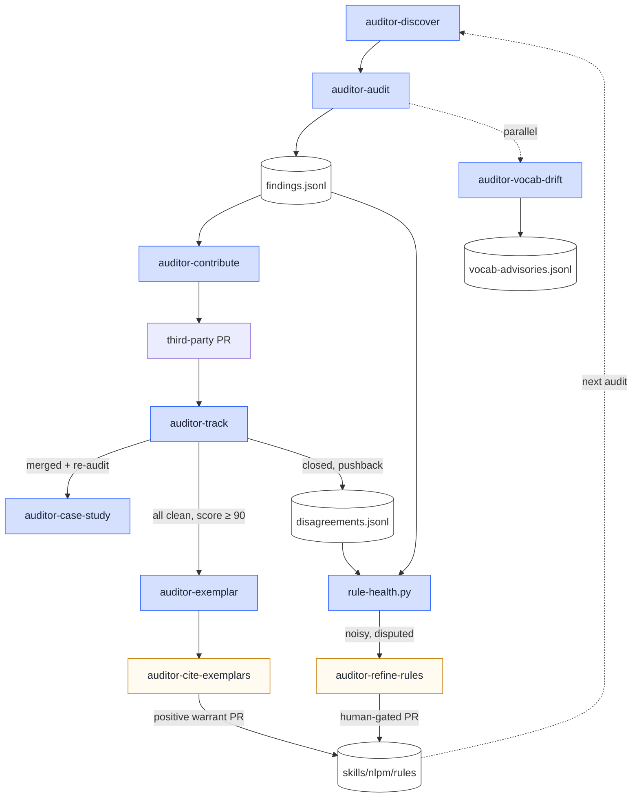
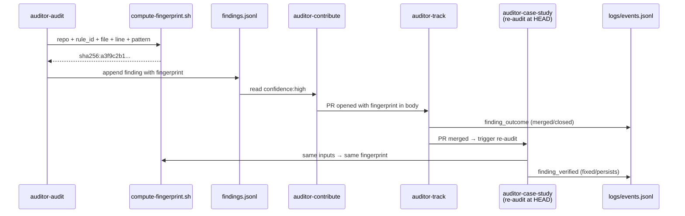
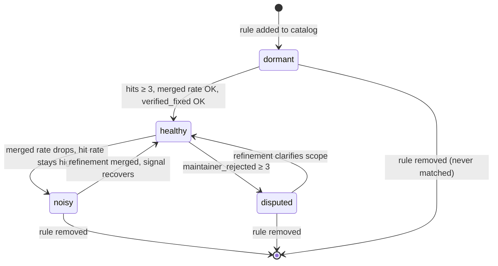

# How it evolves

NLPM is 9 weeks old. The first commit landed on 2026-03-25; the
current release is **v1.0.0** — the multi-tool branded release that
expanded NLPM from Claude-Code-only to Claude Code + Codex CLI +
Antigravity, splitting `nlpm:conventions` into a universal floor plus
three per-tool overlays. In between: 1,300+ commits and six
minor-version gates (v0.2 → v0.4 → v0.6 → v0.7 → v0.8 → v1.0). The
cadence is high because the rules keep getting proven wrong — or right
in ways the rulebook didn't yet encode — by contact with real
repositories.

This page describes the mechanism that absorbs that contact and turns
it into rulebook changes. It is the closest thing NLPM has to a thesis:
a rulebook that doesn't get updated by evidence isn't a rulebook,
it's an opinion.

## The premise

Most static analysis tools ship a rulebook and freeze it. The rules
are an asset; updating them costs review time; updating them too
aggressively is how false positives accumulate. So the rules settle.

NL artifacts don't allow that. The spec moves (Anthropic published
Agent Skills on 2025-12-18; the Linux Foundation forked it; OpenAI,
Microsoft, and Google each adopted on different timelines with
different defaults). The community vocabulary keeps shifting (today's
"command" is yesterday's "task"). The maintainers in the corpus
push back — sometimes the pushback is "your rule found a real bug,
thanks", sometimes it's "your rule doesn't apply to my repo and here's
why". Either signal updates the rulebook.

NLPM treats every rule as a hypothesis with a half-life. The auditor
pipeline is the mechanism that measures the half-life empirically and
opens a PR when the evidence demands one.

## The loop, end-to-end



Everything before `auditor-refine-rules` and `auditor-cite-exemplars`
is automated observation. Only those two steps mutate the rulebook,
and both do it by opening a PR — never by merging. The human reviewer
(xiaolai) accepts the sound proposals and closes the unsound ones.
That single human-gated step is what stops the loop from amplifying
its own noise.

## The eighteen workflows

`.github/workflows/auditor-*.yml` — every one of them is markdown +
shell + Python. No proprietary runners; no LLM agent does anything
without a workflow on record.

| Workflow | Trigger | Role in the loop |
|---|---|---|
| **auditor-discover** | Weekly cron | Find Claude Code plugin repos with ≥500 stars and ≥5 NL artifacts. Writes candidate rows to `auditor/registry/repos.json`. |
| **auditor-batch-processor** | Every 6h cron | Pick the next batch of candidates; promote them through audit → contribute → re-audit phases. |
| **auditor-audit** | Issue label `audit-ready` | Security scan + NL quality audit; emits `findings.jsonl` per finding with deterministic fingerprints. |
| **auditor-vocab-drift** | Same trigger as audit, runs in parallel | Registry-free vocabulary drift advisory. Output never PR-eligible — advisory only. |
| **auditor-contribute** | Issue label `contribute-approved` | Opens PRs for confidence-high findings only; respects target's CONTRIBUTING.md and CoC; stamps every PR body with `nlpm-metadata`. |
| **auditor-track** | Every 4h cron | Polls PR state, emits `finding_outcome` events on merge/close, snapshots maintainer comments. |
| **auditor-case-study** | Issue label `case-study-ready` | Re-audits the target at HEAD after merge. Emits `finding_verified` events (effect-level precision) and writes the case-study article. |
| **auditor-exemplar** | Issue label `case-study-clean` (score ≥ 90, security CLEAR) | Writes a teaching artifact from a high-scoring audit; cited from the rulebook as positive real-world evidence. |
| **auditor-cite-exemplars** | Weekly cron | **Human-gated**. Proposes `> Real-world example:` lines in `skills/nlpm/rules/SKILL.md` for rules with ≥1 exemplar. Opens a PR; deterministic, no LLM. |
| **auditor-suppressions** | Weekly cron | Scans public repos for NLPM rule-override configs; surfaces which rules adopters are turning off. |
| **auditor-classify** | Daily cron | Haiku classifies snapshot maintainer comments → `maintainer_rejected` events. |
| **auditor-daily-report** | Daily cron | Pipeline state report + per-rule health classification. |
| **auditor-render-dashboard** | Daily cron | Renders the cross-repo HTML dashboard from the global logs + registry. |
| **auditor-repo-report** | Manual dispatch | Backfills per-repo HTML reports. Auto-fires at the tail of audit + vocab-drift. |
| **auditor-rule-review** | Manual dispatch | Per-rule audit: hits, verified, disputed, dormant. Used during rulebook drift investigations. |
| **auditor-docs-diff** | Daily cron | Diffs Anthropic's plugins-reference docs against NLPM's cached snapshot — surfaces spec drift before it becomes rule drift. |
| **auditor-integration-test** | Manual dispatch | End-to-end smoke test that the full pipeline still wires up. |
| **auditor-refine-rules** | Weekly cron / manual | **Human-gated**. Runs the rule-health query, picks noisy/disputed rules, opens a refinement PR. Reviewer evaluates; never auto-merges. |

The two human-gated workflows (`auditor-refine-rules`,
`auditor-cite-exemplars`) are the only steps allowed to touch the
rulebook. Everything else writes to append-only logs that the
gated steps read.

## The data layer

Five files carry the entire memory of the loop. They live under
`auditor/` and are documented schema-by-schema in
[`auditor/SCHEMAS.md`](https://github.com/xiaolai/nlpm/blob/main/auditor/SCHEMAS.md).

| File | Append-only | What's in it |
|---|---|---|
| [`auditor/findings.jsonl`](https://github.com/xiaolai/nlpm/blob/main/auditor/findings.jsonl) | yes | One record per audit finding (bug, quality, security, cross-component). Each record carries a deterministic `fingerprint` (sha256 of `repo + rule_id + file + line + pattern`) that joins it across the whole pipeline. |
| [`auditor/disagreements.jsonl`](https://github.com/xiaolai/nlpm/blob/main/auditor/disagreements.jsonl) | yes | Evidence that a finding was wrong, contested, or unwelcome. Four kinds: `self_false_positive`, `pr_comments_snapshot`, `maintainer_rejected`, `downstream_suppression`. |
| [`auditor/logs/events.jsonl`](https://github.com/xiaolai/nlpm/blob/main/auditor/logs/events.jsonl) | yes | Lifecycle events from every workflow run + the aggregated outcome events (`finding_outcome`, `finding_verified`, `finding_introduced`, `findings_aggregated`). |
| [`auditor/vocab-advisories.jsonl`](https://github.com/xiaolai/nlpm/blob/main/auditor/vocab-advisories.jsonl) | yes | One record per vocabulary drift cluster. Advisory only — never reaches the contribute step. |
| [`auditor/registry/repos.json`](https://github.com/xiaolai/nlpm/blob/main/auditor/registry/repos.json) | mutated in place | The tracking database: repo state, scores, PRs opened, lifecycle status. |

Append-only means: fixing a record means appending a superseding
event (`finding_amended`, `gate_override`), not editing the original.
The audit trail is intact even for findings the system later
retracted.

### The fingerprint is the join key

Every finding gets a deterministic fingerprint at creation time
(`compute-fingerprint.sh` is shared by audit + contribute + re-audit).
The same finding seen in a different audit run produces the same
fingerprint, so the loop can answer questions like:

- "How many times has this finding been seen across the corpus?"
- "After we contributed the fix, did the re-audit at HEAD still find it?"
- "Did the maintainer push back on this exact finding, or on a different one in the same PR?"



Without the fingerprint, you can't separate "the rule is bad" from
"the rule is good but the maintainer disagrees" from "the rule fired
in two different ways across the corpus."

## Rule health — how the classification works

[`auditor/scripts/rule-health.py`](https://github.com/xiaolai/nlpm/blob/main/auditor/scripts/rule-health.py)
joins the four logs and classifies every rule_id into one of four
buckets:

| State | Definition |
|---|---|
| **healthy** | Cited often enough; merged-PR rate above threshold; verified_fixed rate (re-audit confirms fix) above threshold |
| **noisy** | High hit rate, low merged rate. Either the rule is firing on false positives, or maintainers consistently judge it not worth fixing |
| **disputed** | Hit at least three times with `maintainer_rejected` events outweighing `finding_verified` events. The rule may be defensible but is provoking enough pushback that the wording or scope needs refinement |
| **dormant** | In the catalog but zero hits in the corpus. Either the rule is irrelevant, or the discovery filter never sees the artifacts that would trigger it |

The verified signal (`finding_verified` events from the re-audit at
target HEAD) is weighted above the merged signal whenever at least
three findings have been verified. "Maintainer accepted our PR" is
useful; "scanner confirms the rule's target is actually gone from
the code" is stronger.

Per-rule output includes:

- hits (total findings emitted)
- contributed / merged / closed_unmerged / open (PR funnel)
- self_fp (we self-flagged as false positive)
- maintainer_rejected (classifier output, from snapshot comments)
- downstream_suppressions (rule-override entries in adopter configs)
- verified_fixed / verified_persists / verify_rate
- dissent_types (the categories of pushback)



This is what `auditor-refine-rules` consumes when it opens its weekly
PR.

## How rule changes happen

Two pathways. Both end at a PR; neither auto-merges.

### Path A — Refinement (negative signal)

Weekly Sunday at 09:00 UTC, `auditor-refine-rules` fires:

1. Run `rule-health.py` over the full log set.
2. Filter to rules classified `noisy` or `disputed`.
3. For each, gather the specific findings + dissent + suppressions
   as evidence.
4. Draft proposed edits to `skills/nlpm/rules/SKILL.md` — usually
   tightening the rule's scope, demoting severity, or splitting one
   rule into two more precise rules.
5. Open a PR labeled `rule-refinement-proposal` against `main`.
6. The reviewer (xiaolai) evaluates against the evidence link in
   the PR body. Sound proposals merge; unsound ones close.

If a `rule-refinement-proposal` PR is already open, the next run is
a no-op — avoids stacking competing proposals.

### Path B — Citation (positive signal)

Same cadence, different trigger. Weekly, `auditor-cite-exemplars`
walks `auditor/exemplars/` and proposes citation lines for each rule
that has at least one exemplar:

```diff
+ > **Real-world example**: see
+ > [`2389-research/review-squad`](https://github.com/2389-research/review-squad)
+ > scoring 96/100 with this rule firing 0 times in the audit.
```

Opens a PR labeled `exemplar-citation-proposal`. Deterministic — no
LLM. The PR is small and easy to review; positive warrant is
cheaper to verify than negative warrant.

## What the commit log shows

The two paths are visible in the version history. A representative
selection from the last six weeks:

| Commit | What changed | Why (which path) |
|---|---|---|
| `v0.7.15` | Tightened `BUG-missing-frontmatter` scope; pre-filtered security FPs | Path A — auditor was flagging benign cases as critical |
| `v0.7.20` | Fixed append-only log race + classifier prompt; backfilled 1,737 findings | Pipeline data-integrity — append-only contract restored |
| `v0.7.22` | Cleared 3 of 4 noisy rules — `CC-stale-count`, demoted `SEC-unpinned-semver` | Path A — rule-health classified them as noisy after maintainer pushback |
| `v0.7.24` | Rebased scoring on the agent-skills.io open standard | External spec drift — Anthropic's name-on-commands optionality contradicted an in-house assumption |
| `v0.7.30` | Cited `code.claude.com/docs` as primary source for the name-on-commands rule | Repeat regression — pinned to the canonical doc, not derived knowledge |
| `v0.7.31` | 4-layer system to keep NLPM in sync with Claude Code docs | Stop the spec-drift class entirely; introduced `auditor-docs-diff` |
| `v0.7.34` | Scorer marks manifest-vs-disk diffs as `confidence: high` | Path A signal — these are deterministic, never speculative |
| `v0.8.0` | Standalone `bin/nlpm-check` binary + author-side templates | Audit research showed pre-commit gates were what authors needed |
| `v0.8.17` | Exemplar pipeline — clean high-scoring audits become teaching artifacts | Path B introduced — positive warrant, not just negative findings |
| `v0.8.18` | Exemplar gallery + rule-citation auto-PR | Path B operationalized |
| `v0.8.22` | Skip top-level `templates/` directory during scan | Tightening discovery filter; author-facing templates kept getting scored as if they were live artifacts |

None of these were ideas at the start of the project. Each is a
response to evidence the auditor produced.

## What this prevents

The shape of the loop is designed against three specific failure
modes:

### 1. Rule rot

Without a re-audit step, rules accumulate as long as someone is
willing to add them. The corpus eventually grows past what any
human can hold in head, and the rulebook drifts away from what
the corpus actually contains.

`auditor-case-study`'s re-audit at HEAD, combined with the
`finding_verified` signal, gives effect-level precision per rule.
A rule that consistently produces `finding_verified == false`
events isn't pulling its weight and gets refined or removed.

### 2. False-positive amplification

If a rule produces noise and the noise is the cheapest source of
"new findings," it will dominate the output. The pipeline would then
optimize for false positives — every batch processed would add more
noise findings to the log, which a naive learning loop would
interpret as the rule "being important."

The fix is two-sided. First, `maintainer_rejected` events
(classifier output from `pr_comments_snapshot`) explicitly subtract
from a rule's perceived value. Second, `downstream_suppressions`
(adopters' rule-override configs) act as a tertiary signal — if
multiple unrelated projects suppress the same rule, the rule is
probably wrong, not the projects.

### 3. Autonomous rulebook drift

The most dangerous failure mode for a self-evolving system is
self-amplification: the system measures something, decides a rule
needs to change based on that measurement, and merges the change
without external review. After a few cycles the rulebook is
optimizing for whatever signal the loop is best at producing,
which may have nothing to do with what users want.

The fix is the human-gated PR. `auditor-refine-rules` and
`auditor-cite-exemplars` are the only steps allowed to mutate the
rulebook. Neither merges. The reviewer sees the proposed change
alongside the linked evidence and accepts or rejects on judgment.

The trade-off is real — rule changes happen on a weekly cadence,
not in real time. That's the cost of preventing the runaway path.
Given the choice between "rules update quickly" and "rules update
correctly," NLPM picks the second. Quickly can be reapplied later;
correctly can't be undone after the corpus has been re-audited
against bad rules.

## The shape of the asset

After 1,287 commits, what NLPM has accumulated is less the
rulebook and more the **infrastructure that keeps the rulebook
honest**:

- 210 audits with structured findings and per-line evidence
- 28 case studies with merged PRs cited back into the rules
- 62 exemplars cited from the rulebook as positive warrant
- 18 workflows that run continuously, mutate nothing without
  review, and leave an append-only audit trail
- Two human-gated PR paths (refinement + citation) that absorb
  the evidence into the only file the loop is allowed to change

The rulebook itself is replaceable. The infrastructure isn't.

## Related

- [Why NLPM is built](/why) — the original gap and the wager
- [How to use it](/how-to-use-it) — the commands and the standalone binaries
- [How it works](/how-it-works) — the two pipelines and one rulebook
- [Reference](/reference/) — R01–R51, P1–P6, scoring, vocabulary, drift
- [Dashboard](/dashboard) — the cross-repo audit data that drives the loop
