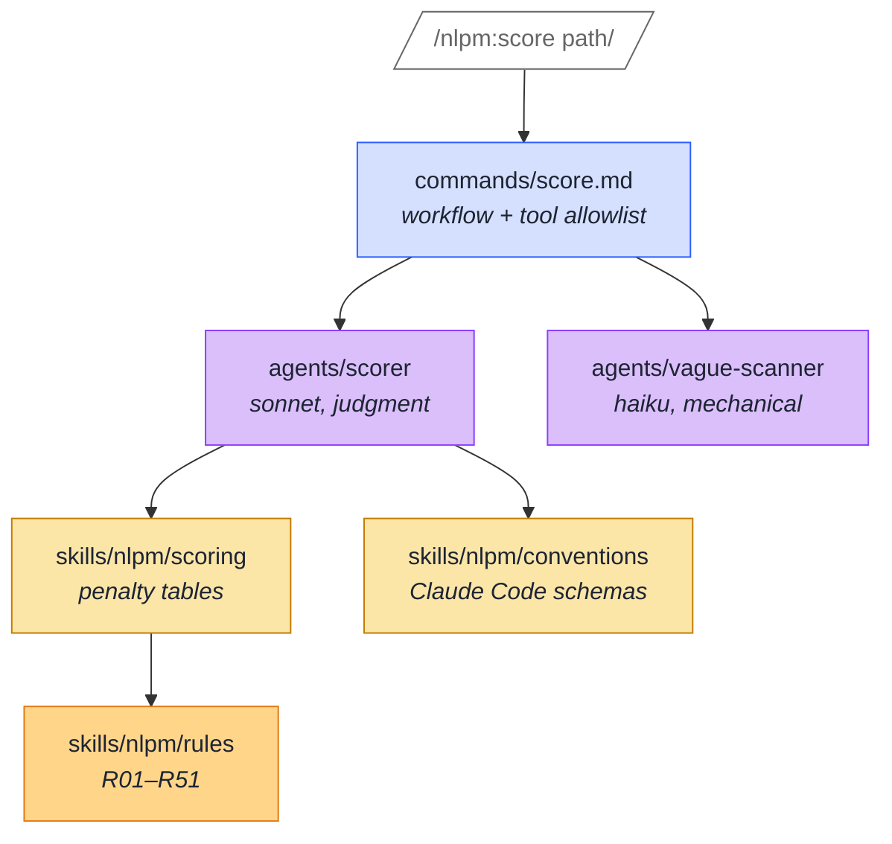
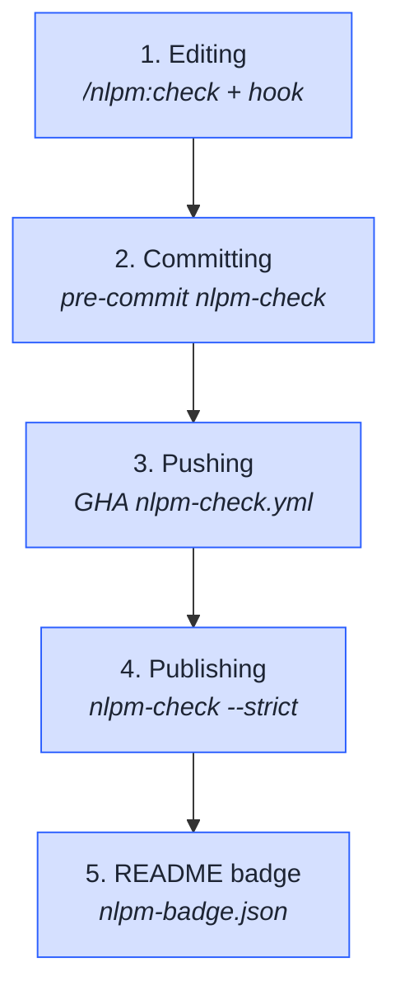

# How to use it

NLPM ships in two shapes. The **plugin** runs inside Claude Code and
gives you eleven slash commands backed by six specialist agents and a
catalog of reference skills. The **standalone binaries** (pure-Python,
stdlib-only, no `pip install`) cover the deterministic subset for
environments without Claude Code — Codex CLI projects, Antigravity
projects, pre-commit hooks, CI runners, release scripts.

The scoring rubric covers **all three tools NLPM supports** (Claude Code,
Codex CLI, Antigravity) via tier-aware overlays — `nlpm:conventions`
(universal floor: SKILL.md open spec, AGENTS.md, R01) plus
`nlpm:conventions-claude` / `nlpm:conventions-codex` /
`nlpm:conventions-antigravity` (per-tool schemas, hook events,
marketplace formats). The scorer auto-classifies each artifact by
its path and applies the matching overlay.

Both shapes share the same rule registry (`skills/nlpm/rules/SKILL.md`,
R01–R51) and the same vocabulary registry
(`skills/nlpm/vocabulary/registry.yaml`), so a finding in your editor
matches a finding in CI exactly.

## Install

Three installation paths, pick whichever fits.

### As a Claude Code plugin — via Anthropic's community marketplace

Curated; updates lag the maintainer marketplace by ~24h.

```bash
claude plugin marketplace add anthropics/claude-plugins-community
claude plugin install nlpm@claude-community --scope project   # or --scope user
```

### As a Claude Code plugin — via the xiaolai marketplace

Latest version lands here first.

```bash
claude plugin marketplace add xiaolai/claude-plugin-marketplace

# Project scope (recommended — lives with the repo)
claude plugin install nlpm@xiaolai --scope project

# User scope (available in every project)
claude plugin install nlpm@xiaolai --scope user
```

If you see "Plugin not found in marketplace 'xiaolai'", run
`claude plugin marketplace update xiaolai` and retry — `plugin install`
does not auto-refresh. The community marketplace doesn't have this caveat.

### As a standalone binary

The standalone `nlpm-check` is a single Python 3.11+ file with no
external dependencies — drop it anywhere on `PATH` or commit it to
your repo.

```bash
# Option A — into /usr/local/bin
curl -fsSL -o /usr/local/bin/nlpm-check \
  https://raw.githubusercontent.com/xiaolai/nlpm/main/bin/nlpm-check
chmod +x /usr/local/bin/nlpm-check

# Option B — into your repo (commits the script alongside your code)
mkdir -p bin
curl -fsSL -o bin/nlpm-check \
  https://raw.githubusercontent.com/xiaolai/nlpm/main/bin/nlpm-check
chmod +x bin/nlpm-check
```

Verify with `nlpm-check --version`. For the README badge, also fetch
`nlpm-badge` from the same `bin/` path.

## The eleven slash commands

Every command is a markdown file under `commands/`. The frontmatter
declares the tools it may call; the body is the workflow. Read any of
them to see exactly what the command does — there is no compiled
runtime in between.



Slash commands dispatch agents; agents load skills; skills cite rules.
The whole stack is markdown — nothing compiles, nothing locks you in.

### `/nlpm:init` — configure the project

First step in a fresh repo. Detects layout, asks for strictness, and
captures a baseline `.claude/nlpm-history.json` snapshot so `trend`
has something to compare against.

```text
/nlpm:init
```

Produces `.claude/nlpm.local.md` with your project's configuration:
score threshold, rule overrides, vocabulary skill path, and the R51
opt-in flag.

### `/nlpm:ls` — discover NL artifacts

Walks the current repo and inventories every Category A/B artifact
it recognizes (skills, agents, commands, rules, hooks, plugins, specs).

```text
/nlpm:ls              # whole repo
/nlpm:ls path/to/dir  # subtree
```

Output: a table grouped by artifact type with file paths. No scoring,
no judgment — just discovery.

### `/nlpm:score` — 100-point quality scoring

The headline command. Scores every NL artifact under the path against
the 51 rules. Deterministic penalties, no LLM judgment in the rubric
itself — only in the per-finding evidence.

```text
/nlpm:score                # score everything
/nlpm:score commands/      # score one subtree
/nlpm:score --changed      # score only files changed since HEAD
```

`--changed` runs `git diff --name-only HEAD`, filters through the
classifier, then scores only NL artifacts in the diff. Cuts review
time on large repos to under a minute.

Threshold is configurable per-project via
`.claude/nlpm.local.md` (default: 70). Files below threshold count
as failing in the summary.

### `/nlpm:check` — cross-component consistency

The check no other validator runs. Diffs the plugin manifest against
disk, walks every cross-reference, and reports gaps:

- manifest-vs-disk inconsistency (skills declared but missing, or
  on disk but unregistered)
- orphaned components (files no manifest references)
- broken cross-references between commands, agents, and skills
- `allowed-tools` entries with no call site
- behavioral contradictions across siblings

```text
/nlpm:check
```

Use this before publishing a plugin. The mattpocock/skills bug
(four unregistered SKILL.md files in a 69.8k⭐ repo) is the canonical
case `/nlpm:check` catches.

### `/nlpm:fix` — auto-fix mechanical issues

Repairs anything the scorer flagged as deterministic: rule-number
drift, frontmatter field renames, missing required fields, miscased
hook event names (`pretooluse` → `PreToolUse`), header gaps.

```text
/nlpm:fix
/nlpm:fix path/to/dir
```

Refuses to touch anything that requires judgment — vague language,
description quality, instruction clarity. Those stay for human review.

### `/nlpm:test` — run NL-TDD specs

NLPM ships with `.nlpm-test/*.spec.md` files that describe expected
behavior for each agent in plain English. `test` evaluates whether
each agent's current definition would satisfy each spec.

```text
/nlpm:test                       # all specs
/nlpm:test .nlpm-test/foo.spec.md
```

Use this to gate agent changes — if the spec passes before but fails
after, your edit broke something. NLPM dogfoods this on its own six
specialist agents.

### `/nlpm:trend` — track score over time

Reads `.claude/nlpm-history.json` (auto-appended by `init` and `score`)
and surfaces the trajectory: which files improved, which regressed,
which rules generate the most current findings.

```text
/nlpm:trend
```

The history file is local and append-only. Delete it to start fresh;
the next `score` will create a new baseline.

### `/nlpm:report` — self-contained HTML report

Renders everything `score` + `check` + `vocab-drift` found into a
single HTML file at `.claude/nlpm-reports/index.html`. Self-contained:
opens directly via `file://`, no server, no network, no build step.

```text
/nlpm:report
/nlpm:report path/to/dir
```

The report includes per-file scores, the score trend chart, the
cross-component graph (AntV G6), the vocabulary noun-verb map, drift
candidates, and the full findings list with severity and rule
citations. Same data shape feeds the cross-repo dashboard at
[/dashboard](/dashboard).

### `/nlpm:security-scan` — executable-surface scan

Looks for hostile patterns in the code-shaped parts of a plugin:
hook scripts, MCP server configs, dependency declarations,
externally-fetched binaries.

```text
/nlpm:security-scan
```

Flags eval/exec, curl-piped-to-shell, credential exfiltration
patterns, unpinned dependency hashes. Severity-graded per the
patterns in `skills/nlpm/security/`. This is what the auditor runs
before contributing PRs to a third-party repo — a `BLOCKED` verdict
gates the rest of the pipeline.

### `/nlpm:vocab-init` — bootstrap a vocabulary registry

The entry point for R51 (vocabulary discipline). Extracts the
project's literary warrant from its actual NL artifacts and writes
a starter `skills/<name>/vocabulary/SKILL.md` + `registry.yaml`.

```text
/nlpm:vocab-init
/nlpm:vocab-init path/to/plugin
```

The seeded registry contains the top extracted nouns + verbs as
canonical entries (you edit it to confirm). Also writes the opt-in
stub to `.claude/nlpm.local.md` so R51 stays disabled until you
explicitly enable it. Adoption is opt-in by design — see
[the six principles](/reference/principles).

### `/nlpm:vocab-drift` — registry-free drift advisory

Doesn't need a registry. Walks the corpus, clusters likely-synonymous
nouns and verbs by judgment, and emits an advisory. Output is
informational only — no penalty, no PR gate.

```text
/nlpm:vocab-drift
```

Use this in two situations: before adopting R51 (to see what cleanup
would be needed), or as a periodic health check alongside R51 (to
catch terms that aren't yet in the registry but probably should be).

## The standalone binaries

For non-interactive environments (CI, pre-commit, release scripts),
the same checks run without Claude Code.

### `bin/nlpm-check`

Implements the deterministic subset of `/nlpm:check`. Pure Python 3.11+,
stdlib only, no `pip install`.

```bash
nlpm-check                  # check current directory
nlpm-check path/            # check a specific path
nlpm-check --json           # machine-readable JSON output
nlpm-check --strict         # fail on findings of any confidence
nlpm-check --quiet          # suppress passing output
nlpm-check --version
```

Exit codes:

| Code | Meaning |
|---|---|
| 0 | No high-confidence findings (clean) |
| 1 | One or more high-confidence findings (strict: any finding) |
| 2 | I/O error or malformed manifest |

What it catches at confidence-high (exit 1):

- **manifest-disk-diff** — file declared in `plugin.json` missing on
  disk, or component on disk not reachable from manifest
- **frontmatter** — missing required `name` / `description` fields
- **skill-name-parent** — `name:` field doesn't match parent dir
  (Claude Code's loader silently drops these)
- **skill-name-format** — `name:` violates `^[a-z][a-z0-9-]{0,63}$`
- **hook-event-case** — `pretooluse` instead of `PreToolUse`
  (case-sensitive loader silently ignores wrong-case)

Multi-plugin monorepos are auto-detected — if your repo has multiple
`.claude-plugin/plugin.json` files, each is checked in isolation and
the aggregate state is reported.

### `bin/nlpm-badge`

Reads `nlpm-check --json` output on stdin and writes a shields.io
endpoint-compatible JSON to stdout. No external services involved.

```bash
nlpm-check --json . | nlpm-badge > nlpm-badge.json
nlpm-check --json . | nlpm-badge --attestation > nlpm-attestation.json
```

The basic badge JSON contains only the fields shields.io's endpoint
schema documents (`schemaVersion`, `label`, `message`, `color`). The
`--attestation` variant emits a sidecar with `checked_at`,
`manifest_disk_consistent`, and the full finding counts — useful as
a signed claim downstream.

## Authoring workflow

The five lifecycle points where NLPM plugs into your work, in the
order they happen:



Each step blocks the next if it fails — bad commits don't land, bad
pushes don't merge, bad releases don't publish. The badge is the
public attestation that all four gates passed at the SHA it points to.

### 1. Editing — slash commands and hooks

While in Claude Code, `/nlpm:check` and `/nlpm:score` give immediate
feedback. The plugin's PostToolUse hook (installed automatically when
you `claude plugin install nlpm@xiaolai`) emits advisory output as
you write SKILL.md / agent / command files — see the path you just
edited in the assistant's stream.

For deeper review, `/nlpm:report` writes a complete HTML report you
can open in the browser.

### 2. Committing — pre-commit hook

Drop in the template:

```bash
curl -fsSL -o .git/hooks/pre-commit \
  https://raw.githubusercontent.com/xiaolai/nlpm/main/templates/pre-commit-nlpm.sh
chmod +x .git/hooks/pre-commit
```

Now `git commit` runs `nlpm-check` on staged changes and blocks the
commit on high-confidence findings. Bypass with `git commit --no-verify`
(not recommended).

For [`pre-commit`](https://pre-commit.com/) framework users, add to
`.pre-commit-config.yaml`:

```yaml
repos:
  - repo: local
    hooks:
      - id: nlpm-check
        name: nlpm-check
        entry: nlpm-check
        language: system
        pass_filenames: false
        files: '(\.claude-plugin/.+\.json|skills/.+/SKILL\.md|agents/.+\.md|commands/.+\.md|hooks/hooks\.json)$'
```

### 3. Pushing — GitHub Actions

Copy the workflow template into your repo:

```bash
mkdir -p .github/workflows
curl -fsSL -o .github/workflows/nlpm-check.yml \
  https://raw.githubusercontent.com/xiaolai/nlpm/main/templates/workflows/nlpm-check.yml
```

The workflow runs `nlpm-check` on every push and pull request. No
secrets required; no write permission unless you opt into the
badge-publish step on `main`.

GHA annotations land on the exact `file:line` of every finding, so
the PR review surface shows them inline.

### 4. Publishing — release script

Add to whatever runs before `npm publish` / `release-please` / your
release flow:

```bash
nlpm-check --strict . || {
  echo "nlpm-check found issues. Fix them or run /nlpm:fix in Claude Code."
  exit 1
}
```

`--strict` fails on findings of any confidence (high + medium + low),
not just the high-confidence subset that blocks `git commit`.

### 5. Showing the "Validated by NLPM" badge

The GHA workflow publishes `nlpm-badge.json` to the repo root on every
push to `main`. Add this line to your `README.md`:

```markdown

```

The badge auto-updates each push to `main`:

| State | Color | Message |
|---|---|---|
| Clean | green | `0 issues · v1.1.x` |
| Advisory | yellow | `0 high · N advisory` (medium/low findings only) |
| Failing | red | `N high issues` |

For monorepos with multiple sub-plugins:

| State | Color | Message |
|---|---|---|
| All clean | green | `N plugins clean` |
| Some advisory | yellow | `N plugins · K advisory` |
| Any failing | red | `N of M plugins fail` |

The JSON payload includes a `manifest_disk_consistent` boolean and a
SHA-stamped `checked_at` timestamp under `extras` — downstream
consumers can verify the badge wasn't stale-cached.

To publish manually (the first time, before CI catches up):

```bash
nlpm-check --json . | nlpm-badge > nlpm-badge.json
git add nlpm-badge.json
git commit -m "chore: add nlpm-badge.json"
```

## As a consumer — the auditor dashboard

If you are evaluating a plugin you didn't write, NLPM's cross-repo
audit data is the consumer-facing surface:

- **[Dashboard](/dashboard)** — every audited repo, sortable by score,
  with the rule-distribution heatmap and the vocabulary-drift network
- **[Featured audits](/featured-audits)** — the noteworthy ones,
  curated with PR links and merged-status
- **Per-repo reports** — drill into any row on the dashboard for the
  full audit (per-finding evidence, severity, rule citation, line
  numbers), including the [NLPM self-audit](/reports/xiaolai-nlpm-for-claude)
  at 100/100

Each finding cites the rule that produced it. The rule cites the
exemplars that warrant it. The exemplars cite the merged PRs that
proved the rule survives contact with reality.

## Configuration reference

### `.claude/nlpm.local.md` — project config

Created by `/nlpm:init`. Two fenced YAML blocks: one for thresholds
and global settings, one for per-rule overrides.

```yaml
score_threshold: 70   # files scoring below this count as failing

rule_overrides:
  R03:
    max_penalty: 5    # cap this rule's contribution
  R12:
    suppress: true    # disable this rule entirely
  R51:
    enabled: true     # opt into vocabulary discipline
    vocabulary_skill: skills/myplugin/vocabulary
```

See [Reference → Scoring & severity](/reference/scoring) for the
full schema and every supported override type.

### `.nlpm-test/*.spec.md` — agent specs

NL-TDD specs: each file describes an expected behavior in plain
English. `/nlpm:test` evaluates whether the current artifact would
satisfy each spec.

The format is documented in
[`skills/nlpm/testing/SKILL.md`](https://github.com/xiaolai/nlpm/blob/main/skills/nlpm/testing/SKILL.md).

### `skills/<name>/vocabulary/registry.yaml` — vocabulary registry

Optional. Required only if you enable R51. Declares canonical
nouns, verbs, scopes, and sanctioned cross-scope homonyms. NLPM
ships [its own example registry](https://github.com/xiaolai/nlpm/blob/main/skills/nlpm/vocabulary/registry.yaml)
covering the `internal` and `auditor` scopes.

## Related

- [Why NLPM is built](/why) — the gap NLPM exists to fill
- [How it works](/how-it-works) — the two pipelines and one rulebook
- [How it evolves](/how-it-evolves) — the feedback loop that keeps the rules honest
- [Install](/install) — focused install guide with the curl one-liners
- [Reference](/reference/) — R01–R51, P1–P6, scoring, vocabulary, drift
